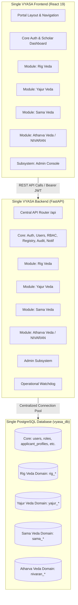

# VYASA Modular Monolith Architectural Specification
**Document Version:** 1.0.0-ARCHITECTURE  
**Parent System:** VYASA Ecosystem (Chhatrapati Shahu Ji Maharaj University, Kanpur)  
**Status:** Approved Target Architecture

---

## 1. System Vision
VYASA is an institutional R&D governance and scholar lifecycle platform engineered for Chhatrapati Shahu Ji Maharaj University (CSJMU). The architecture is finalized as a **Single Application Modular Monolith**:
- **ONE Frontend Application:** Single React 19 application (`apps/vyasa/frontend`).
- **ONE Backend Application:** Single FastAPI application (`apps/vyasa/backend`).
- **ONE PostgreSQL Database:** Unified database instance (`vyasa_db`).

There are no separate independent applications for individual pillars or Veda domains.

---

## 2. Foundational Veda Governance Pillars
VYASA organizes university governance into four Veda-inspired domains:

| Veda Pillar | Domain Title | Core Focus | Implementation Status |
| :--- | :--- | :--- | :--- |
| **Rig Veda** | Research & Knowledge Creation | Doctoral lifecycle, synopsis progression, thesis defense, publication repositories | Planned Boundary (Phase 2) |
| **Yajur Veda** | Research Administration & Incentives | Research grants, project funding, ethics board reviews, incentive disbursements | Planned Boundary (Phase 2) |
| **Sama Veda** | Research Recognition & Communication | Citation metrics, faculty awards, symposium management, open-access showcase | Planned Boundary (Phase 2) |
| **Atharva Veda** | Grievance Redressal & Institutional Well-Being | NIVARAN-AI case management, accountable hierarchical triage, cryptographic dossiers | Active Modular Integration |

---

## 3. Strict Module Boundary Rules
To guarantee that the modular monolith remains maintainable, extensible, and clean:
1. **Isolated Business Logic:** Each module encapsulates its business logic in `services/`.
2. **No Direct Model Mutation Across Modules:** A module service cannot write directly to another module's database models.
3. **Shared Core Anchors:** All modules reference `users.id` directly for scholar and authority identity.
4. **Service Contracts & Events:** Cross-module coordination utilizes defined service methods or asynchronous outbox notifications.
5. **No Artificial Relationships:** Modules remain decoupled unless a genuine institutional relationship exists.
6. **In-Process Modularity:** Modules are mounted as routers in the master backend and routes in the master frontend.
