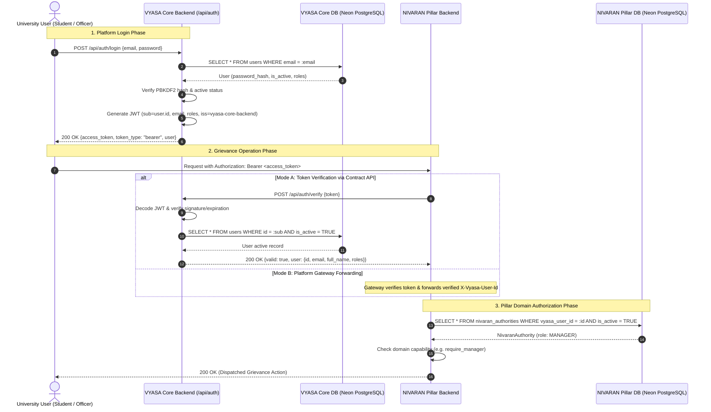

# VYASA Platform Identity & Pillar Authentication Contract

**Document Identifier:** `VYASA-ARCH-IDENTITY-01`  
**Status:** FROZEN ARCHITECTURAL CONTRACT  
**Owner:** VYASA Platform Architecture Core  
**Governing Principle:** *"VYASA owns institutional identity. Pillars own domain roles."*  

---

## 1. Core Architectural Separation

The VYASA Research and Governance Ecosystem enforces a strict boundary between platform-level identity and pillar-specific domain workflows:

```
┌────────────────────────────────────────────────────────────────────────┐
│                          VYASA CORE ECOSYSTEM                          │
│                                                                        │
│   • Central Identity Management (User Directory in Neon PostgreSQL)    │
│   • Password Storage & Cryptographic Verification (PBKDF2-HMAC-SHA256) │
│   • Platform Token Issuance & Signature (PyJWT with HS256)             │
│   • Generic Ecosystem Roles (administrator, authority, applicant)      │
│   • Pillar Token Introspection Contract (`POST /api/auth/verify`)      │
└───────────────────────────────────┬────────────────────────────────────┘
                                    │
                         Authentication Contract
                         (Token / REST API / Gateway)
                                    │
                                    ▼
┌────────────────────────────────────────────────────────────────────────┐
│                        NIVARAN GRIEVANCE PILLAR                        │
│                                                                        │
│   • Grievance Data & Dispute Lifecycles (Frozen 40-Table DB)           │
│   • Academic Disciplinary Taxonomy (10 Subject Clusters, 16 Categories)│
│   • Domain Authority Roles (MANAGER, DEAN, ASSISTANT_DEAN, etc.)       │
│   • Grievance Workflow Authorization & Triage Clearance                │
│   • Zero Credential Storage & Zero Local JWT Issuance                  │
└────────────────────────────────────────────────────────────────────────┘
```

---

## 2. Seven Cardinal Architectural Principles

### A. VYASA Owns Identity
All user profiles (`id`, `email`, `first_name`, `last_name`, `phone`, `is_active`) originate within and are owned exclusively by VYASA Core. Independent pillars do not maintain independent user registries or user identity creation flows.

### B. VYASA Owns Credentials and Generic Ecosystem Roles
Password hashes (PBKDF2-HMAC-SHA256 with 100,000 iterations) are stored strictly within the `users` table of the VYASA Core database. Generic platform roles (`administrator`, `authority`, `applicant`) represent systemic tiers across CSJMU and are managed exclusively by VYASA Core.

### C. Pillars Do Not Access VYASA DB Directly
Independent pillars (including NIVARAN) operate in isolated database instances. There are **zero cross-database foreign keys**, zero cross-database queries, and zero shared database connection pools. A pillar backend cannot read or write to VYASA Core tables.

### D. Pillars Verify VYASA Identity Through the Authentication Contract
When an incoming HTTP request reaches a pillar backend (or API Gateway), identity authenticity is established by submitting the Bearer token to VYASA Core's token verification contract endpoint:
```http
POST /api/auth/verify
Content-Type: application/json

{
  "token": "eyJhbGciOiJIUzI1NiIsInR5cCI6IkpXVCJ9..."
}
```
VYASA Core decodes the token, cryptographically validates signature and expiration, queries its database to confirm the user currently exists and is active, and returns:
```json
{
  "valid": true,
  "user": {
    "id": "7b1f3c8a-4d2e-5a6b-9c0d-1e2f3a4b5c6d",
    "email": "manager@csjmu.ac.in",
    "first_name": "Central",
    "last_name": "Manager",
    "roles": ["authority"]
  }
}
```
If the token is forged, expired, or the user is deactivated/deleted, VYASA Core returns `{"valid": false}`.

### E. NIVARAN Owns Grievance Data and NIVARAN-Specific Roles
All grievance complaints, status transitions, attachments, committee inquests, digital signatures, and E-Files belong exclusively to NIVARAN. Furthermore, institutional authority roles such as:
- `MANAGER`
- `ASSISTANT_DEAN`
- `ASSOCIATE_DEAN`
- `DEAN`
- `GUEST_MEMBER`
are strictly NIVARAN domain concepts. They **do not exist** inside VYASA Core models, tables, or generic role enums.

### F. `vyasa_user_id` Is the Logical Identity Bridge
NIVARAN links its internal domain entities (`nivaran_authorities`, `student_master_records`, `grievances.applicant_id`, etc.) to the platform user via a single, immutable UUID column: **`vyasa_user_id`**. This is a purely logical reference, resolved via API calls rather than physical foreign keys.

### G. Generic VYASA Roles and NIVARAN Domain Roles Are Separate Concepts
- **VYASA Role:** Represents platform tier (e.g. `applicant` = student/scholar; `authority` = faculty/staff).
- **NIVARAN Domain Role:** Represents grievance jurisdiction (e.g. `MANAGER` = central operational clearinghouse; `ASSISTANT_DEAN` = cluster-specific arbitrator).
A user with generic VYASA role `authority` might have NIVARAN domain role `MANAGER`, while another has `ASSISTANT_DEAN`. VYASA Core remains agnostic of this distinction.

### H. Institutional Authority Identity Seeding Foundation
To ensure independent pillars (such as NIVARAN) can map real university officers to canonical identities without inventing synthetic UUIDs or local passwords:
- **Source of Truth:** VYASA Core provides a safe, ENV/manifest-driven seeding mechanism with 15 explicit slots (`AUTHORITY_01` through `AUTHORITY_15`).
- **Strict Role Confinement:** All 15 identities receive strictly the generic `authority` role in VYASA Core.
- **Prohibited Pillar Invasions:** Pillar-specific roles (`MANAGER`, `DEAN`, `ASSISTANT_DEAN`, etc.) are explicitly forbidden in VYASA configuration.
- **Idempotency & Non-Destruction:** Seeding preserves stable UUIDs, updates names/credentials without data loss, and leaves unrelated users completely untouched.

---

## 3. End-to-End Authentication & Authorization Sequence



---

## 4. API Endpoints Specification

### 1. `POST /api/auth/login`
- **Request:** `{ "email": "...", "password": "..." }`
- **Response (200 OK):**
  ```json
  {
    "access_token": "eyJhbGciOiJIUzI1NiIs...",
    "token_type": "bearer",
    "expires_in": 3600,
    "user": {
      "id": "7b1f3c8a-4d2e-5a6b-9c0d-1e2f3a4b5c6d",
      "email": "scholar@csjmu.ac.in",
      "first_name": "Aryabhata",
      "last_name": "Scholar",
      "roles": ["applicant"]
    }
  }
  ```

### 2. `GET /api/auth/me`
- **Headers:** `Authorization: Bearer <token>`
- **Response (200 OK):**
  ```json
  {
    "id": "7b1f3c8a-4d2e-5a6b-9c0d-1e2f3a4b5c6d",
    "email": "scholar@csjmu.ac.in",
    "first_name": "Aryabhata",
    "last_name": "Scholar",
    "roles": ["applicant"]
  }
  ```

### 3. `POST /api/auth/verify`
- **Request:** `{ "token": "<access_token>" }` or `Authorization: Bearer <token>`
- **Response (200 OK - Valid):**
  ```json
  {
    "valid": true,
    "user": {
      "id": "7b1f3c8a-4d2e-5a6b-9c0d-1e2f3a4b5c6d",
      "email": "scholar@csjmu.ac.in",
      "first_name": "Aryabhata",
      "last_name": "Scholar",
      "roles": ["applicant"]
    }
  }
  ```
- **Response (200 OK - Invalid / Expired / Deactivated):**
  ```json
  {
    "valid": false
  }
  ```

---

## 5. NIVARAN Production Identity Bridge Implementation

### A. Architectural Components in NIVARAN Pillar

```
Client HTTP Request
  │ (Authorization: Bearer <vyasa_jwt>)
  ▼
app.core.identity: get_authenticated_vyasa_identity
  │
  ▼ Calls VyasaIdentityClient.verify_token(token)
  │ (HTTP POST {VYASA_CORE_URL}/api/auth/verify)
  ▼
Returns VerifiedVyasaIdentity(id, email, first_name, last_name, roles)
  │
  ▼
app.core.authorization: get_current_authority
  │ (Queries nivaran_authorities WHERE vyasa_user_id = identity.id AND is_active = TRUE)
  ▼
Returns NivaranAuthority (NivaranRole.MANAGER / ASSISTANT_DEAN / etc.)
  │
  ▼
app.core.authorization: require_manager / require_nivaran_role / require_nivaran_permission
  │ (Enforces domain role / permission)
  ▼
Controller Endpoint Execution
```

### B. Anti-Spoofing & Boundary Invariants

1. **Authoritative Verification:** Client-supplied tokens are authoritatively verified against VYASA Core via `VyasaIdentityClient`.
2. **Anti-Spoofing Header Protection:** Client-supplied headers (e.g. `X-Vyasa-User-Id`, `X-Role`, or body attributes) cannot override or bypass verified identity. If a Bearer token is provided, the verified identity payload from VYASA Core unconditionally governs.
3. **Fail-Closed on Unreachable Identity Authority:** If the VYASA Core identity service is unreachable, timed out, or returns a 5xx error, NIVARAN immediately rejects with a controlled HTTP 401 Unauthorized (`VyasaIdentityServiceError`), preventing unauthorized access during platform outages.
4. **Database Separation Invariant:** NIVARAN never connects to the VYASA Core database directly. All cross-boundary identity verification happens over the REST/ASGI contract (`POST /api/auth/verify`).
5. **Role Separation Invariant:** VYASA Core generic platform roles (e.g. `authority`, `administrator`) never automatically confer NIVARAN domain roles (e.g. `MANAGER`). Authority roles are resolved strictly from the local `nivaran_authorities` table in NIVARAN's Neon database.

