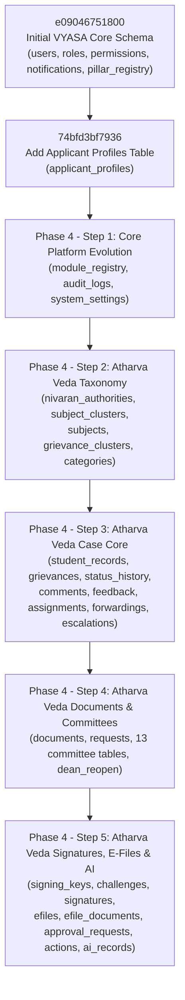

# VYASA Unified Database Blueprint & Relational Schema Specification
**Document Version:** 2.1.0-VALIDATED-DB-BLUEPRINT  
**Parent System:** VYASA Ecosystem (Chhatrapati Shahu Ji Maharaj University, Kanpur)  
**Database Engine:** PostgreSQL 16+ (Hosted on Neon Serverless)  
**Architecture:** Single Application Modular Monolith (`vyasa_db`)  
**Design Phase:** Phase 3.1 — Validation & Correction Pass (Design-Only / Zero DDL Executed)

---

## 1. Architectural Target & Source of Truth

In accordance with ADR-001 and ADR-002, the VYASA platform consolidates institutional R&D governance and scholar lifecycle management for Chhatrapati Shahu Ji Maharaj University (CSJMU) into a **Single Application Modular Monolith** supported by **ONE PostgreSQL Database (`vyasa_db`)**.

```mermaid
graph TD
    subgraph SingleDatabase["Single PostgreSQL Database (vyasa_db)"]
        subgraph CoreDomain["Core Platform Domain (public) - 10 Tables"]
            users[users]
            roles[roles]
            permissions[permissions]
            user_roles[user_roles]
            role_permissions[role_permissions]
            applicant_profiles[applicant_profiles]
            notifications[notifications]
            module_registry[module_registry]
            audit_logs[audit_logs]
            system_settings[system_settings]
        end

        subgraph AtharvaDomain["Atharva Veda: Grievance Redressal (public.nivaran_*) - 38 Tables"]
            niv_auth[nivaran_authorities]
            niv_tax[nivaran_taxonomy (clusters, subjects, categories) - 4 tables]
            niv_case[nivaran_case_management (student_records, grievances, history, comments, feedback) - 5 tables]
            niv_route[nivaran_routing (assignments, forwardings, escalations) - 3 tables]
            niv_doc[nivaran_documents (evidence, requests) - 2 tables]
            niv_comm[nivaran_committees (roster, polls, votes, meetings, recommendations) - 13 tables]
            niv_reopen[nivaran_dean_reopen_reviews - 1 table]
            niv_sign[nivaran_signatures (keys, challenges, RSA-PSS signatures) - 3 tables]
            niv_efile[nivaran_efiles (dossiers, compiled documents) - 2 tables]
            niv_appr[nivaran_approvals (requests, actions) - 2 tables]
            niv_ai[nivaran_ai_telemetry (processing records, clusters) - 2 tables]
        end

        subgraph FutureVedas["Future Veda Extensions (Provisional Boundaries & Reserved Namespaces)"]
            rig_domain[Rig Veda: Research Creation - public.rig_*]
            yajur_domain[Yajur Veda: Research Administration - public.yajur_*]
            sama_domain[Sama Veda: Research Recognition - public.sama_*]
        end
    end

    users -->|1:1 Identity Anchor| applicant_profiles
    users -->|1:1 Authority Profile| niv_auth
    users -->|1:N Case Submissions| niv_case
    users -->|1:N Notifications| notifications
    users -->|1:N Platform Audit Actor| audit_logs
    users -.->|Reserved Anchor| rig_domain
    users -.->|Reserved Anchor| yajur_domain
    users -.->|Reserved Anchor| sama_domain
```

---

## 2. PostgreSQL Schema Organization Strategy (ADR-009)

Following comprehensive architectural evaluation in **ADR-009**, VYASA utilizes **Single PostgreSQL Schema (`public`) with Strict Table Prefixing**:
- **Core Domain:** Unprefixed canonical foundational tables (`users`, `roles`, `permissions`, `user_roles`, `role_permissions`, `applicant_profiles`, `notifications`, `audit_logs`, `module_registry`, `system_settings`).
- **Atharva Veda Domain:** Strict prefix `nivaran_*` across all 38 domain-specific tables.
- **Future Veda Domains:** Reserved prefixes `rig_*`, `yajur_*`, and `sama_*`.

### Architectural Justification:
1. **Neon Serverless & PgBouncer Compatibility:** Transaction-mode pooling ignores session-level `SET search_path`. Single-schema eliminates schema search-path connection drift entirely.
2. **Deterministic Alembic Lineage:** Single migration lineage with zero multi-schema branch synchronization bugs.
3. **Declarative Foreign Keys:** Direct relational integrity (`ForeignKey('users.id', ondelete='RESTRICT')`) without requiring schema qualifications in models.
4. **Zero-Downtime Migration:** Preserves the existing baseline tables (`users`, `roles`, etc.) without risky `ALTER TABLE SET SCHEMA` migrations.

---

## 3. Core Schema Inventory & Evolution Assessment

| Table | Current Baseline | Status / Classification | Target Evolution in Phase 4 | Code / Migration Impact |
| :--- | :--- | :--- | :--- | :--- |
| `users` | `e09046751800` | **A. Correct as-is** | Retain as canonical identity root. Primary Key UUIDv4. | None. Used by all auth and session services. |
| `roles` | `e09046751800` | **A. Correct as-is** | Core platform roles: `applicant`, `authority`, `administrator`. | None. Fully supported in RBAC middleware. |
| `permissions`| `e09046751800` | **A. Correct as-is** | Resource-action format (`resource:action`). | None. Granular permissions enforced in API routers. |
| `user_roles` | `e09046751800` | **A. Correct as-is** | Composite PK `(user_id, role_id)`. Cascade on user/role deletion. | None. Standard junction. |
| `role_permissions`| `e09046751800` | **A. Correct as-is** | Composite PK `(role_id, permission_id)`. Cascade on role/permission deletion. | None. Standard junction. |
| `applicant_profiles`| `74bfd3bf7936` | **A. Correct as-is** | Shared academic identity for scholars across all 4 Vedas. | Generalize consumption across Rig/Yajur/Sama/Atharva. |
| `notifications` | `e09046751800` | **A. Correct as-is** | Unified in-app notifications with JSONB metadata. | All modules write directly to this table. |
| `pillar_registry`| `e09046751800` | **C. Requires migration** | Evolve to `module_registry`: rename `pillar_key` &rarr; `module_key`; deprecate external `base_url`. | DB holds operational state (`is_enabled`, `status`); routing stays in code. |
| `audit_logs` | Missing in Core | **C. Requires migration** | Add centralized platform security and administrative audit log. | Captures platform logins, RBAC changes, admin actions. |
| `system_settings`| Missing in Core | **C. Requires migration** | Add key-value institutional settings table with audit author FK. | Dynamic platform config, maintenance flags, banner alerts. |

---

## 4. Module Registry Architectural Validation

### Code Configuration vs. Database State
To prevent putting executable business logic into database configuration:
1. **Executable Code Layer (`app.core.registry.ModuleDescriptor`):**  
   Internal routing prefixes (e.g. `/modules/atharva-veda/nivaran`), UI icon definitions, sidebar navigation ordering, and required RBAC permission checks remain defined in Python code.
2. **Database State Layer (`module_registry` table):**  
   The database table stores strictly **operational deployment flags**:
   - `module_key`: VARCHAR(64) UNIQUE (e.g. `atharva_veda_nivaran`, `rig_veda`, `yajur_veda`, `sama_veda`)
   - `name`: VARCHAR(128)
   - `status`: VARCHAR(32) (`active`, `beta`, `maintenance`, `planned`)
   - `version`: VARCHAR(32)
   - `is_enabled`: BOOLEAN (Emergency kill-switch / progressive rollout toggle)
   - `metadata_json`: JSONB (Non-executable audit details or feature flags)
   - Timestamps: `created_at`, `updated_at`

---

## 5. Atharva Veda / NIVARAN 40-Table Reconciliation Audit

The standalone NIVARAN reference model comprised **exactly 40 tables**. Their exact disposition in the unified modular monolith is:

$$\text{Total Tables (40)} = 38\text{ (Preserved as public.nivaran\_*)} + 1\text{ (Absorbed into Core audit\_logs)} + 1\text{ (Deprecated outbox)}$$

```
40 Reference Tables in Standalone NIVARAN:
├── 38 Tables &rarr; Preserved as namespaced tables in Atharva Veda (public.nivaran_*)
├── 1 Table  &rarr; Absorbed into Core Domain (audit_logs &rarr; public.audit_logs)
└── 1 Table  &rarr; Deprecated / Eliminated (grievance_notification_outbox &rarr; direct DB notifications)
```

### Table-by-Table Disposition Matrix:

| # | Standalone NIVARAN Table | Unified VYASA Target Table | Action | Reason & Relationship Changes |
| :--- | :--- | :--- | :--- | :--- |
| 1 | `nivaran_authorities` | `nivaran_authorities` | Preserve | Logical UUID `vyasa_user_id` converted to direct declarative FK `users.id` (1:1, RESTRICT). |
| 2 | `subject_clusters` | `nivaran_subject_clusters` | Preserve | Namespaced. FK `assistant_dean_id` references `nivaran_authorities.id`. |
| 3 | `subjects` | `nivaran_subjects` | Preserve | Namespaced. 55 subjects. FK `subject_cluster_id` references `nivaran_subject_clusters.id`. |
| 4 | `grievance_clusters` | `nivaran_grievance_clusters` | Preserve | Namespaced. 3 clusters. FK `associate_dean_id` references `nivaran_authorities.id`. |
| 5 | `categories` | `nivaran_categories` | Preserve | Namespaced. Dynamic routing rules (Grievance Cluster, Asst Dean, Fixed Authority). |
| 6 | `student_master_records` | `nivaran_student_master_records` | Preserve | Preserved as immutable legal snapshot. `student_vyasa_user_id` becomes direct FK `users.id`. |
| 7 | `grievances` | `nivaran_grievances` | Preserve | Core case record. `applicant_vyasa_user_id` becomes direct FK `users.id` (RESTRICT). |
| 8 | `grievance_status_history`| `nivaran_grievance_status_history`| Preserve | Append-only status transition log. FK `grievance_id` (RESTRICT on official case). |
| 9 | `comments` | `nivaran_comments` | Preserve | Case timeline notes. FK `author_user_id` references `users.id`. |
| 10 | `grievance_feedback` | `nivaran_grievance_feedback` | Preserve | Post-resolution survey. 1:1 FK `grievance_id`. |
| 11 | `assignments` | `nivaran_assignments` | Preserve | Authority assignment history. FK `authority_id` references `nivaran_authorities.id`. |
| 12 | `forwarding_confirmations`| `nivaran_forwarding_confirmations`| Preserve | Accountable forwarding with 6 checkboxes and 3 justifications. RESTRICT delete rule. |
| 13 | `escalations` | `nivaran_escalations` | Preserve | Case escalation trail. FK `escalated_by_id` references `nivaran_authorities.id`. |
| 14 | `documents` | `nivaran_documents` | Preserve | Evidence metadata & checksums. `uploaded_by_vyasa_user_id` becomes direct FK `users.id`. |
| 15 | `document_requests` | `nivaran_document_requests` | Preserve | Evidence clarification requests. FK `requested_by_id` references `nivaran_authorities.id`. |
| 16 | `committee_creation_requests`| `nivaran_committee_creation_requests`| Preserve | Charter requests to Dean. FK `grievance_id`, FK `requested_by_id`. |
| 17 | `grievance_committees` | `nivaran_committees` | Preserve | Inquiry committee master entity. Renamed to clean convention `nivaran_committees`. |
| 18 | `committee_members` | `nivaran_committee_members` | Preserve | Member roster. FK `committee_id`, FK `authority_id`. |
| 19 | `committee_member_recommendations`| `nivaran_committee_member_recs`| Preserve | Individual assessments submitted by members. |
| 20 | `committee_final_recommendations`| `nivaran_committee_final_recs`| Preserve | Consolidated Chairperson report. 1:1 FK `committee_id`. |
| 21 | `committee_messages` | `nivaran_committee_messages` | Preserve | In-camera deliberation chat log. FK `committee_id`, FK `sender_authority_id`. |
| 22 | `committee_polls` | `nivaran_committee_polls` | Preserve | Formal ballot container. FK `committee_id`. |
| 23 | `committee_poll_options` | `nivaran_committee_poll_options` | Preserve | Ballot options. FK `poll_id` (CASCADE on poll draft deletion). |
| 24 | `committee_poll_voters` | `nivaran_committee_poll_voters` | Preserve | Snapshot of eligible voters. FK `poll_id`, FK `member_id`. |
| 25 | `committee_poll_votes` | `nivaran_committee_poll_votes` | Preserve | Cast ballots with cryptographic vote hash. FK `poll_id`. |
| 26 | `committee_decision_records`| `nivaran_committee_decision_records`| Preserve | Sealed outcome of ballots. 1:1 FK `poll_id`. |
| 27 | `committee_meetings` | `nivaran_committee_meetings` | Preserve | Scheduled hearings and sessions. FK `committee_id`. |
| 28 | `committee_meeting_participants`| `nivaran_committee_meeting_participants`| Preserve | Attendance register. FK `meeting_id`, FK `users.id`. |
| 29 | `dean_reopen_reviews` | `nivaran_dean_reopen_reviews` | Preserve | Single-chance Dean adjudication review. FK `grievance_id`, FK `users.id`. |
| 30 | `signing_key_versions` | `nivaran_signing_key_versions` | Preserve | Institutional RSA-3072 key lifecycle. Independent cryptographic master. |
| 31 | `signing_authorization_challenges`| `nivaran_signing_challenges`| Preserve | Single-use 5-minute challenges bound to TOTP. FK `authority_id`. |
| 32 | `digital_signatures` | `nivaran_digital_signatures` | Preserve | Polymorphic RSA-PSS digital signatures. FK `signer_user_id` references `users.id`. |
| 33 | `efiles` | `nivaran_efiles` | Preserve | 15-section PDF legal dossier container. 1:1 FK `grievance_id` (RESTRICT on sealed dossier). |
| 34 | `efile_documents` | `nivaran_efile_documents` | Preserve | Junction locking document versions to dossier. FK `efile_id`, FK `document_id`. |
| 35 | `approval_requests` | `nivaran_approval_requests` | Preserve | High-stakes escalation approvals. FK `grievance_id`, FK `requested_by_id`. |
| 36 | `approval_actions` | `nivaran_approval_actions` | Preserve | Step-by-step approval decision history. FK `approval_request_id`. |
| 37 | `ai_processing_records` | `nivaran_ai_processing_records` | Preserve | ML triage inference telemetry. FK `grievance_id`. |
| 38 | `clusters` | `nivaran_ai_clusters` | Preserve | Unsupervised topic clusters. Renamed to clean prefix `nivaran_ai_clusters`. |
| 39 | `audit_logs` | `public.audit_logs` | **Absorbed** | Merged into centralized Core `audit_logs` with `module = 'atharva_veda'`. Avoids redundant audit tables. |
| 40 | `grievance_notification_outbox`| `None` (Direct DB) | **Deprecated** | Deprecated because VYASA is a single modular monolith. Notifications are written directly to Core `notifications` in the same DB transaction. |

---

## 6. Corrected Referential Integrity & Delete Policy

### Reconciliation of CASCADE vs. RESTRICT for Official Governance Records:
A child record containing official historical evidence must never disappear accidentally because a parent entity is deleted.
1. **Core Identity Protection:**  
   `users` &rarr; `nivaran_authorities`: `ON DELETE RESTRICT`. A user who holds an institutional office cannot be deleted.  
   `users` &rarr; `nivaran_grievances`: `ON DELETE RESTRICT`. A user who has filed a grievance case cannot be deleted.  
   `users` &rarr; `nivaran_digital_signatures`: `ON DELETE RESTRICT`. A user who has executed a digital signature cannot be deleted.
2. **Official Case Protection:**  
   Once a grievance reaches an official state (`UNDER_INITIAL_REVIEW`, `FORWARDED`, `RESOLVED`, `CLOSED`), **hard deletion of the grievance is prohibited by application policy**.  
   `nivaran_grievances` &rarr; `nivaran_efiles`: `ON DELETE RESTRICT` when `is_sealed = TRUE`. A grievance cannot be deleted if a sealed legal dossier exists.  
   `nivaran_grievances` &rarr; `nivaran_status_history`: `ON DELETE RESTRICT`. Historical state transitions cannot be purged.  
   `nivaran_grievances` &rarr; `nivaran_forwarding_confirmations`: `ON DELETE RESTRICT`. Statutory forwarding confirmations cannot be purged.  
   `nivaran_documents` &rarr; `nivaran_efile_documents`: `ON DELETE RESTRICT`. Evidence documents locked in an E-File cannot be deleted.
3. **Controlled Cascades (Only for Transient/Draft Children):**  
   - `user_roles` and `role_permissions` cascade when roles/permissions are removed.  
   - `notifications` cascade when a user account is deleted.  
   - `nivaran_committee_poll_options` cascade only if the parent poll is deleted in `DRAFT` status before launch.

---

## 7. Query-Driven Indexing Plan (Universal Indexing Corrected)

> [!IMPORTANT]
> The blanket rule "Universal Foreign Key Indexing" has been removed. Every index is strictly justified by high-frequency query patterns, cardinality, and write overhead.

### Index Classification Matrix:

| Table | Indexed Columns | Classification | Query Pattern & Justification | Expected Benefit vs Write Cost |
| :--- | :--- | :--- | :--- | :--- |
| `users` | `email` | **KEEP** | Login authentication (`WHERE email = ?`). High selectivity. | Mandatory for authentication SLA (<10ms). Minimal write overhead. |
| `applicant_profiles` | `user_id` | **KEEP** | 1:1 scholar profile lookup on dashboard load. | Instant lookup. Write occurs once at onboarding. |
| `applicant_profiles` | `phd_registration_number`| **KEEP** | Search by registration number. High selectivity. | Instant lookup. Unique constraint backed. |
| `nivaran_authorities` | `vyasa_user_id` | **KEEP** | Authority resolution on every authenticated request. | High frequency. 1:1 unique B-tree. |
| `nivaran_grievances` | `(applicant_vyasa_user_id, status, created_at DESC)` | **KEEP** | Applicant active grievance dashboard filter. | Composite index eliminates sort overhead for applicant home screen. |
| `nivaran_grievances` | `(assigned_authority_id, status, priority, created_at ASC)` | **KEEP** | Authority triage work queue. High frequency. | Eliminates sequential scan across thousands of grievances. |
| `nivaran_grievances` | `grievance_id` | **KEEP** | Tracking number lookup (`CSJMU-YYYY-NNNNN`). | High selectivity; unique lookup index. |
| `nivaran_status_history`| `grievance_id` | **KEEP** | Timeline rendering for case detail view. | Frequent 1:M join. Write occurs only on status change. |
| `nivaran_documents` | `sha256_hash` | **KEEP** | Document deduplication & integrity check during upload. | High selectivity. Prevents duplicate uploads. |
| `nivaran_documents` | `grievance_id` | **KEEP** | Fetching all case attachments for dossier compilation. | Standard join filter. |
| `audit_logs` | `(module, created_at DESC)`| **KEEP** | Administrative audit trail filtering by module and time. | Optimizes admin console log searches. |
| `user_roles` | `role_id` | **KEEP** | Finding all users assigned to an administrative role. | Necessary for authority broadcast dispatch. |
| `role_permissions` | `permission_id` | **REMOVE** | Checking permissions by role is always `WHERE role_id = ?` (covered by PK). | Reverse lookup from permission to roles is rarely queried. Write overhead saved. |
| `nivaran_categories` | `fixed_authority_id` | **DEFER** | Low table cardinality (<50 categories). PostgreSQL planner uses seq scan. | Index overhead exceeds table scan cost for 50 rows. Defer to production scale. |
| `nivaran_subjects` | `subject_cluster_id` | **DEFER** | Static academic taxonomy (55 subjects total). | Entire table fits in a single memory page. Index provides zero speedup. |
| `nivaran_efile_documents`| `document_id` | **REVIEW AFTER EXPLAIN ANALYZE**| Inverse check whether document is in E-File. | Low write frequency, evaluate under real dossier loads. |

---

## 8. Normalization Audit & Justified Snapshot Denormalization

### 1. 3NF Baseline
All operational entities adhere strictly to **Third Normal Form (3NF)**. Every non-key column is functionally dependent on the primary key, the whole primary key, and nothing but the primary key.

### 2. Rigorous Classification of Denormalized Snapshots
We distinguish between **Architectural Decisions**, **Institutional Policies**, and **Evidentiary Integrity Requirements**:

| Snapshot Field | Table | Source of Truth | Classification | Technical & Institutional Rationale |
| :--- | :--- | :--- | :--- | :--- |
| `name_snapshot`, `email_snapshot` | `nivaran_authorities` | Core `users` table | **Institutional Policy & Evidentiary Integrity** | Official administrative rulings must permanently reflect the designated officer's identity at the time of appointment. If the faculty member subsequently changes their personal name or email in Core `users`, historical signed rulings must not rewrite the past. |
| `registration_number_snapshot`, `full_name_snapshot` | `nivaran_student_master_records` | Core `applicant_profiles` & `users` | **Evidentiary Integrity (RTI & Legal Audit)** | Grievance filings are legal petitions. If a student's contact details or name change post-marriage, the filed petition and sealed dossier must reflect the student's status at the moment of filing. |
| `document_sha256_snapshot` | `nivaran_efile_documents` | `nivaran_documents.sha256_hash` | **Architectural Decision (Immutability)** | Freezes the exact SHA-256 hash of each evidence document at dossier compilation time. If an attachment is subsequently deleted or altered, the sealed dossier provides tamper evidence. |
| Previous Cycle Audit Fields | `nivaran_grievances` | `nivaran_status_history` & `assignments` | **Architectural Decision (Performance Optimization)** | When a grievance is reopened by the Dean, 8 dedicated columns store the previous resolution summary, authority ID, and timestamps. This avoids complex recursive self-joins on high-frequency dashboard queries while maintaining full audit fidelity. |

---

## 9. Future Veda Domain Classifications

To ensure zero speculative design drift:

| Veda Domain | Governance Scope | Status in Phase 3.1 | Reserved Namespace | Integration Anchors |
| :--- | :--- | :--- | :--- | :--- |
| **Rig Veda** | Research & Knowledge Creation (Doctoral lifecycle, synopsis progression, thesis defense) | **Provisional Architectural Boundary & Reserved Integration Point** | `rig_*` | `users.id` (scholar, supervisor), `applicant_profiles.id`, `notifications` |
| **Yajur Veda** | Research Administration & Incentives (Research grants, funded projects, ethics reviews) | **Provisional Architectural Boundary & Reserved Integration Point** | `yajur_*` | `users.id` (Principal Investigator), `notifications` |
| **Sama Veda** | Research Recognition & Communication (Faculty awards, citation metrics, symposiums) | **Provisional Architectural Boundary & Reserved Integration Point** | `sama_*` | `users.id` (award nominee), `system_settings` |

Future engineering teams can introduce tables prefixed with `rig_*`, `yajur_*`, and `sama_*` following [`Future Veda Database Domain Integration Specification & Template`](file:///C:/Projects/VYASA/docs/database/future-veda-schema-template.md) without modifying Core identity or Atharva Veda schema.

---

## 10. Security, Privacy & Cryptographic Verification Audit

### Established Implementation Decisions vs. Proposed Standards:

| Security Dimension | Technical Implementation | Status / Classification | Rationale & Protection |
| :--- | :--- | :--- | :--- |
| **Password Storage** | Bcrypt with work factor 12 | **Established Implementation Decision** | Hashed credentials; plaintext passwords never touch database (`users.password_hash`). |
| **TOTP Authorization** | AES-256-GCM encrypted secrets | **Established Implementation Decision** | TOTP secrets for high-stakes authority signing are encrypted at rest. |
| **Digital Signatures** | RSA-3072 with PSS padding & SHA-256 | **Established Architectural Standard** | Institutional asymmetric signing keys in `nivaran_signing_key_versions` provide non-repudiation for grievance resolutions and Dean reopening orders. |
| **Signing Challenges** | Single-use 5-minute nonces | **Established Architectural Standard** | Prevents signature replay attacks (`nivaran_signing_challenges`). |
| **PII Protection** | Role-based column masking in API layer | **Institutional Policy (DPDP Act Alignment)** | Scholar mobile numbers and emails are masked from unauthorized faculty and non-assigned officers. |
| **Data Retention** | Soft deactivation (`is_active = FALSE`) | **Institutional Policy & Audit Mandate** | Official institutional governance records are never hard-deleted. |

---

## 11. Document Storage Architecture

- **PostgreSQL Database (`nivaran_documents`):** Stores strictly document metadata (`file_name`, `mime_type`, `file_size_bytes`, `sha256_hash`, `ocr_status`, `extracted_text`, `storage_key`).
- **Object / Blob Storage (S3 / MinIO):** Stores raw binary PDF and image data under content-addressed or UUID-prefixed keys:
  `storage/grievances/{grievance_id}/{document_uuid}_{sanitized_filename}`
- **Integrity Verification:** SHA-256 is computed before upload and verified on retrieval and dossier compilation to guarantee tamper resistance.

---

## 12. Transaction Boundaries & Concurrency Control

| Workflow | Operations in Atomic Transaction | Locking Strategy | Isolation Level | Justification |
| :--- | :--- | :--- | :--- | :--- |
| **Grievance Submission** | 1. Insert `student_master_records`<br>2. Insert `grievances`<br>3. Insert `status_history`<br>4. Insert `documents`<br>5. Insert `notifications` | Standard transaction boundary; unique constraint on `grievance_id` | `READ COMMITTED` | Standard OLTP write. DB unique constraint guarantees no duplicate tracking numbers. |
| **Accountable Forwarding** | 1. Verify authority active<br>2. Update `grievances.assigned_authority_id`<br>3. Insert `forwarding_confirmations`<br>4. Insert `assignments`<br>5. Insert `status_history` | Row-level `SELECT FOR UPDATE` on `grievances` row | `READ COMMITTED` | Prevents race condition where two officers forward the same grievance concurrently. |
| **Committee Ballot Cast** | 1. Verify voter eligibility<br>2. Insert `poll_votes`<br>3. Update `poll_voters.has_voted = TRUE` | Row-level `SELECT FOR UPDATE` on `poll_voters` row | `REPEATABLE READ` | Strictly prevents double-voting race conditions by the same committee member. |
| **E-File Dossier Sealing** | 1. Compute composite SHA-256<br>2. Insert `efiles`<br>3. Bulk insert `efile_documents`<br>4. Insert `digital_signatures` | Row-level `SELECT FOR UPDATE` on `grievances` | `READ COMMITTED` | Ensures dossier compilation and digital sealing occur atomically without concurrent file additions. |

---

## 13. Alembic Migration Sequence (Phase 4 Linear Execution Plan)



### Safety Guarantees:
- Every step is an independent, sequentially numbered, reversible Alembic migration.
- `downgrade()` is fully implemented for every revision.
- Zero destructive DDL executed on existing tables (`users`, `roles`, `applicant_profiles`).
- Pre-migration backup and post-migration verification tests are mandatory before proceeding between steps.
