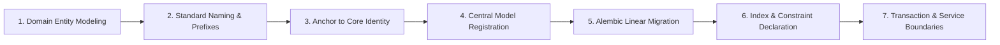

# Future Veda Database Domain Integration Specification & Template
**Document Version:** 1.0.0-TEMPLATE  
**Target:** Engineering Teams implementing Rig Veda, Yajur Veda, or Sama Veda

---

## 1. Overview
VYASA operates as a single application modular monolith with **ONE PostgreSQL database** (`vyasa_db`). When introducing a new Veda domain (Rig Veda for Research Knowledge Creation, Yajur Veda for Research Administration, or Sama Veda for Research Recognition), the module must follow this standardized database integration lifecycle to ensure zero architectural drift.

---

## 2. Seven-Step Integration Lifecycle



### Step 1: Domain Entity & Relationship Modeling
- Model domain-specific business entities in `apps/vyasa/backend/app/modules/<veda_name>/models/`.
- Ensure all operational tables adhere strictly to **Third Normal Form (3NF)**.
- Identify any legal or archival documents (e.g. published thesis approval, grant disbursement voucher) that require `_snapshot` columns for immutable historical preservation.

### Step 2: Standard Naming & Domain Prefixing
All tables in the Veda domain must strictly follow ADR-009 and ADR-010:
- **Rig Veda:** Prefix every table with `rig_` (e.g. `rig_synopses`, `rig_supervisors`, `rig_defense_committees`, `rig_publications`).
- **Yajur Veda:** Prefix every table with `yajur_` (e.g. `yajur_grants`, `yajur_projects`, `yajur_disbursements`, `yajur_ethics_reviews`).
- **Sama Veda:** Prefix every table with `sama_` (e.g. `sama_awards`, `sama_citations`, `sama_symposia`, `sama_showcases`).

### Step 3: Anchor to Centralized Core Identity
- **Do NOT** create separate user, credential, session, or applicant tables within the Veda module.
- Anchor all scholar, faculty, and administrator references directly to `app.core.models.user.User` via `users.id`:
  ```python
  from sqlalchemy import ForeignKey
  from sqlalchemy.dialects.postgresql import UUID
  from sqlalchemy.orm import Mapped, mapped_column

  scholar_user_id: Mapped[uuid.UUID] = mapped_column(
      UUID(as_uuid=True),
      ForeignKey("users.id", ondelete="RESTRICT"),
      nullable=False,
      index=True,
      comment="References canonical Core scholar identity"
  )
  ```
- Use `ON DELETE RESTRICT` for any entity representing official academic milestones or institutional records.

### Step 4: Central Model Registration
Register all new SQLAlchemy models in `apps/vyasa/backend/app/core/database.py` (or central metadata import file) so that Alembic detects all tables within the unified declarative `Base.metadata`:
```python
# In app/core/database.py or app/models/__init__.py
from app.modules.rig_veda.models import RigSynopsis, RigSupervisor  # type: ignore
```

### Step 5: Linear Alembic Migration Authoring
- Generate a new migration strictly within `apps/vyasa/backend/alembic/versions/`:
  ```bash
  alembic revision -m "add_rig_veda_synopsis_domain_tables"
  ```
- Ensure `down_revision` points to the immediately preceding unified migration.
- Verify both `upgrade()` and `downgrade()` functions are fully implemented and tested.
- Do NOT run migrations that execute table drops or disruptive DDL on live Core tables.

### Step 6: Index & Constraint Standards
- Define query-driven indexes based on demonstrated query filters, joins, or sorting. Do not index foreign keys universally by default.
- Define explicit composite indexes for high-frequency query filters (e.g. `scholar_user_id` + `status`).
- Use standardized constraint names:
  - PK: `pk_<table_name>`
  - FK: `fk_<table_name>_<column_name>`
  - UQ: `uq_<table_name>_<column_names>`
  - CK: `ck_<table_name>_<rule_name>`

### Step 7: Service Layer Transaction Boundaries
- Encapsulate all multi-table mutations within an atomic `async with session.begin():` block.
- For business status transitions, insert a corresponding immutable transition log record within the same transaction.
- Dispatch user notifications by inserting directly into Core `notifications` table within the same transaction, or staging into an async outbox.

---

## 3. Template Python Model (Rig Veda Example)

```python
import uuid
from datetime import datetime, timezone
from sqlalchemy import (
    CheckConstraint,
    DateTime,
    ForeignKey,
    String,
    Text,
    func,
)
from sqlalchemy.dialects.postgresql import UUID, JSONB
from sqlalchemy.orm import Mapped, mapped_column, relationship

from app.core.database import Base


class RigSynopsis(Base):
    __tablename__ = "rig_synopses"
    __table_args__ = (
        CheckConstraint(
            "status IN ('DRAFT', 'SUBMITTED', 'UNDER_REVIEW', 'APPROVED', 'REJECTED')",
            name="ck_rig_synopses_status",
        ),
    )

    id: Mapped[uuid.UUID] = mapped_column(
        UUID(as_uuid=True),
        primary_key=True,
        default=uuid.uuid4,
    )
    scholar_user_id: Mapped[uuid.UUID] = mapped_column(
        UUID(as_uuid=True),
        ForeignKey("users.id", ondelete="RESTRICT"),
        nullable=False,
        index=True,
    )
    title: Mapped[str] = mapped_column(String(500), nullable=False)
    abstract: Mapped[str] = mapped_column(Text, nullable=False)
    status: Mapped[str] = mapped_column(
        String(32),
        default="DRAFT",
        nullable=False,
        index=True,
    )
    
    # Legally frozen snapshot at approval
    supervisor_name_snapshot: Mapped[str | None] = mapped_column(String(150), nullable=True)
    department_snapshot: Mapped[str | None] = mapped_column(String(150), nullable=True)
    
    metadata_json: Mapped[dict | None] = mapped_column(JSONB, nullable=True)
    created_at: Mapped[datetime] = mapped_column(
        DateTime(timezone=True),
        server_default=func.now(),
        nullable=False,
    )
    updated_at: Mapped[datetime] = mapped_column(
        DateTime(timezone=True),
        server_default=func.now(),
        onupdate=func.now(),
        nullable=False,
    )
```
