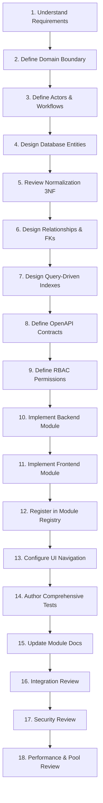

# Future Team Development Guide: Adding a New VYASA Module
**System:** VYASA Modular Monolith Platform  
**Target Audience:** Future Engineering Teams, Maintainers, and University Architects  
**Standard Lifecycle:** 18-Step Engineering Governance Process

---

## Overview
VYASA is a single modular monolith application. When implementing a new governance domain or expanding an existing Veda pillar (Rig Veda, Yajur Veda, Sama Veda, Atharva Veda), follow this mandatory 18-step engineering lifecycle.

---

## The 18-Step Module Lifecycle

### Step 1: Understand Requirements
- Solicit explicit functional and institutional governance rules from university stakeholders (Dean of R&D, Vice Chancellor's office, doctoral committee, research directors).
- Document business problems, regulatory requirements (UGC / NAAC / CSJMU statutes), and success criteria.

### Step 2: Define Domain Boundary
- Categorize the capability under one of the 4 foundational Veda domains:
  - **Rig Veda:** Knowledge discovery, thesis progression, synopsis, research archives.
  - **Yajur Veda:** Grants, incentives, funds, ethics clearances.
  - **Sama Veda:** Citations, metrics, faculty awards, symposiums, public dissemination.
  - **Atharva Veda:** Grievances, dispute resolution, committee voting, legal dossiers.
- Establish strict ownership: what data does this module own, and what Core services does it consume?

### Step 3: Define Actors and Workflows
- Identify all user personas interacting with the module:
  - Scholars / Applicants (`applicant`)
  - Faculty Supervisors / Departmental Evaluators (`authority`)
  - Deans, Associate Deans, Committee Members (`authority`)
  - Institutional System Administrators (`administrator`)
- Diagram workflow state machines (e.g., Draft $\rightarrow$ Submitted $\rightarrow$ Under Review $\rightarrow$ Approved / Rejected $\rightarrow$ Archived).

### Step 4: Design Database Entities
- Draft conceptual ER diagrams.
- Use explicit table namespaces (e.g., `rig_*`, `yajur_*`, `sama_*`, `nivaran_*`).
- All primary keys must be UUIDv4 (`UUID(as_uuid=True)` with server-side `gen_random_uuid()`).
- Use standardized audit timestamps (`created_at`, `updated_at` with timezone `Asia/Kolkata`).

### Step 5: Review Normalization (3NF Baseline)
- Ensure all tables satisfy Third Normal Form (3NF) to eliminate duplicate data and update anomalies.
- Identify legitimate exceptions where point-in-time denormalization is required (e.g., freezing scholar name/department on signed legal dossiers).

### Step 6: Design Relationships & Foreign Keys
- Establish referential integrity to Core tables:
  - Direct foreign keys to `users.id` with `ON DELETE RESTRICT` or `ON DELETE CASCADE`.
- For genuine cross-module linkages, use declarative foreign keys or junction tables. Never use artificial or synthetic cross-module dependencies.

### Step 7: Design Query-Driven Indexes
- Index every foreign key column without exception.
- Add unique constraints on candidate business keys.
- Create composite indexes tailored to high-frequency filter queries (e.g., `(user_id, status, created_at DESC)`).
- Avoid redundant indexes on low-cardinality status columns unless part of a composite index.

### Step 8: Define APIs & OpenAPI Contracts
- Design RESTful endpoints under `/api/modules/<veda-slug>/`.
- Define request and response schemas in Pydantic v2.
- Wrap all responses in the standardized `ApiResponse[T]` envelope with consistent `ApiErrorDetail`.

### Step 9: Define RBAC Permissions
- Register granular permission tokens in format `<veda>:<action>` (e.g., `rig:submit`, `rig:review`, `yajur:disburse`).
- Map default permissions to platform roles (`applicant`, `authority`, `administrator`).
- Implement FastAPI dependency guards using `Depends(get_current_user)`.

### Step 10: Implement Backend Module
- Scaffold directory structure inside `apps/vyasa/backend/app/modules/<module_name>/`:
  - `__init__.py`: Export router.
  - `router.py`: APIRouter definitions.
  - `models/`: SQLAlchemy ORM models.
  - `schemas/`: Pydantic input/output schemas.
  - `services/`: Encapsulated business logic.
  - `dependencies.py`: Dependency injection and authorization checks.
- Register router in `apps/vyasa/backend/app/modules/__init__.py`.
- Author linear Alembic migration in `apps/vyasa/backend/alembic/versions/`.

### Step 11: Implement Frontend Module
- Scaffold directory structure inside `apps/vyasa/frontend/src/modules/<module-slug>/`:
  - `index.ts`: Barrel export.
  - `routes.tsx`: Route elements.
  - `pages/`: Page-level containers.
  - `components/`: Domain widgets using `@vyasa/ui` tokens.
  - `services/`: Typed API client methods.
  - `types/`: TypeScript interfaces.
- Mount routes into `apps/vyasa/frontend/src/App.tsx`.

### Step 12: Register in Module Registry
- Add module descriptor to `DEFAULT_VEDA_MODULES` in `app.core.registry`.
- Configure `module_key`, `name`, `veda_domain`, `version`, `internal_route_prefix`, and required permissions.

### Step 13: Configure Navigation
- Update `VEDA_MODULE_NAV` in `src/core/navigation/index.ts`.
- Link the module into scholar and authority dashboard menus with dynamic visibility based on user roles and enabled state.

### Step 14: Add Tests
- **Backend:** Create unit and integration tests under `apps/vyasa/backend/tests/test_module_<name>.py`. Verify with `pytest`.
- **Frontend:** Create component and routing tests under `src/modules/<module-slug>/__tests__/`. Verify with `npm run test`.
- Verify 100% of existing test suites continue to pass without regressions.

### Step 15: Update Documentation
- Author `README.md` within the module folders (frontend and backend).
- Create a dedicated domain specification document in `docs/vedas/<veda-slug>/README.md` fulfilling all 20 required module documentation criteria.

### Step 16: Perform Integration Review
- Validate end-to-end user workflows from login to data submission, review, approval, and audit logging.
- Verify that module failure does not cascade to unrelated Veda modules.

### Step 17: Perform Security Review
- Verify that all endpoints require authenticated sessions and validate RBAC permissions on the backend.
- Confirm input validation rejects malformed payloads (SQL injection, XSS, parameter tampering).
- Confirm zero secrets or credentials are hardcoded.

### Step 18: Perform Performance & Pool Review
- Review SQLAlchemy query plans (`EXPLAIN ANALYZE`).
- Verify no N+1 query patterns exist (use `selectinload` or `joinedload` appropriately).
- Validate that database sessions are released cleanly back to the connection pool in `finally` blocks.
- Check telemetry through `/api/watchdog/metrics`.
