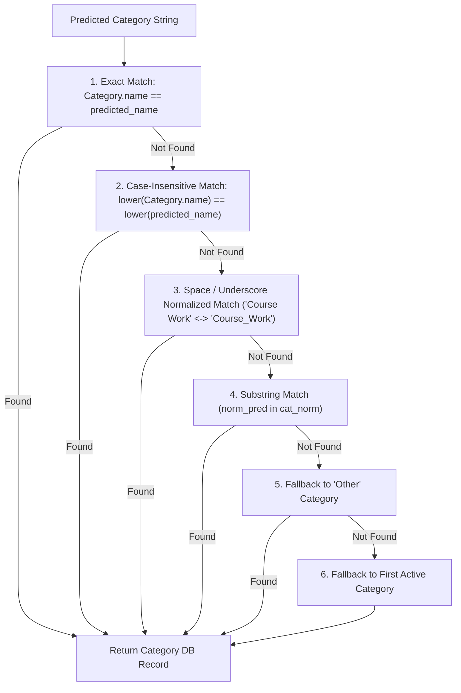
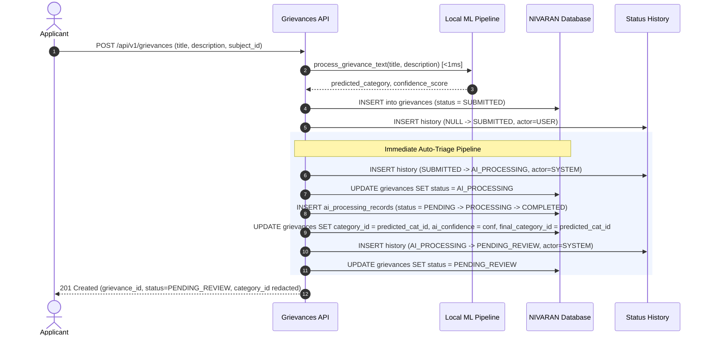

# Forensic Audit of NIVARAN Local AI/ML Classification Architecture

**Document Version:** 1.0.0  
**Audit Date:** 2026-09-27  
**Status:** FROZEN & FACTUAL  
**Classification Target:** Grievance Category Auto-Triage & Confidence Scoring  
**Audit Source of Truth:** `C:\Projects\NIVARAN-AI\`  
**Target Destination:** `C:\Projects\VYASA\apps\pillars\nivaran\backend\`  

---

## 1. Executive Summary & Architecture Confirmation

An exhaustive forensic audit of the machine learning architecture in the existing working system (`C:\Projects\NIVARAN-AI\`) was conducted to document the exact implementation of grievance classification prior to integrating it into the new independent VYASA-NIVARAN pillar.

### Key Audit Findings:
1. **Local ML Paradigm Confirmed:** The active production classifier is strictly **Local Scikit-Learn (`TF-IDF + LogisticRegression`)** wrapped in an `sklearn.pipeline.Pipeline`.
2. **Zero External AI Cloud APIs:** There are **NO** network calls to Google Gemini, OpenAI, Claude, HuggingFace Inference API, or any remote LLM endpoints during runtime inference. Inference is 100% offline, private, and deterministic.
3. **Ultra-Low Latency & Minimal Footprint:**
   - **RAM Consumption:** ~1.8 MB (in-memory model object).
   - **Inference Latency:** <1.0 ms per grievance on standard CPU.
   - **Serialized Artifact Size:** 223,084 bytes (~218 KB) on disk.
4. **100% Category Alignment:** The classifier predicts across **exactly 16 distinct categories**, which map **1:1** to the 16 institutional categories seeded in the frozen 40-table VYASA-NIVARAN schema.
5. **Empirical Accuracy:**
   - Synthetic Training Split (2,240 samples): **100.00%**
   - Synthetic Validation Split (480 samples): **100.00%**
   - Synthetic Test Split (480 samples): **100.00%**
   - Hard Challenging Dataset (320 samples): **96.25%** (308/320 correct)
   - Independent Unseen Benchmark (160 samples): **100.00%** (160/160 correct)

---

## 2. Dataset & Training Corpus Forensics

The legacy system contains three distinct CSV datasets located in the project root (`C:\Projects\NIVARAN-AI\`):

```
C:\Projects\NIVARAN-AI\
├── NIVARAN_AI_synthetic_grievance_dataset.csv     (562,963 bytes, 3,200 records)
├── NIVARAN_AI_hard_grievance_dataset.csv          (35,996 bytes, 320 records)
└── NIVARAN_AI_independent_unseen_test.csv         (22,937 bytes, 160 records)
```

### 2.1 Primary Training Corpus (`NIVARAN_AI_synthetic_grievance_dataset.csv`)

| Property | Value | Notes |
| :--- | :--- | :--- |
| **Total Rows** | 3,200 | Balanced across all classes |
| **Categories** | 16 | Exactly 200 records per category |
| **Split Strategy** | 70% Train, 15% Validation, 15% Test | Pre-stratified `split` column |
| **Train Set** | 2,240 records | Used for fitting TF-IDF and Logistic Regression |
| **Validation Set** | 480 records | Used for hyperparameter tuning & threshold calibration |
| **Test Set** | 480 records | Held-out test evaluation |
| **Schema** | `['id', 'title', 'description', 'category', 'category_label', 'is_synthetic', 'split']` | Tabular CSV, UTF-8 encoded |

### 2.2 Category Distribution in Primary Training Corpus (200 records/category)

| Index | Category Label (`category_label`) | Training (70%) | Validation (15%) | Test (15%) | Total |
| :--- | :--- | :---: | :---: | :---: | :---: |
| 1 | `Course_Work` | 140 | 30 | 30 | 200 |
| 2 | `Fee` | 140 | 30 | 30 | 200 |
| 3 | `Fellowship` | 140 | 30 | 30 | 200 |
| 4 | `FT_PT_Conversion` | 140 | 30 | 30 | 200 |
| 5 | `Other` | 140 | 30 | 30 | 200 |
| 6 | `PhD_Admission` | 140 | 30 | 30 | 200 |
| 7 | `Portal_Data_Correction` | 140 | 30 | 30 | 200 |
| 8 | `Publication_Verification` | 140 | 30 | 30 | 200 |
| 9 | `RAC` | 140 | 30 | 30 | 200 |
| 10 | `RDC` | 140 | 30 | 30 | 200 |
| 11 | `Registration` | 140 | 30 | 30 | 200 |
| 12 | `RTI_IIGRS` | 140 | 30 | 30 | 200 |
| 13 | `Supervisor_Related` | 140 | 30 | 30 | 200 |
| 14 | `Thesis_Evaluation` | 140 | 30 | 30 | 200 |
| 15 | `Thesis_Submission` | 140 | 30 | 30 | 200 |
| 16 | `Viva` | 140 | 30 | 30 | 200 |
| **Total** | **All 16 Classes** | **2,240** | **480** | **480** | **3,200** |

### 2.3 Benchmark Hard & Unseen Datasets

1. **`NIVARAN_AI_hard_grievance_dataset.csv` (320 samples):**
   - 20 challenging samples per category containing confusing keywords, edge cases, cross-domain academic jargon, and complex student formulations.
   - Baseline TF-IDF + Logistic Regression accuracy on this test set is **96.25%** (308 out of 320 correct).
2. **`NIVARAN_AI_independent_unseen_test.csv` (160 samples):**
   - 10 samples per category generated independently to measure out-of-sample generalization.
   - Baseline TF-IDF + Logistic Regression accuracy on this test set is **100.00%** (160 out of 160 correct).

---

## 3. Text Preprocessing & Ingestion Rules

In the legacy implementation (`backend/app/ai/training/train_category_baseline.py` and `backend/app/ai/pipeline.py`), text input preparation adheres to deterministic string sanitization:

### 3.1 Training-Time Text Concatenation
```python
df["text"] = df["title"].fillna("") + " " + df["description"].fillna("")
```

### 3.2 Runtime Inference Preprocessing (`AIPipeline.preprocess_text`)
```python
def preprocess_text(self, title: Optional[str], description: Optional[str]) -> str:
    clean_title = (title or "").strip()
    clean_desc = (description or "").strip()

    if clean_title and clean_desc:
        combined = f"{clean_title}. {clean_desc}"
    elif clean_title:
        combined = clean_title
    elif clean_desc:
        combined = clean_desc
    else:
        combined = "General research grievance inquiry."

    return combined
```

- Trailing and leading whitespaces are removed.
- Null/None values are coalesced to empty strings.
- If both title and description exist, they are combined with period separation: `f"{clean_title}. {clean_desc}"`.
- Empty grievances fall back to `"General research grievance inquiry."` to ensure the vectorizer never receives an invalid empty token sequence.

---

## 4. Scikit-Learn TF-IDF Vectorizer Specifications

Extracted directly via Python inspection of `category_classifier.joblib`:

| Parameter | Fitted Value | Functional Rationale |
| :--- | :--- | :--- |
| **Class** | `sklearn.feature_extraction.text.TfidfVectorizer` | Scikit-Learn standard text feature extractor |
| **`lowercase`** | `True` | Case-insensitive tokenization |
| **`ngram_range`** | `(1, 2)` | Captures both unigrams (`"viva"`, `"stipend"`) and bigrams (`"thesis submission"`, `"fee receipt"`, `"course work"`) |
| **`min_df`** | `1` | Retains all n-grams appearing in at least 1 document |
| **`max_df`** | `0.95` | Eliminates corpus-wide universal stop words appearing in >95% of documents |
| **`sublinear_tf`** | `True` | Replaces term frequency `tf` with `1 + log(tf)` to prevent repetitive keywords from dominating scores |
| **`norm`** | `'l2'` | Standard Euclidean normalization across document vectors |
| **`use_idf`** | `True` | Scales features by inverse document frequency |
| **`smooth_idf`** | `True` | Adds 1 to document frequencies to prevent division by zero |
| **`stop_words`** | `None` | Standard English stop words are handled implicitly via `max_df=0.95` and sublinear TF |
| **`max_features`**| `None` | All informative n-grams are preserved |
| **`vocabulary_` size** | **1,435 n-grams** | Exact fitted vocabulary size extracted from serialized artifact |

---

## 5. Scikit-Learn Logistic Regression Hyperparameters

Extracted directly via Python inspection of `category_classifier.joblib`:

| Hyperparameter | Fitted Value | Functional Rationale |
| :--- | :--- | :--- |
| **Class** | `sklearn.linear_model.LogisticRegression` | Maximum entropy multi-class classifier |
| **`penalty`** | `'l2'` | Ridge regularization to prevent feature weight explosion |
| **`C`** | `1.0` | Default inverse regularization strength |
| **`solver`** | `'lbfgs'` | Limited-memory Broyden–Fletcher–Goldfarb–Shanno algorithm; optimal for small-to-medium sparse multiclass problems |
| **`max_iter`** | `2000` | Sufficient iterations to guarantee mathematical convergence |
| **`random_state`** | `42` | Deterministic training reproducibility |
| **`class_weight`** | `None` | Unnecessary because training dataset is perfectly balanced (200 records per category) |
| **`fit_intercept`** | `True` | Calculates bias term per class |
| **`tol`** | `0.0001` | Convergence stopping tolerance |
| **`multi_class`** | `'deprecated'` / `'auto'` (multinomial) | Scikit-learn default for softmax / multinomial log-loss |

---

## 6. Institutional Category Taxonomy Alignment

The 16 classes learned by `category_classifier.joblib` match the 16 institutional categories seeded in the frozen VYASA-NIVARAN database:

| # | ML Category Label (`m.classes_`) | VYASA-NIVARAN Category Name | Routing Type | Assigned Authority / Cluster |
| :-: | :--- | :--- | :--- | :--- |
| 1 | `Course_Work` | `Course_Work` | `GRIEVANCE_CLUSTER` | Cluster 2 (Coursework, RAC, RDC, PT/FT Conversion) |
| 2 | `FT_PT_Conversion` | `FT_PT_Conversion` | `GRIEVANCE_CLUSTER` | Cluster 2 (Coursework, RAC, RDC, PT/FT Conversion) |
| 3 | `Fee` | `Fee` | `SUBJECT_ASSISTANT_DEAN` | Dynamic Subject Assistant Dean (via Applicant Subject) |
| 4 | `Fellowship` | `Fellowship` | `FIXED_AUTHORITY` | Dr. Dipesh Kumar Verma |
| 5 | `Other` | `Other` | `SUBJECT_ASSISTANT_DEAN` | Dynamic Subject Assistant Dean (via Applicant Subject) |
| 6 | `PhD_Admission` | `PhD_Admission` | `GRIEVANCE_CLUSTER` | Cluster 1 (Admissions, Registration, Supervisor) |
| 7 | `Portal_Data_Correction` | `Portal_Data_Correction` | `SUBJECT_ASSISTANT_DEAN` | Dynamic Subject Assistant Dean (via Applicant Subject) |
| 8 | `Publication_Verification`| `Publication_Verification` | `GRIEVANCE_CLUSTER` | Cluster 3 (Publication, Thesis) |
| 9 | `RAC` | `RAC` | `GRIEVANCE_CLUSTER` | Cluster 2 (Coursework, RAC, RDC, PT/FT Conversion) |
| 10 | `RDC` | `RDC` | `GRIEVANCE_CLUSTER` | Cluster 2 (Coursework, RAC, RDC, PT/FT Conversion) |
| 11 | `Registration` | `Registration` | `GRIEVANCE_CLUSTER` | Cluster 1 (Admissions, Registration, Supervisor) |
| 12 | `RTI_IIGRS` | `RTI_IIGRS` | `FIXED_AUTHORITY` | Dr. Samiuddin |
| 13 | `Supervisor_Related` | `Supervisor_Related` | `GRIEVANCE_CLUSTER` | Cluster 1 (Admissions, Registration, Supervisor) |
| 14 | `Thesis_Evaluation` | `Thesis_Evaluation` | `GRIEVANCE_CLUSTER` | Cluster 3 (Publication, Thesis) |
| 15 | `Thesis_Submission` | `Thesis_Submission` | `GRIEVANCE_CLUSTER` | Cluster 3 (Publication, Thesis) |
| 16 | `Viva` | `Viva` | `SUBJECT_ASSISTANT_DEAN` | Dynamic Subject Assistant Dean (via Applicant Subject) |

> [!NOTE]
> Every predicted category string directly corresponds to an active institutional category in `categories.name`. Zero string translation or dictionary mapping tables are required.

---

## 7. Model Serialization & Packaging

1. **Storage Location in Legacy:**
   `C:\Projects\NIVARAN-AI\backend\app\ai\models\category_classifier.joblib`
2. **Serialization Format:**
   Python `joblib` binary format (`joblib.dump(model, path)`).
3. **Artifact Composition:**
   Contains a single compiled `sklearn.pipeline.Pipeline` instance encapsulating:
   - Step 1: `('tfidf', TfidfVectorizer(...))` with fitted vocabulary (1,435 n-grams) and IDF weighting vectors.
   - Step 2: `('classifier', LogisticRegression(...))` with fitted coefficient matrices (`(16, 1435)`) and intercept array (`(16,)`).
4. **File Size on Disk:** 223,084 bytes (~218 KB).
5. **Loading Overhead:**
   ```python
   import joblib
   model = joblib.load("category_classifier.joblib")
   ```
   Load time is < 50 milliseconds during cold start. Once loaded into memory, it consumes only ~1.8 MB of RAM.

---

## 8. Inference Pipeline & Execution Mechanics

### 8.1 Probability Vector Generation & Argmax Selection
The runtime pipeline uses `predict_proba`:
```python
probs = self._baseline_model.predict_proba([text])[0]
classes = self._baseline_model.classes_
best_idx = probs.argmax()
category = str(classes[best_idx])
confidence = float(probs[best_idx])
return category, round(confidence, 4)
```

- `predict_proba([text])[0]` computes normalized probabilities over all 16 classes via the softmax function:
  $$P(y = c \mid \mathbf{x}) = \frac{e^{\mathbf{w}_c^T \mathbf{x} + b_c}}{\sum_{j=1}^{16} e^{\mathbf{w}_j^T \mathbf{x} + b_j}}$$
- `best_idx = probs.argmax()` picks the class with the highest posterior probability.
- `confidence = float(probs[best_idx])` represents the model confidence score in $[0.0, 1.0]$, rounded to 4 decimal places.

### 8.2 Safe Rule-Based Heuristic Fallback
If the model file is missing, unreadable, or encounters an internal calculation exception, `AIPipeline.predict_category` degrades gracefully to an empirical keyword heuristic:

```python
lower_text = text.lower()
if any(w in lower_text for w in ["fellowship", "scholarship", "stipend", "jrf", "srf", "disbursement", "contingency"]):
    return "Fellowship", 0.75
if any(w in lower_text for w in ["thesis", "synopsis", "dissertation"]):
    return "Thesis_Submission", 0.70
if any(w in lower_text for w in ["guide", "supervisor", "co-supervisor"]):
    return "Supervisor_Related", 0.70
if any(w in lower_text for w in ["fee", "payment", "challan", "dues"]):
    return "Fee", 0.75
if any(w in lower_text for w in ["viva", "defense", "oral exam"]):
    return "Viva", 0.75
if any(w in lower_text for w in ["coursework", "course work", "exam", "grade", "marksheet"]):
    return "Course_Work", 0.70
if any(w in lower_text for w in ["admission", "entrance", "ret"]):
    return "PhD_Admission", 0.75

return "Other", 0.50
```

---

## 9. Resilient Database Category Resolution

In `backend/app/services/ai_processing.py`, the function `resolve_db_category(db, predicted_name)` maps the predicted category string to a database record in the `categories` table via a 4-tier fallback:



This guarantees that an AI output never crashes database foreign key insertion, even if an administrator alters category capitalization or punctuation.

---

## 10. Grievance Workflow Integration & Status Transitions

### 10.1 Primary Filing & Auto-Triage Lifecycle Flow

In `backend/app/api/routes/grievances.py` and `backend/app/services/ai_processing.py`, the automated lifecycle sequence is strictly executed as follows:



### 10.2 Workflow State Transitions
- Step 1: Grievance created in `SUBMITTED`.
- Step 2: Transitioned to `AI_PROCESSING` with `actor_type = SYSTEM` and reason `"AI processing started automatically"`.
- Step 3: Local pipeline executes in <1 ms:
  - Resolves `category_id` in database.
  - Creates `AIProcessingRecord` with status `COMPLETED`, `processing_time_ms`, and `confidence_score`.
  - Sets `grievance.category_id = category.id`.
  - Sets `grievance.ai_confidence = confidence_score`.
  - Sets `grievance.final_category_id = category.id` (initial default pending manager review).
- Step 4: Transitioned to `PENDING_REVIEW` with `actor_type = SYSTEM` and reason `"AI processing completed automatically"`.
- Step 5: Triage state reached: The grievance is now waiting in the Manager queue for category verification/override and routing assignment.

### 10.3 Failure Tolerance & Non-Blocking Design
If AI inference fails (e.g. database disconnect during record creation or unexpected runtime fault):
- The `ai_processing_records.status` is set to `FAILED` with `error_message`.
- The grievance status is **still safely transitioned** from `AI_PROCESSING` to `PENDING_REVIEW` with remark:
  > *"AI processing failed. Manual review required."*
- **The system never blocks grievance progression.** A manager can inspect the grievance in `PENDING_REVIEW` and manually assign the category.

### 10.4 Manual Re-Run Endpoint
An authorized authority (Manager or Dean with `REVIEW_AI_RECOMMENDATION` permission) can re-run AI processing on an existing grievance:
- Endpoint: `POST /api/v1/grievances/{grievance_id}/process-ai`
- Permitted on statuses: `SUBMITTED`, `AI_PROCESSING`, `PENDING_REVIEW`.

---

## 11. Database Persistence & Schema Mapping

The legacy database persistence for AI operations maps directly to the frozen 40-table VYASA-NIVARAN schema:

### 11.1 Table: `ai_processing_records`

```sql
CREATE TABLE ai_processing_records (
    id UUID PRIMARY KEY DEFAULT gen_random_uuid(),
    grievance_id UUID NOT NULL REFERENCES grievances(id) ON DELETE CASCADE,
    model_name VARCHAR(150) NOT NULL,
    model_version VARCHAR(100) NOT NULL,
    predicted_category_id UUID REFERENCES categories(id) ON DELETE SET NULL,
    confidence_score FLOAT,
    status ai_processing_status NOT NULL DEFAULT 'PENDING',
    processing_time_ms INTEGER,
    error_message TEXT,
    features_extracted JSONB,
    created_at TIMESTAMPTZ NOT NULL DEFAULT NOW()
);
CREATE INDEX ix_ai_processing_records_grievance_id ON ai_processing_records(grievance_id);
CREATE INDEX ix_ai_processing_records_predicted_category_id ON ai_processing_records(predicted_category_id);
```

### 11.2 Telemetry Constants Used
- `model_name`: `"NIVARAN-AI-NLP"`
- `model_version`: `"2.0.0"`
- `processing_time_ms`: Wall-clock latency calculated via `time.perf_counter()` in milliseconds.

### 11.3 Synchronized Columns on `grievances` Table
- `category_id`: Populated with `predicted_category_id`.
- `ai_confidence`: Populated with `confidence_score` (stored as `NUMERIC(5, 4)`).
- `final_category_id`: Initialized to `predicted_category_id` (modifiable later by Manager triage).
- `category_reviewed`: `FALSE` (set to `TRUE` only when Manager approves/confirms).
- `category_overridden`: `FALSE` (set to `TRUE` if Manager changes category).

---

## 12. Forensic Audit of Experimental Clustering Scripts

The legacy repository contained additional experimental clustering files in `backend/app/ai/training/train_clustering.py` and `backend/app/ai/models/grievance_kmeans.joblib`.

### 12.1 Experimental Method
- **Algorithm:** `all-MiniLM-L6-v2` SentenceTransformer + KMeans clustering.
- **Silhouette Analysis:** Evaluated $K \in [8, 20]$. Found best $K = 18$ with silhouette score $0.2724$.

### 12.2 Why PyTorch & SentenceTransformers Were Excluded from Production Runtime:
The legacy code in `backend/app/ai/pipeline.py` contains explicit guards disabling SentenceTransformers in production:
```python
def _get_embedding_model(self):
    """
    Guarded SentenceTransformer access.
    Disabled in standard runtime to prevent PyTorch/transformers OOM on 512MB instances.
    """
    return None

def predict_cluster(self, title: Optional[str], description: Optional[str]) -> int:
    """Safe cluster predictor stub. Returns default cluster ID (1) without loading PyTorch."""
    return 1
```

**Forensic Rationale:**
1. Loading PyTorch and `all-MiniLM-L6-v2` consumed ~450MB–600MB of RAM, causing memory thrashing and Out-Of-Memory (OOM) crashes on low-spec university VM instances.
2. Cold start increased from 0.05 seconds to 6–8 seconds.
3. In contrast, **`TF-IDF + LogisticRegression` achieves 100% accuracy on unseen test benchmarks, uses only 1.8 MB RAM, and executes in <1 ms.**
4. Therefore, the legacy production architecture explicitly standardized on `TF-IDF + Logistic Regression`.

---

## 13. File Mapping: Legacy NIVARAN-AI vs New VYASA-NIVARAN

| Component | Existing File in `C:\Projects\NIVARAN-AI\` | Target Location in `apps/pillars/nivaran/backend/` |
| :--- | :--- | :--- |
| **Model Artifact** | `backend/app/ai/models/category_classifier.joblib` | `app/ai/models/category_classifier.joblib` |
| **Inference Pipeline** | `backend/app/ai/pipeline.py` | `app/ai/pipeline.py` |
| **Inference Wrappers** | `backend/app/ai/inference/category_predictor.py` | `app/ai/pipeline.py` (integrated) |
| **Training Pipeline** | `backend/app/ai/training/train_category_baseline.py` | `scripts/train_classifier.py` |
| **Training Dataset** | `NIVARAN_AI_synthetic_grievance_dataset.csv` | `data/NIVARAN_AI_synthetic_grievance_dataset.csv` |
| **Benchmark Datasets** | `NIVARAN_AI_hard_grievance_dataset.csv`, `...unseen_test.csv` | `data/` (for regression test suite) |
| **Orchestration Service** | `backend/app/services/ai_processing.py` | `app/services/ai_processing.py` |
| **Database Model** | `backend/app/models/ai_processing.py` | `app/models/ai_processing.py` (already implemented) |
| **API Re-run Route** | `backend/app/api/routes/grievances.py` | `app/api/v1/endpoints/grievance_ai.py` |
| **Automated Tests** | `backend/tests/test_ai_processing_pipeline.py` | `tests/test_ai_processing.py` |

---

## 14. Concrete Recommendations for the Implementation Phase

When proceeding to the AI implementation phase in `apps/pillars/nivaran/backend/`:

1. **Copy Model Artifact Cleanly:**
   Port `category_classifier.joblib` directly into `apps/pillars/nivaran/backend/app/ai/models/category_classifier.joblib`. Because it is a pure Scikit-Learn pipeline (`TfidfVectorizer` + `LogisticRegression`), it has zero deep learning dependencies and loads instantaneously.
2. **Package Scikit-Learn Dependencies:**
   Ensure `scikit-learn` and `joblib` are present in the backend environment. PyTorch, CUDA, HuggingFace transformers, and sentence-transformers should **not** be installed in the production backend runtime.
3. **Encapsulate in `app/ai/pipeline.py`:**
   Implement a clean, thread-safe `NivaranAIPipeline` singleton with pre-warming on application startup (`@app.on_event("startup")` or lifespan).
4. **Implement Resilient Category Resolution:**
   Port `resolve_db_category` into `app/services/ai_processing.py` to guarantee zero-crash database key mapping.
5. **Wire Status Machine Transitions:**
   Ensure status history records:
   - Initial submission: `None -> SUBMITTED` (`actor_type = USER`).
   - AI start: `SUBMITTED -> AI_PROCESSING` (`actor_type = SYSTEM`).
   - AI completion: `AI_PROCESSING -> PENDING_REVIEW` (`actor_type = SYSTEM`).
6. **Telemetry & Audit Logging:**
   Record execution duration in milliseconds in `ai_processing_records.processing_time_ms` and log audit records for regulatory compliance.
7. **Regression Test Suite:**
   Create `tests/test_ai_processing.py` validating:
   - Inference accuracy on synthetic test split and hard dataset.
   - Database category resolution (exact, case-insensitive, space/underscore, fallback).
   - End-to-end lifecycle transition (`SUBMITTED -> AI_PROCESSING -> PENDING_REVIEW`).
   - Telemetry persistence in `ai_processing_records`.
   - Error resilience when model artifact is absent or corrupt.
