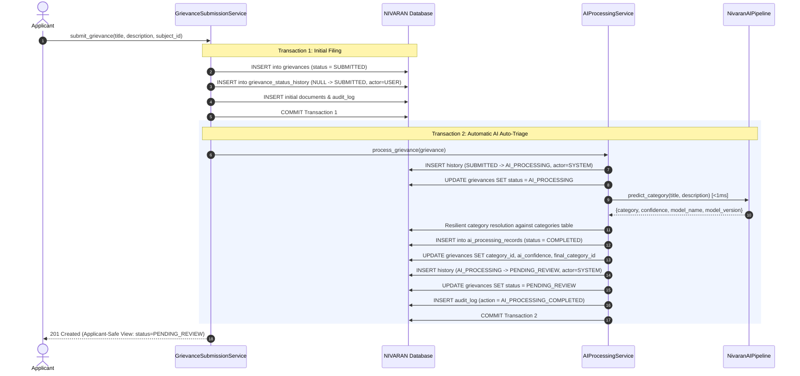

# NIVARAN Pillar AI Processing Integration

**Document Version:** 1.0.0  
**Status:** IMPLEMENTED & VERIFIED  
**Phase:** AI Processing Integration & Triage Hand-Off  
**Target Services:** `app/services/ai_processing.py`, `app/services/grievance_submission.py`  
**Execution Environment:** 100% Local Scikit-Learn (CPU, <1 ms Latency, ~1.8 MB RAM)  

---

## 1. Architectural Principles

> **AI provides a category recommendation. Manager review is mandatory. Manager Accept/Override is NOT implemented in this phase. Routing is NOT implemented in this phase.**

The AI processing layer operates purely as a local, non-blocking categorization advisor. It runs deterministically using the pre-trained local Scikit-Learn pipeline (`TfidfVectorizer` + `LogisticRegression`), requires zero cloud AI APIs, and transitions all grievances safely into `PENDING_REVIEW` for mandatory human administrative triage.

---

## 2. Grievance Intake & Automatic AI Invocation Flow

### 2.1 Transactional Boundary Separation
1. **Transaction 1 (Initial Filing):** The grievance is created in `SUBMITTED` status, records its initial history entry (`previous_status=None, new_status=SUBMITTED, actor=USER`), links attachments, records `GRIEVANCE_SUBMITTED` in audit log, and commits atomically.
2. **Transaction 2 (AI Auto-Triage):** `AIProcessingService.process_grievance` is invoked immediately after the grievance is committed. It advances status through `AI_PROCESSING` to `PENDING_REVIEW`, records `ai_processing_records`, sets grievance categorization fields, records audit logs, and commits.
3. If an unexpected runtime error occurs during AI processing, Transaction 1 remains intact. The grievance is never deleted and is transitioned to `PENDING_REVIEW` for manual administrative resolution.

---

## 3. Resilient Database Category Resolution

The local classifier predicts one of the 16 institutional category strings. The service maps this string to a primary key in the `categories` table via `AIProcessingService.resolve_db_category(db, predicted_name)`:

1. **Tier 1 (Exact Match):** `Category.name == predicted_name` and `is_active == True`.
2. **Tier 2 (Case-Insensitive Match):** `lower(Category.name) == lower(predicted_name)`.
3. **Tier 3 (Normalized Match):** Spaces and underscores are normalized (e.g. `"Course Work"` <-> `"Course_Work"`).
4. **Tier 4 (Safe Failure):** If no matching category is found, returns `None`.
   - **No Fabrication:** The system **never** creates a synthetic category in the database and **never** fabricates a guess.
   - If `resolve_db_category` returns `None`, AI processing is marked `FAILED` and sent to manual triage.

---

## 4. Database Persistence & Grievance Field Updates

### 4.1 Telemetry in `ai_processing_records`
On successful prediction:
- `grievance_id`: UUID foreign key to `grievances.id`.
- `model_name`: `"NIVARAN-AI-NLP"`.
- `model_version`: `"2.0.0"`.
- `predicted_category_id`: Foreign key to resolved `categories.id`.
- `confidence_score`: Float between `0.0` and `1.0` (rounded to 4 decimal places).
- `status`: `AIProcessingStatus.COMPLETED`.
- `processing_time_ms`: Wall-clock duration in milliseconds measured via `time.perf_counter()`.
- `error_message`: `None`.
- `created_at`: UTC timestamp.

### 4.2 Synchronization with `grievances` Table
- `grievance.category_id`: Populated with `predicted_category_id`.
- `grievance.ai_confidence`: Populated with `confidence_score`.
- `grievance.final_category_id`: Initialized to `predicted_category_id` (indicates the current AI recommendation pending human review).
- `grievance.category_reviewed`: Set to `False`.
- `grievance.category_overridden`: Set to `False`.
- `grievance.status`: Set to `GrievanceStatus.PENDING_REVIEW`.

---

## 5. Failure Handling & Non-Blocking Resilience

If any AI operation fails (inference exception, unresolvable category, or model fault):
1. **`AIProcessingRecord` Creation:** A record is inserted with:
   - `status = AIProcessingStatus.FAILED`.
   - `predicted_category_id = None`.
   - `confidence_score = None`.
   - `error_message`: Controlled single-line failure description (no raw stack traces).
2. **Grievance State:**
   - `grievance.category_id = None`.
   - `grievance.ai_confidence = None`.
   - `grievance.final_category_id = None`.
   - `grievance.category_reviewed = False`.
   - `grievance.category_overridden = False`.
   - `grievance.status = GrievanceStatus.PENDING_REVIEW`.
3. **Status History:**
   - `previous_status = GrievanceStatus.AI_PROCESSING`.
   - `new_status = GrievanceStatus.PENDING_REVIEW`.
   - `actor_type = HistoryActorType.SYSTEM`.
   - `remarks = "AI processing failed. Manual review required."`.
4. **Audit Trail:** An audit log entry is recorded with action `AI_PROCESSING_FAILED`.
5. **No Blockers:** The grievance is safely awaiting review in the Manager intake queue.

---

## 6. Applicant Visibility & Information Hiding

The applicant API response (`ApplicantGrievanceResponse`) enforces strict information boundaries:
- **Exposed to Applicant:**
  - `grievance_id`, `title`, `description`, `subject_name`, `subject_cluster_name`, `status` (`PENDING_REVIEW`), `priority`, `submitted_at`, `documents`, `status_history`.
- **Strictly Redacted from Applicant:**
  - `model_name`, `model_version`, `ai_confidence`, `category_id`, `final_category_id`, `processing_time_ms`, internal audit logs, internal comments, and error details.

---

## 7. Deferred Workflow Boundaries

The following workflow responsibilities are deliberately deferred to subsequent phases:
- **Manager Triage & Review:** Reviewing the AI recommendation, confirming or overriding the category.
- **Routing Engine:** Routing to Assistant Deans, Associate Deans, or fixed authorities based on category routing type (`GRIEVANCE_CLUSTER`, `SUBJECT_ASSISTANT_DEAN`, `FIXED_AUTHORITY`).
- **Manual AI Re-Processing Endpoint:** (`POST /api/v1/grievances/{id}/process-ai`) will be added alongside Manager/Dean authority permission enforcement.
