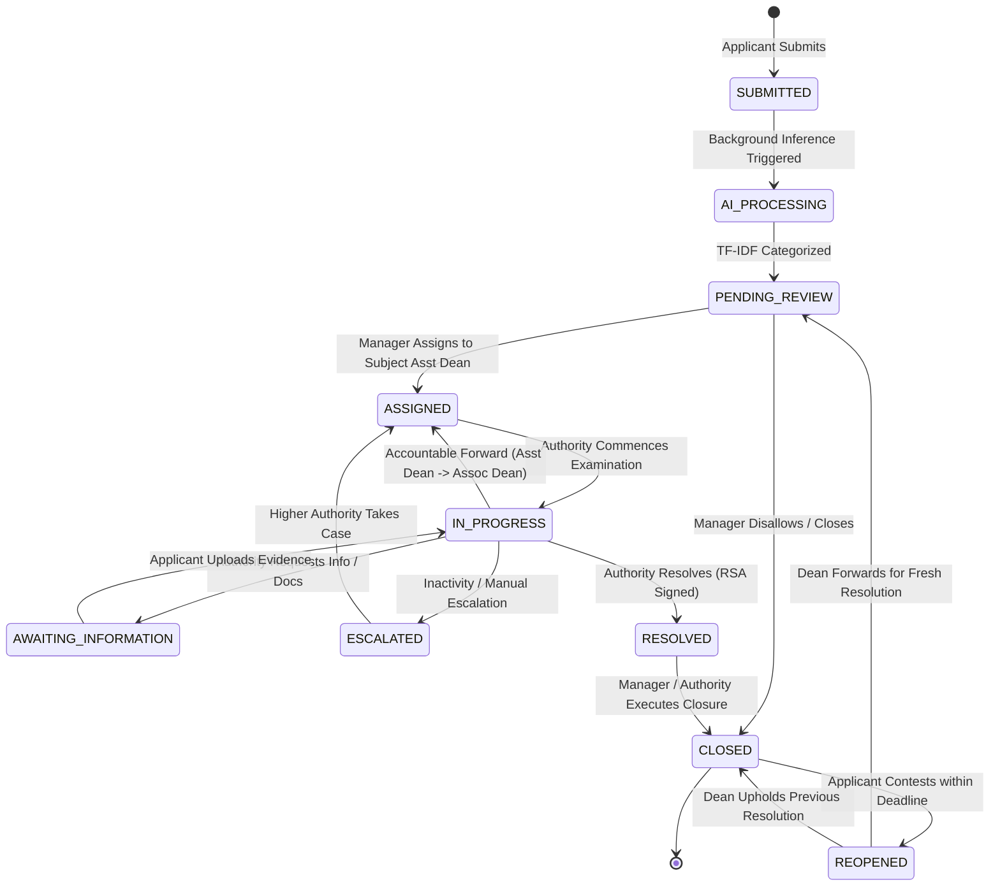

# VYASA-NIVARAN Pillar: Database Architecture Specification
**Document Version:** 1.0.0-DESIGN  
**Pillar Identity:** NIVARAN (Institutional Grievance Redressal & Cryptographic Dossier System)  
**Parent Ecosystem:** VYASA (Chhatrapati Shahu Ji Maharaj University, Kanpur)  
**Design Status:** APPROVED ARCHITECTURAL SPECIFICATION (Design Only — Ready for Next Phase Implementation)

---

## 1. Architecture Overview

NIVARAN is an institutional-grade, AI-assisted grievance redressal and cryptographic case management pillar within the VYASA ecosystem. It automates and enforces the administrative governance framework of **Chhatrapati Shahu Ji Maharaj University (CSJMU), Kanpur**.

### Core Tenets
1. **Decoupled Pillar Architecture:** NIVARAN operates with its own dedicated relational database (`vyasa_nivaran_db`). It owns all grievance domain logic, academic hierarchy mappings, committee deliberative voting, cryptographic signatures, and e-file assembly.
2. **Platform Identity Consumption:** NIVARAN does **not** duplicate identity, login credentials, passwords, session tokens, or authentication infrastructure. It consumes verified identities from VYASA Core via immutable UUID references (`vyasa_user_id`).
3. **Deterministic Authority Routing:** Two-level hierarchical triage:
   - **Level 1 (Subject Assistant Dean):** Determined strictly by the grievance's academic `subject_id` $\rightarrow$ `subject_cluster_id` (1 of 10 Subject Clusters).
   - **Level 2 (Grievance Associate Dean or Fixed Authority):** Determined by the grievance's `category_id` routing type (`GRIEVANCE_CLUSTER` with 3 clusters, `SUBJECT_ASSISTANT_DEAN` as terminal, or `FIXED_AUTHORITY`).
4. **Accountable Administrative Forwarding:** Prohibits casual "pass-the-buck" routing by mandating 6 verification checkboxes and 3 structured justification narratives.
5. **Cryptographic Dossier Archival:** Critical closures require RSA-3072 / PSS digital signatures with single-use TOTP challenge-response verification, permanently bound into 15-section immutable ReportLab PDF E-Files.

```mermaid
flowchart TD
    subgraph Core["VYASA Core Platform"]
        CoreUsers[VYASA Users & Identity]
        CoreAuth[VYASA Auth / JWT / Sessions]
        CoreNotif[Platform Notification Engine]
        CoreRegistry[Pillar Registry Contract]
    end

    subgraph Nivaran["NIVARAN Domain Database (vyasa_nivaran_db)"]
        AuthMap[NIVARAN Authority Mappings]
        SubClusters[10 Subject Clusters & 55 Subjects]
        GrvClusters[3 Grievance Clusters & Categories]
        GrvCore[Grievances & 10-State Machine]
        Routing[Accountable Routing & Forwarding]
        Committees[Special Committee Subsystem & Polls]
        Approvals[Hierarchical Approval Actions]
        DeanReview[Dean Reopen Adjudication]
        EFiles[E-Files & Cryptographic Signatures]
        Outbox[Notification Event Outbox]
    end

    CoreUsers -.->|vyasa_user_id (UUID)| AuthMap
    CoreUsers -.->|vyasa_user_id (UUID)| GrvCore
    CoreRegistry --- Nivaran
    Outbox -.->|Transactional Event Dispatch| CoreNotif
```

---

## 2. VYASA Core ↔ NIVARAN DB Boundary

To preserve platform modularity, data ownership is segregated into two strict non-overlapping domains:

| Architectural Domain | VYASA Core Database | NIVARAN Database |
| :--- | :--- | :--- |
| **User Identity & Profiles** | **Owner** (`users`, `email`, names, phone, generic roles) | **Consumer** (`vyasa_user_id`, local name/email snapshots for audit) |
| **Authentication & Tokens** | **Owner** (passwords, JWT, sessions, password reset) | **Forbidden** (Never stores hashes, login tokens, or reset tables) |
| **Multi-Factor Auth (TOTP)** | **Owner** (TOTP secrets, QR provisioning) | **Consumer** (Verifies TOTP through Core during Step-Up challenges) |
| **Pillar Registration** | **Owner** (`pillar_registry`, service endpoint metadata) | **Consumer** (Consumes contract routes) |
| **Platform Notifications** | **Owner** (`notifications` table & centralized push) | **Emitter** (`grievance_notification_outbox` event table) |
| **Grievance Lifecycle** | **None** (Zero domain knowledge) | **Owner** (`grievances`, state machine, priority, tracking IDs) |
| **Authority Structure** | **Generic** (`administrator`, `authority`, `applicant`) | **Owner** (`MANAGER`, `ASSISTANT_DEAN`, `ASSOCIATE_DEAN`, `DEAN`, `GUEST_MEMBER`) |
| **Academic Clustering** | **None** | **Owner** (10 Subject Clusters, 55 Subjects, 3 Grievance Clusters) |
| **Routing & Forwarding** | **None** | **Owner** (6 checkboxes, 3 text fields, assignments, escalations) |
| **Committee Governance** | **None** | **Owner** (Charters, live messaging, multi-policy voting, decisions) |
| **Legal & Cryptographic Archival** | **None** | **Owner** (RSA-3072 signatures, signing challenges, ReportLab E-Files) |
| **Student Domain Records** | **None** | **Owner** (`student_master_records` academic snapshots) |

---

## 3. Identity Mapping Strategy

### 3.1 Principle: Separation of Identity from Role Authority
In VYASA Core, an individual is simply an authenticated user with generic platform roles (`applicant`, `authority`, `administrator`).  
In NIVARAN, that user may carry specific administrative jurisdiction, departmental authority, or cluster responsibilities.

### 3.2 Design: `nivaran_authorities` Mapping Entity
NIVARAN defines a clean domain mapping table `nivaran_authorities`:
- Every authority is keyed to `vyasa_user_id` (a UUID reference matching VYASA Core `users.id`).
- Maintains local snapshots (`name_snapshot`, `email_snapshot`, `department`) to allow offline dossier compilation and audit generation without synchronous Core lookups.
- Enforces strict institutional role constraints via the `NivaranRole` enum.
- Maps 1:1 to Subject Clusters (Assistant Dean) or Grievance Clusters (Associate Dean).

```mermaid
classDiagram
    class VyasaUser {
        <<VYASA Core DB>>
        UUID id
        string email
        string first_name
        string last_name
        string role
    }

    class NivaranAuthority {
        <<NIVARAN DB>>
        UUID id
        UUID vyasa_user_id
        NivaranRole role
        string department
        string designation
        boolean is_active
    }

    class SubjectCluster {
        <<NIVARAN DB>>
        UUID id
        int cluster_number [1..10]
        string name
        UUID assistant_dean_id
    }

    class GrievanceCluster {
        <<NIVARAN DB>>
        UUID id
        int cluster_number [1..3]
        string name
        UUID associate_dean_id
    }

    VyasaUser ..> NivaranAuthority : vyasa_user_id
    NivaranAuthority "1" -- "1" SubjectCluster : assistant_dean_id (1:1)
    NivaranAuthority "1" -- "1" GrievanceCluster : associate_dean_id (1:1)
```

---

## 4. Complete Entity List (27 Tables)

The NIVARAN database architecture consists of 27 tables organized into 8 functional domains:

### Domain 1: Authority & Academic Hierarchy (5 Tables)
1. `nivaran_authorities` — Authority profiles binding VYASA users to NIVARAN roles.
2. `subject_clusters` — 10 administrative subject clusters headed by Assistant Deans.
3. `subjects` — 55 university academic subjects linked to subject clusters.
4. `grievance_clusters` — 3 senior grievance clusters headed by Associate Deans.
5. `categories` — Grievance categories with tri-state routing configuration.

### Domain 2: Grievance Case Management (5 Tables)
6. `student_master_records` — Student academic profile and historical affiliation snapshots.
7. `grievances` — Central case management entity governing tracking, category, and state.
8. `grievance_status_history` — Immutable state transition logs with actor attribution.
9. `comments` — Internal administrative notes and official public case comments.
10. `grievance_feedback` — Post-resolution applicant ratings (1-5 scales) and feedback.

### Domain 3: Routing, Assignment & Accountability (3 Tables)
11. `assignments` — Active and historical authority assignments for grievances.
12. `forwarding_confirmations` — 6-checkbox and 3-justification accountable forwarding records.
13. `escalations` — Formal hierarchical grievance escalations and reason logs.

### Domain 4: Document Management & Clarifications (2 Tables)
14. `documents` — Grievance document attachments, versioning, storage keys, and SHA-256 hashes.
15. `document_requests` — Formal administrative requests for applicant documentation.

### Domain 5: Committee Deliberation & Voting Subsystem (8 Tables)
16. `committee_creation_requests` — Formal requests from managers/authorities to charter a committee.
17. `grievance_committees` — Special inquiry and standing committees.
18. `committee_members` — Member rosters (Chairperson, Member, Observer) with guest scoping.
19. `committee_member_recommendations` — Individual member evaluations and recommendations.
20. `committee_final_recommendations` — Consolidated chairperson final committee report.
21. `committee_messages` — Real-time deliberation logs captured during inquiry sessions.
22. `committee_polls` — Formal multi-policy voting sessions (Simple Majority, Two-Thirds, Unanimous).
23. `committee_poll_options` — Configurable ballot choices for committee polls.
24. `committee_poll_voters` — Roll-call voter eligibility and participation tracking.
25. `committee_poll_votes` — Cast ballots with optional comments and IP auditing.
26. `committee_decision_records` — Sealed, immutable voting decisions bound to grievances.
27. `committee_meetings` — Hybrid/virtual hearing schedules with Google Meet integration.
28. `committee_meeting_participants` — Attendance and participant rosters for hearings.

### Domain 6: Dispute Arbitration (1 Table)
29. `dean_reopen_reviews` — Formal Dean adjudication of applicant-contested reopenings.

### Domain 7: Cryptographic Signing & E-File Dossiers (5 Tables)
30. `signing_key_versions` — Asymmetric RSA-3072 public key registry and status tracking.
31. `signing_authorization_challenges` — Single-use 5-minute TOTP challenges bound to payload hashes.
32. `digital_signatures` — Immutable RSA-PSS-SHA256 mathematical signature records.
33. `efiles` — Master administrative dossier snapshots (JSONB) and compiled ReportLab PDFs.
34. `efile_documents` — Versioned document attachments sealed within the E-File dossier.
35. `approval_requests` — Structured authority approval requests and revision tracking.
36. `approval_actions` — Step-by-step approval/rejection actions and decision contexts.

### Domain 8: Platform Eventing, AI & Auditing (4 Tables)
37. `ai_processing_records` — Machine learning inference logs, category predictions, and latency.
38. `grievance_notification_outbox` — Transactional event queue dispatched to VYASA Core.
39. `audit_logs` — System-wide operational security and data-access audit trail.
40. `clusters` — Semantic/ML clustering models, algorithm metadata, and semantic cluster assignments.

---

## 5. ER-Style Relationship Description

```mermaid
erDiagram
    nivaran_authorities ||--o| subject_clusters : heads_as_assistant_dean
    nivaran_authorities ||--o| grievance_clusters : heads_as_associate_dean
    nivaran_authorities ||--o{ categories : fixed_authority_for
    nivaran_authorities ||--o{ assignments : assigned_to
    nivaran_authorities ||--o{ assignments : assigned_by
    nivaran_authorities ||--o{ forwarding_confirmations : confirms
    nivaran_authorities ||--o{ committee_members : serves_on
    nivaran_authorities ||--o{ digital_signatures : signs

    subject_clusters ||--o{ subjects : contains
    subjects ||--o{ grievances : classifies

    grievance_clusters ||--o{ categories : groups
    categories ||--o{ grievances : categorizes_primary
    categories ||--o{ grievances : categorizes_final

    student_master_records ||--o{ grievances : profile_of
    student_master_records ||--o{ efiles : attached_to

    grievances ||--o{ assignments : receives
    grievances ||--o{ forwarding_confirmations : forwarded_via
    grievances ||--o{ escalations : subject_to
    grievances ||--o{ grievance_status_history : tracks
    grievances ||--o{ comments : annotates
    grievances ||--o{ documents : includes
    grievances ||--o{ document_requests : requires
    grievances ||--o{ grievance_committees : referred_to
    grievances ||--o{ approval_requests : requires_approval
    grievances ||--o| dean_reopen_reviews : reviewed_by_dean
    grievances ||--o| efiles : compiled_into
    grievances ||--o{ digital_signatures : sealed_by
    grievances ||--o| grievance_feedback : receives_rating
    grievances ||--o{ ai_processing_records : classified_by
    grievances ||--o{ grievance_notification_outbox : emits_events

    assignments ||--o| forwarding_confirmations : accountability_record

    grievance_committees ||--o{ committee_members : composed_of
    grievance_committees ||--o{ committee_member_recommendations : submits_recs
    grievance_committees ||--o| committee_final_recommendations : final_report
    grievance_committees ||--o{ committee_messages : logs_chat
    grievance_committees ||--o{ committee_polls : conducts_ballots
    grievance_committees ||--o{ committee_decision_records : seals_decisions
    grievance_committees ||--o{ committee_meetings : convenes

    committee_polls ||--o{ committee_poll_options : offers
    committee_polls ||--o{ committee_poll_voters : registers_voters
    committee_polls ||--o{ committee_poll_votes : collects_ballots
    committee_polls ||--o| committee_decision_records : produces_result

    committee_meetings ||--o{ committee_meeting_participants : attends

    approval_requests ||--o{ approval_actions : step_history

    efiles ||--o{ efile_documents : binds
    efiles ||--o| digital_signatures : authenticated_by
```



---

## 6. Table-by-Table Schema Specification

### Domain 1: Authority & Academic Hierarchy

#### Table 1: `nivaran_authorities`
Platform mapping entity binding a VYASA Core user identity to a NIVARAN domain role.
```sql
CREATE TABLE nivaran_authorities (
    id UUID PRIMARY KEY DEFAULT gen_random_uuid(),
    vyasa_user_id UUID NOT NULL UNIQUE,
    role VARCHAR(32) NOT NULL, -- Enum: NivaranRole
    department VARCHAR(150),
    designation VARCHAR(150),
    name_snapshot VARCHAR(150) NOT NULL,
    email_snapshot VARCHAR(255) NOT NULL,
    phone_snapshot VARCHAR(32),
    is_active BOOLEAN NOT NULL DEFAULT TRUE,
    created_at TIMESTAMPTZ NOT NULL DEFAULT NOW(),
    updated_at TIMESTAMPTZ NOT NULL DEFAULT NOW(),
    CONSTRAINT ck_authority_role CHECK (role IN ('MANAGER', 'ASSISTANT_DEAN', 'ASSOCIATE_DEAN', 'DEAN', 'GUEST_MEMBER'))
);
CREATE INDEX ix_nivaran_authorities_vyasa_user_id ON nivaran_authorities(vyasa_user_id);
CREATE INDEX ix_nivaran_authorities_role ON nivaran_authorities(role);
```

#### Table 2: `subject_clusters`
Defines the 10 university academic subject clusters headed 1:1 by an Assistant Dean.
```sql
CREATE TABLE subject_clusters (
    id UUID PRIMARY KEY DEFAULT gen_random_uuid(),
    cluster_number INTEGER NOT NULL UNIQUE,
    name VARCHAR(150) NOT NULL,
    assistant_dean_id UUID NOT NULL UNIQUE REFERENCES nivaran_authorities(id) ON DELETE RESTRICT,
    is_active BOOLEAN NOT NULL DEFAULT TRUE,
    created_at TIMESTAMPTZ NOT NULL DEFAULT NOW(),
    updated_at TIMESTAMPTZ NOT NULL DEFAULT NOW(),
    CONSTRAINT ck_subject_cluster_number CHECK (cluster_number BETWEEN 1 AND 10)
);
CREATE INDEX ix_subject_clusters_cluster_number ON subject_clusters(cluster_number);
CREATE INDEX ix_subject_clusters_assistant_dean_id ON subject_clusters(assistant_dean_id);
```

#### Table 3: `subjects`
Specific academic subjects mapped 1:many to exactly one subject cluster.
```sql
CREATE TABLE subjects (
    id UUID PRIMARY KEY DEFAULT gen_random_uuid(),
    name VARCHAR(150) NOT NULL UNIQUE,
    subject_cluster_id UUID NOT NULL REFERENCES subject_clusters(id) ON DELETE RESTRICT,
    is_active BOOLEAN NOT NULL DEFAULT TRUE,
    created_at TIMESTAMPTZ NOT NULL DEFAULT NOW(),
    updated_at TIMESTAMPTZ NOT NULL DEFAULT NOW()
);
CREATE INDEX ix_subjects_name ON subjects(name);
CREATE INDEX ix_subjects_subject_cluster_id ON subjects(subject_cluster_id);
```

#### Table 4: `grievance_clusters`
Defines the 3 senior grievance clusters headed 1:1 by an Associate Dean.
```sql
CREATE TABLE grievance_clusters (
    id UUID PRIMARY KEY DEFAULT gen_random_uuid(),
    cluster_number INTEGER NOT NULL UNIQUE,
    name VARCHAR(150) NOT NULL,
    associate_dean_id UUID NOT NULL UNIQUE REFERENCES nivaran_authorities(id) ON DELETE RESTRICT,
    is_active BOOLEAN NOT NULL DEFAULT TRUE,
    created_at TIMESTAMPTZ NOT NULL DEFAULT NOW(),
    updated_at TIMESTAMPTZ NOT NULL DEFAULT NOW(),
    CONSTRAINT ck_grievance_cluster_number CHECK (cluster_number BETWEEN 1 AND 3)
);
CREATE INDEX ix_grievance_clusters_cluster_number ON grievance_clusters(cluster_number);
CREATE INDEX ix_grievance_clusters_associate_dean_id ON grievance_clusters(associate_dean_id);
```

#### Table 5: `categories`
Grievance categories supporting tri-state deterministic routing.
```sql
CREATE TABLE categories (
    id UUID PRIMARY KEY DEFAULT gen_random_uuid(),
    name VARCHAR(100) NOT NULL UNIQUE,
    description TEXT,
    routing_type VARCHAR(32) NOT NULL DEFAULT 'GRIEVANCE_CLUSTER',
    grievance_cluster_id UUID REFERENCES grievance_clusters(id) ON DELETE RESTRICT,
    fixed_authority_id UUID REFERENCES nivaran_authorities(id) ON DELETE RESTRICT,
    is_active BOOLEAN NOT NULL DEFAULT TRUE,
    created_at TIMESTAMPTZ NOT NULL DEFAULT NOW(),
    updated_at TIMESTAMPTZ NOT NULL DEFAULT NOW(),
    CONSTRAINT ck_category_routing_type CHECK (routing_type IN ('GRIEVANCE_CLUSTER', 'SUBJECT_ASSISTANT_DEAN', 'FIXED_AUTHORITY')),
    CONSTRAINT ck_category_routing_consistency CHECK (
        (routing_type = 'GRIEVANCE_CLUSTER' AND grievance_cluster_id IS NOT NULL AND fixed_authority_id IS NULL) OR
        (routing_type = 'SUBJECT_ASSISTANT_DEAN' AND grievance_cluster_id IS NULL AND fixed_authority_id IS NULL) OR
        (routing_type = 'FIXED_AUTHORITY' AND grievance_cluster_id IS NULL AND fixed_authority_id IS NOT NULL)
    )
);
CREATE INDEX ix_categories_name ON categories(name);
CREATE INDEX ix_categories_routing_type ON categories(routing_type);
```

---

### Domain 2: Grievance Case Management

#### Table 6: `student_master_records`
Domain academic record of doctoral scholars and applicants at CSJMU.
```sql
CREATE TABLE student_master_records (
    id UUID PRIMARY KEY DEFAULT gen_random_uuid(),
    vyasa_student_id UUID NOT NULL UNIQUE, -- References VYASA Core user
    record_number VARCHAR(64) NOT NULL UNIQUE,
    registration_number_snapshot VARCHAR(100),
    enrollment_number_snapshot VARCHAR(100),
    department_snapshot VARCHAR(150),
    programme_snapshot VARCHAR(100),
    research_centre_snapshot VARCHAR(150),
    status VARCHAR(32) NOT NULL DEFAULT 'ACTIVE',
    created_at TIMESTAMPTZ NOT NULL DEFAULT NOW(),
    updated_at TIMESTAMPTZ NOT NULL DEFAULT NOW(),
    CONSTRAINT ck_student_record_status CHECK (status IN ('ACTIVE', 'ARCHIVED'))
);
CREATE INDEX ix_student_master_records_vyasa_student_id ON student_master_records(vyasa_student_id);
CREATE INDEX ix_student_master_records_record_number ON student_master_records(record_number);
```

#### Table 7: `grievances`
Primary grievance entity with 10-state lifecycle, category review flags, and cycle tracking.
```sql
CREATE TABLE grievances (
    id UUID PRIMARY KEY DEFAULT gen_random_uuid(),
    grievance_id VARCHAR(30) NOT NULL UNIQUE, -- E.g. G-2026-XXXX
    applicant_vyasa_user_id UUID NOT NULL, -- Logical reference to VYASA Core user
    student_record_id UUID REFERENCES student_master_records(id) ON DELETE RESTRICT,
    subject_id UUID REFERENCES subjects(id) ON DELETE RESTRICT,
    title VARCHAR(255) NOT NULL,
    description TEXT NOT NULL,
    category_id UUID REFERENCES categories(id) ON DELETE RESTRICT,
    final_category_id UUID REFERENCES categories(id) ON DELETE RESTRICT,
    category_reviewed BOOLEAN NOT NULL DEFAULT FALSE,
    category_overridden BOOLEAN NOT NULL DEFAULT FALSE,
    status VARCHAR(32) NOT NULL DEFAULT 'SUBMITTED',
    priority VARCHAR(32) NOT NULL DEFAULT 'MEDIUM',
    ai_confidence NUMERIC(5, 4),
    submitted_at TIMESTAMPTZ NOT NULL DEFAULT NOW(),
    resolved_at TIMESTAMPTZ,
    closed_at TIMESTAMPTZ,
    last_action_at TIMESTAMPTZ NOT NULL DEFAULT NOW(),
    last_reminder_at TIMESTAMPTZ,
    resolution_notes TEXT,
    resolved_by_authority_id UUID REFERENCES nivaran_authorities(id) ON DELETE SET NULL,
    closure_remarks TEXT,
    closed_by_authority_id UUID REFERENCES nivaran_authorities(id) ON DELETE SET NULL,
    reopened_at TIMESTAMPTZ,
    reopened_by_vyasa_user_id UUID,
    reopen_reason TEXT,
    previous_resolution_notes TEXT,
    previous_resolved_by_id UUID REFERENCES nivaran_authorities(id) ON DELETE SET NULL,
    previous_resolved_at TIMESTAMPTZ,
    previous_closure_remarks TEXT,
    previous_closed_by_id UUID REFERENCES nivaran_authorities(id) ON DELETE SET NULL,
    previous_closed_at TIMESTAMPTZ,
    created_at TIMESTAMPTZ NOT NULL DEFAULT NOW(),
    updated_at TIMESTAMPTZ NOT NULL DEFAULT NOW(),
    CONSTRAINT ck_grievance_status CHECK (status IN (
        'SUBMITTED', 'AI_PROCESSING', 'PENDING_REVIEW', 'ASSIGNED',
        'IN_PROGRESS', 'AWAITING_INFORMATION', 'ESCALATED',
        'RESOLVED', 'CLOSED', 'REOPENED'
    )),
    CONSTRAINT ck_grievance_priority CHECK (priority IN ('LOW', 'MEDIUM', 'HIGH', 'CRITICAL'))
);
CREATE INDEX ix_grievances_grievance_id ON grievances(grievance_id);
CREATE INDEX ix_grievances_applicant_user_id ON grievances(applicant_vyasa_user_id);
CREATE INDEX ix_grievances_status ON grievances(status);
CREATE INDEX ix_grievances_subject_id ON grievances(subject_id);
CREATE INDEX ix_grievances_final_category_id ON grievances(final_category_id);
CREATE INDEX ix_grievances_last_action_at ON grievances(last_action_at);
```

#### Table 8: `grievance_status_history`
Immutable audit log recording every lifecycle transition with actor identity.
```sql
CREATE TABLE grievance_status_history (
    id UUID PRIMARY KEY DEFAULT gen_random_uuid(),
    grievance_id UUID NOT NULL REFERENCES grievances(id) ON DELETE CASCADE,
    previous_status VARCHAR(32),
    new_status VARCHAR(32) NOT NULL,
    changed_by_vyasa_user_id UUID,
    actor_type VARCHAR(16) NOT NULL DEFAULT 'USER',
    reason TEXT,
    created_at TIMESTAMPTZ NOT NULL DEFAULT NOW(),
    CONSTRAINT ck_history_actor_type CHECK (actor_type IN ('USER', 'SYSTEM'))
);
CREATE INDEX ix_status_history_grievance_id ON grievance_status_history(grievance_id);
CREATE INDEX ix_status_history_created_at ON grievance_status_history(created_at);
```

#### Table 9: `comments`
Internal authority deliberations and external communication remarks.
```sql
CREATE TABLE comments (
    id UUID PRIMARY KEY DEFAULT gen_random_uuid(),
    grievance_id UUID NOT NULL REFERENCES grievances(id) ON DELETE CASCADE,
    author_vyasa_user_id UUID NOT NULL,
    author_role VARCHAR(32) NOT NULL,
    comment TEXT NOT NULL,
    is_internal BOOLEAN NOT NULL DEFAULT FALSE,
    created_at TIMESTAMPTZ NOT NULL DEFAULT NOW(),
    updated_at TIMESTAMPTZ NOT NULL DEFAULT NOW()
);
CREATE INDEX ix_comments_grievance_id ON comments(grievance_id);
```

#### Table 10: `grievance_feedback`
Applicant satisfaction rating submitted upon case resolution or closure.
```sql
CREATE TABLE grievance_feedback (
    id UUID PRIMARY KEY DEFAULT gen_random_uuid(),
    grievance_id UUID NOT NULL UNIQUE REFERENCES grievances(id) ON DELETE CASCADE,
    applicant_vyasa_user_id UUID NOT NULL,
    resolution_quality INTEGER NOT NULL,
    response_time INTEGER NOT NULL,
    overall_experience INTEGER NOT NULL,
    feedback_remarks TEXT,
    submitted_at TIMESTAMPTZ NOT NULL DEFAULT NOW(),
    CONSTRAINT ck_feedback_resolution_quality CHECK (resolution_quality BETWEEN 1 AND 5),
    CONSTRAINT ck_feedback_response_time CHECK (response_time BETWEEN 1 AND 5),
    CONSTRAINT ck_feedback_overall_experience CHECK (overall_experience BETWEEN 1 AND 5)
);
CREATE INDEX ix_grievance_feedback_grievance_id ON grievance_feedback(grievance_id);
```

---

### Domain 3: Routing, Assignment & Accountability

#### Table 11: `assignments`
Active and historical authority assignments for each grievance.
```sql
CREATE TABLE assignments (
    id UUID PRIMARY KEY DEFAULT gen_random_uuid(),
    grievance_id UUID NOT NULL REFERENCES grievances(id) ON DELETE CASCADE,
    assigned_to_authority_id UUID NOT NULL REFERENCES nivaran_authorities(id) ON DELETE RESTRICT,
    assigned_by_authority_id UUID NOT NULL REFERENCES nivaran_authorities(id) ON DELETE RESTRICT,
    assigned_at TIMESTAMPTZ NOT NULL DEFAULT NOW(),
    unassigned_at TIMESTAMPTZ,
    remarks TEXT,
    is_active BOOLEAN NOT NULL DEFAULT TRUE
);
CREATE INDEX ix_assignments_grievance_id ON assignments(grievance_id);
CREATE INDEX ix_assignments_assigned_to ON assignments(assigned_to_authority_id);
CREATE INDEX ix_assignments_is_active ON assignments(is_active);
```

#### Table 12: `forwarding_confirmations`
Enforces accountable forwarding with 6 mandatory checkboxes and 3 mandatory justifications.
```sql
CREATE TABLE forwarding_confirmations (
    id UUID PRIMARY KEY DEFAULT gen_random_uuid(),
    assignment_id UUID NOT NULL UNIQUE REFERENCES assignments(id) ON DELETE CASCADE,
    grievance_id UUID NOT NULL REFERENCES grievances(id) ON DELETE CASCADE,
    confirmed_by_authority_id UUID NOT NULL REFERENCES nivaran_authorities(id) ON DELETE RESTRICT,
    target_authority_id UUID NOT NULL REFERENCES nivaran_authorities(id) ON DELETE RESTRICT,
    
    -- 6 Mandatory Boolean Checkboxes
    reviewed_details BOOLEAN NOT NULL DEFAULT TRUE,
    reviewed_documents BOOLEAN NOT NULL DEFAULT TRUE,
    understands_status BOOLEAN NOT NULL DEFAULT TRUE,
    action_taken_within_authority BOOLEAN NOT NULL DEFAULT TRUE,
    forwarding_necessary BOOLEAN NOT NULL DEFAULT TRUE,
    accepts_accountability BOOLEAN NOT NULL DEFAULT TRUE,

    -- 3 Mandatory Justification Texts
    forwarding_reason TEXT NOT NULL,
    action_taken TEXT NOT NULL,
    why_higher_intervention_required TEXT NOT NULL,

    confirmed_at TIMESTAMPTZ NOT NULL DEFAULT NOW(),
    CONSTRAINT ck_forwarding_confirmations_all_true CHECK (
        reviewed_details = TRUE AND
        reviewed_documents = TRUE AND
        understands_status = TRUE AND
        action_taken_within_authority = TRUE AND
        forwarding_necessary = TRUE AND
        accepts_accountability = TRUE
    )
);
CREATE INDEX ix_forwarding_confirmations_grievance_id ON forwarding_confirmations(grievance_id);
CREATE INDEX ix_forwarding_confirmations_confirmed_by ON forwarding_confirmations(confirmed_by_authority_id);
```

#### Table 13: `escalations`
Formal hierarchical escalation events triggered by inaction or deadline expiry.
```sql
CREATE TABLE escalations (
    id UUID PRIMARY KEY DEFAULT gen_random_uuid(),
    grievance_id UUID NOT NULL REFERENCES grievances(id) ON DELETE CASCADE,
    from_authority_id UUID NOT NULL REFERENCES nivaran_authorities(id) ON DELETE RESTRICT,
    from_role VARCHAR(32) NOT NULL,
    to_role VARCHAR(32) NOT NULL,
    reason TEXT NOT NULL,
    remarks TEXT,
    escalated_at TIMESTAMPTZ NOT NULL DEFAULT NOW(),
    CONSTRAINT ck_escalation_from_role CHECK (from_role IN ('MANAGER', 'ASSISTANT_DEAN', 'ASSOCIATE_DEAN')),
    CONSTRAINT ck_escalation_to_role CHECK (to_role IN ('ASSISTANT_DEAN', 'ASSOCIATE_DEAN', 'DEAN'))
);
CREATE INDEX ix_escalations_grievance_id ON escalations(grievance_id);
```

---

### Domain 4: Document Management & Clarifications

#### Table 14: `documents`
Uploaded grievance evidence, authority attachments, and cryptographic content hashes.
```sql
CREATE TABLE documents (
    id UUID PRIMARY KEY DEFAULT gen_random_uuid(),
    grievance_id UUID NOT NULL REFERENCES grievances(id) ON DELETE CASCADE,
    uploaded_by_vyasa_user_id UUID NOT NULL,
    file_name VARCHAR(255) NOT NULL,
    file_path VARCHAR(1000) NOT NULL,
    mime_type VARCHAR(100) NOT NULL,
    file_size BIGINT NOT NULL,
    document_type VARCHAR(50) DEFAULT 'ATTACHMENT',
    storage_key VARCHAR(500),
    content_hash VARCHAR(64), -- SHA-256
    version INTEGER NOT NULL DEFAULT 1,
    created_at TIMESTAMPTZ NOT NULL DEFAULT NOW()
);
CREATE INDEX ix_documents_grievance_id ON documents(grievance_id);
CREATE INDEX ix_documents_content_hash ON documents(content_hash);
```

#### Table 15: `document_requests`
Official requests issued by authorities to applicants requiring supplementary evidence.
```sql
CREATE TABLE document_requests (
    id UUID PRIMARY KEY DEFAULT gen_random_uuid(),
    grievance_id UUID NOT NULL REFERENCES grievances(id) ON DELETE CASCADE,
    requested_by_authority_id UUID NOT NULL REFERENCES nivaran_authorities(id) ON DELETE RESTRICT,
    request_group_id UUID NOT NULL DEFAULT gen_random_uuid(),
    document_name VARCHAR(255) NOT NULL,
    description TEXT,
    is_required BOOLEAN NOT NULL DEFAULT TRUE,
    status VARCHAR(32) NOT NULL DEFAULT 'PENDING',
    deadline TIMESTAMPTZ,
    previous_grievance_status VARCHAR(50),
    uploaded_document_id UUID REFERENCES documents(id) ON DELETE SET NULL,
    requested_at TIMESTAMPTZ NOT NULL DEFAULT NOW(),
    responded_at TIMESTAMPTZ,
    reviewed_at TIMESTAMPTZ,
    reviewed_by_authority_id UUID REFERENCES nivaran_authorities(id) ON DELETE SET NULL,
    review_remarks TEXT,
    created_at TIMESTAMPTZ NOT NULL DEFAULT NOW(),
    updated_at TIMESTAMPTZ NOT NULL DEFAULT NOW(),
    CONSTRAINT ck_document_request_status CHECK (status IN (
        'PENDING', 'UPLOADED', 'APPROVED', 'REJECTED', 'EXPIRED', 'CANCELLED'
    ))
);
CREATE INDEX ix_document_requests_grievance_id ON document_requests(grievance_id);
CREATE INDEX ix_document_requests_status ON document_requests(status);
```

---

### Domain 5: Committee Deliberation & Voting Subsystem

#### Table 16: `committee_creation_requests`
Requests to charter special inquiry committees.
```sql
CREATE TABLE committee_creation_requests (
    id UUID PRIMARY KEY DEFAULT gen_random_uuid(),
    grievance_id UUID NOT NULL REFERENCES grievances(id) ON DELETE CASCADE,
    requested_by_authority_id UUID NOT NULL REFERENCES nivaran_authorities(id) ON DELETE RESTRICT,
    requested_to_authority_id UUID NOT NULL REFERENCES nivaran_authorities(id) ON DELETE RESTRICT,
    requester_role VARCHAR(50) NOT NULL,
    target_role VARCHAR(50) NOT NULL,
    reason TEXT NOT NULL,
    proposed_scope TEXT NOT NULL,
    supporting_remarks TEXT,
    status VARCHAR(32) NOT NULL DEFAULT 'PENDING',
    resolved_by_authority_id UUID REFERENCES nivaran_authorities(id) ON DELETE SET NULL,
    resolved_at TIMESTAMPTZ,
    resolution_remarks TEXT,
    created_at TIMESTAMPTZ NOT NULL DEFAULT NOW(),
    updated_at TIMESTAMPTZ NOT NULL DEFAULT NOW(),
    CONSTRAINT ck_committee_request_status CHECK (status IN ('PENDING', 'APPROVED', 'REJECTED', 'CANCELLED'))
);
CREATE INDEX ix_committee_creation_requests_grievance_id ON committee_creation_requests(grievance_id);
```

#### Table 17: `grievance_committees`
Special ad-hoc or standing inquiry committees.
```sql
CREATE TABLE grievance_committees (
    id UUID PRIMARY KEY DEFAULT gen_random_uuid(),
    grievance_id UUID NOT NULL REFERENCES grievances(id) ON DELETE CASCADE,
    created_by_authority_id UUID NOT NULL REFERENCES nivaran_authorities(id) ON DELETE RESTRICT,
    creation_request_id UUID REFERENCES committee_creation_requests(id) ON DELETE SET NULL,
    name VARCHAR(255) NOT NULL,
    purpose TEXT NOT NULL,
    scope TEXT NOT NULL,
    status VARCHAR(32) NOT NULL DEFAULT 'ACTIVE',
    closed_at TIMESTAMPTZ,
    closed_by_authority_id UUID REFERENCES nivaran_authorities(id) ON DELETE SET NULL,
    dissolved_at TIMESTAMPTZ,
    dissolved_by_authority_id UUID REFERENCES nivaran_authorities(id) ON DELETE SET NULL,
    created_at TIMESTAMPTZ NOT NULL DEFAULT NOW(),
    updated_at TIMESTAMPTZ NOT NULL DEFAULT NOW(),
    CONSTRAINT ck_committee_status CHECK (status IN ('ACTIVE', 'CLOSED', 'DISSOLVED'))
);
CREATE INDEX ix_grievance_committees_grievance_id ON grievance_committees(grievance_id);
CREATE INDEX ix_grievance_committees_status ON grievance_committees(status);
```

#### Table 18: `committee_members`
Committee rosters supporting 2 to 10 members, Chair, Members, and Guest Members.
```sql
CREATE TABLE committee_members (
    id UUID PRIMARY KEY DEFAULT gen_random_uuid(),
    committee_id UUID NOT NULL REFERENCES grievance_committees(id) ON DELETE CASCADE,
    authority_id UUID NOT NULL REFERENCES nivaran_authorities(id) ON DELETE RESTRICT,
    added_by_authority_id UUID NOT NULL REFERENCES nivaran_authorities(id) ON DELETE RESTRICT,
    added_at TIMESTAMPTZ NOT NULL DEFAULT NOW(),
    member_role VARCHAR(32) NOT NULL DEFAULT 'MEMBER',
    is_active BOOLEAN NOT NULL DEFAULT TRUE,
    removed_at TIMESTAMPTZ,
    removed_by_authority_id UUID REFERENCES nivaran_authorities(id) ON DELETE SET NULL,
    CONSTRAINT uq_committee_member_membership UNIQUE (committee_id, authority_id),
    CONSTRAINT ck_committee_member_role CHECK (member_role IN ('CHAIRPERSON', 'MEMBER', 'OBSERVER'))
);
CREATE INDEX ix_committee_members_committee_id ON committee_members(committee_id);
CREATE INDEX ix_committee_members_authority_id ON committee_members(authority_id);
```

#### Table 19: `committee_member_recommendations`
Independent member evaluations submitted during inquiry.
```sql
CREATE TABLE committee_member_recommendations (
    id UUID PRIMARY KEY DEFAULT gen_random_uuid(),
    committee_id UUID NOT NULL REFERENCES grievance_committees(id) ON DELETE CASCADE,
    committee_member_id UUID NOT NULL REFERENCES committee_members(id) ON DELETE CASCADE,
    grievance_id UUID NOT NULL REFERENCES grievances(id) ON DELETE CASCADE,
    authority_id UUID NOT NULL REFERENCES nivaran_authorities(id) ON DELETE RESTRICT,
    recommendation_type VARCHAR(50) NOT NULL DEFAULT 'UPHOLD',
    recommendation VARCHAR(255) NOT NULL,
    reasoning TEXT NOT NULL,
    created_at TIMESTAMPTZ NOT NULL DEFAULT NOW(),
    updated_at TIMESTAMPTZ NOT NULL DEFAULT NOW(),
    CONSTRAINT uq_committee_member_recommendation UNIQUE (committee_id, committee_member_id),
    CONSTRAINT ck_member_recommendation_type CHECK (recommendation_type IN (
        'UPHOLD', 'PARTIALLY_UPHOLD', 'REJECT', 'REQUEST_ADDITIONAL_EVIDENCE',
        'ADMINISTRATIVE_ACTION', 'POLICY_REVIEW', 'OTHER'
    ))
);
CREATE INDEX ix_member_recommendations_committee_id ON committee_member_recommendations(committee_id);
```

#### Table 20: `committee_final_recommendations`
Consolidated report compiled by the Committee Chairperson.
```sql
CREATE TABLE committee_final_recommendations (
    id UUID PRIMARY KEY DEFAULT gen_random_uuid(),
    committee_id UUID NOT NULL UNIQUE REFERENCES grievance_committees(id) ON DELETE CASCADE,
    grievance_id UUID NOT NULL REFERENCES grievances(id) ON DELETE CASCADE,
    chairperson_id UUID NOT NULL REFERENCES nivaran_authorities(id) ON DELETE RESTRICT,
    final_decision VARCHAR(50) NOT NULL DEFAULT 'UPHOLD',
    summary TEXT NOT NULL,
    detailed_findings TEXT NOT NULL,
    recommended_actions TEXT NOT NULL,
    policy_implications TEXT,
    status VARCHAR(32) NOT NULL DEFAULT 'DRAFT',
    finalized_at TIMESTAMPTZ,
    created_at TIMESTAMPTZ NOT NULL DEFAULT NOW(),
    updated_at TIMESTAMPTZ NOT NULL DEFAULT NOW(),
    CONSTRAINT ck_final_committee_decision CHECK (final_decision IN (
        'UPHOLD', 'PARTIALLY_UPHOLD', 'REJECT', 'REQUEST_ADDITIONAL_EVIDENCE',
        'RECOMMEND_ADMINISTRATIVE_ACTION', 'RECOMMEND_POLICY_REVIEW', 'OTHER'
    )),
    CONSTRAINT ck_final_recommendation_status CHECK (status IN ('DRAFT', 'FINALIZED'))
);
CREATE INDEX ix_final_recommendations_committee_id ON committee_final_recommendations(committee_id);
```

#### Table 21: `committee_messages`
Live deliberation chat messages between committee members.
```sql
CREATE TABLE committee_messages (
    id UUID PRIMARY KEY DEFAULT gen_random_uuid(),
    committee_id UUID NOT NULL REFERENCES grievance_committees(id) ON DELETE CASCADE,
    sender_authority_id UUID NOT NULL REFERENCES nivaran_authorities(id) ON DELETE RESTRICT,
    message_type VARCHAR(16) NOT NULL DEFAULT 'MESSAGE',
    message TEXT NOT NULL,
    created_at TIMESTAMPTZ NOT NULL DEFAULT NOW(),
    CONSTRAINT ck_committee_message_type CHECK (message_type IN ('MESSAGE', 'SYSTEM'))
);
CREATE INDEX ix_committee_messages_committee_id ON committee_messages(committee_id);
CREATE INDEX ix_committee_messages_created_at ON committee_messages(created_at);
```

#### Table 22: `committee_polls`
Formal voting sessions conducted under configured constitutional policies.
```sql
CREATE TABLE committee_polls (
    id UUID PRIMARY KEY DEFAULT gen_random_uuid(),
    grievance_id UUID NOT NULL REFERENCES grievances(id) ON DELETE CASCADE,
    committee_id UUID NOT NULL REFERENCES grievance_committees(id) ON DELETE CASCADE,
    created_by_authority_id UUID NOT NULL REFERENCES nivaran_authorities(id) ON DELETE RESTRICT,
    title VARCHAR(255) NOT NULL,
    description TEXT,
    voting_policy VARCHAR(32) NOT NULL DEFAULT 'SIMPLE_MAJORITY',
    quorum_percentage NUMERIC(5, 2) NOT NULL DEFAULT 50.00,
    majority_threshold NUMERIC(5, 2) NOT NULL DEFAULT 50.00,
    status VARCHAR(32) NOT NULL DEFAULT 'OPEN',
    anonymous_voting BOOLEAN NOT NULL DEFAULT FALSE,
    deadline_at TIMESTAMPTZ,
    closed_at TIMESTAMPTZ,
    closed_by_authority_id UUID REFERENCES nivaran_authorities(id) ON DELETE SET NULL,
    cancellation_reason TEXT,
    created_at TIMESTAMPTZ NOT NULL DEFAULT NOW(),
    updated_at TIMESTAMPTZ NOT NULL DEFAULT NOW(),
    CONSTRAINT ck_committee_voting_policy CHECK (voting_policy IN ('SIMPLE_MAJORITY', 'TWO_THIRDS', 'UNANIMOUS')),
    CONSTRAINT ck_committee_poll_status CHECK (status IN ('OPEN', 'CLOSED', 'CANCELLED'))
);
CREATE INDEX ix_committee_polls_committee_id ON committee_polls(committee_id);
CREATE INDEX ix_committee_polls_status ON committee_polls(status);
```

#### Table 23: `committee_poll_options`
Configurable choices on a committee voting ballot.
```sql
CREATE TABLE committee_poll_options (
    id UUID PRIMARY KEY DEFAULT gen_random_uuid(),
    poll_id UUID NOT NULL REFERENCES committee_polls(id) ON DELETE CASCADE,
    option_text VARCHAR(255) NOT NULL,
    option_code VARCHAR(50),
    description TEXT,
    display_order INTEGER NOT NULL DEFAULT 0,
    created_at TIMESTAMPTZ NOT NULL DEFAULT NOW(),
    CONSTRAINT uq_committee_poll_options_order UNIQUE (poll_id, display_order),
    CONSTRAINT uq_committee_poll_options_text UNIQUE (poll_id, option_text)
);
CREATE INDEX ix_committee_poll_options_poll_id ON committee_poll_options(poll_id);
```

#### Table 24: `committee_poll_voters`
Roll-call voter eligibility and ballot status tracking.
```sql
CREATE TABLE committee_poll_voters (
    id UUID PRIMARY KEY DEFAULT gen_random_uuid(),
    poll_id UUID NOT NULL REFERENCES committee_polls(id) ON DELETE CASCADE,
    committee_member_id UUID REFERENCES committee_members(id) ON DELETE SET NULL,
    authority_id UUID NOT NULL REFERENCES nivaran_authorities(id) ON DELETE RESTRICT,
    voter_role VARCHAR(50) NOT NULL,
    institutional_role VARCHAR(50) NOT NULL,
    is_eligible BOOLEAN NOT NULL DEFAULT TRUE,
    has_voted BOOLEAN NOT NULL DEFAULT FALSE,
    voted_at TIMESTAMPTZ,
    created_at TIMESTAMPTZ NOT NULL DEFAULT NOW(),
    CONSTRAINT uq_committee_poll_voters_poll_authority UNIQUE (poll_id, authority_id)
);
CREATE INDEX ix_committee_poll_voters_poll_id ON committee_poll_voters(poll_id);
```

#### Table 25: `committee_poll_votes`
Individual cast ballots with cryptographic IP audit trail.
```sql
CREATE TABLE committee_poll_votes (
    id UUID PRIMARY KEY DEFAULT gen_random_uuid(),
    poll_id UUID NOT NULL REFERENCES committee_polls(id) ON DELETE CASCADE,
    voter_id UUID NOT NULL UNIQUE REFERENCES committee_poll_voters(id) ON DELETE CASCADE,
    authority_id UUID NOT NULL REFERENCES nivaran_authorities(id) ON DELETE RESTRICT,
    option_id UUID NOT NULL REFERENCES committee_poll_options(id) ON DELETE RESTRICT,
    remarks TEXT,
    client_ip VARCHAR(100),
    voted_at TIMESTAMPTZ NOT NULL DEFAULT NOW(),
    CONSTRAINT uq_committee_poll_votes_poll_authority UNIQUE (poll_id, authority_id)
);
CREATE INDEX ix_committee_poll_votes_poll_id ON committee_poll_votes(poll_id);
CREATE INDEX ix_committee_poll_votes_option_id ON committee_poll_votes(option_id);
```

#### Table 26: `committee_decision_records`
Immutable sealed resolution produced upon completion of a vote.
```sql
CREATE TABLE committee_decision_records (
    id UUID PRIMARY KEY DEFAULT gen_random_uuid(),
    grievance_id UUID NOT NULL REFERENCES grievances(id) ON DELETE CASCADE,
    committee_id UUID NOT NULL REFERENCES grievance_committees(id) ON DELETE CASCADE,
    poll_id UUID NOT NULL UNIQUE REFERENCES committee_polls(id) ON DELETE RESTRICT,
    winning_option_id UUID REFERENCES committee_poll_options(id) ON DELETE SET NULL,
    winning_option_text VARCHAR(255),
    title VARCHAR(255) NOT NULL,
    resolution_summary TEXT NOT NULL,
    voting_policy VARCHAR(32) NOT NULL,
    eligible_voters INTEGER NOT NULL,
    total_votes_cast INTEGER NOT NULL,
    quorum_required NUMERIC(5, 2) NOT NULL,
    quorum_achieved NUMERIC(5, 2) NOT NULL,
    quorum_met BOOLEAN NOT NULL,
    decision_status VARCHAR(32) NOT NULL,
    vote_breakdown JSONB NOT NULL,
    sealed_at TIMESTAMPTZ NOT NULL DEFAULT NOW(),
    sealed_by_authority_id UUID NOT NULL REFERENCES nivaran_authorities(id) ON DELETE RESTRICT,
    created_at TIMESTAMPTZ NOT NULL DEFAULT NOW(),
    CONSTRAINT ck_committee_decision_status CHECK (decision_status IN (
        'RATIFIED', 'FAILED_QUORUM', 'FAILED_MAJORITY', 'TIE', 'REJECTED'
    ))
);
CREATE INDEX ix_committee_decision_records_grievance_id ON committee_decision_records(grievance_id);
CREATE INDEX ix_committee_decision_records_committee_id ON committee_decision_records(committee_id);
```

#### Table 27: `committee_meetings`
Hybrid and virtual hearings scheduled for inquiry and evidence gathering.
```sql
CREATE TABLE committee_meetings (
    id UUID PRIMARY KEY DEFAULT gen_random_uuid(),
    grievance_id UUID NOT NULL REFERENCES grievances(id) ON DELETE CASCADE,
    committee_id UUID NOT NULL REFERENCES grievance_committees(id) ON DELETE CASCADE,
    meeting_type VARCHAR(32) NOT NULL,
    title VARCHAR(255) NOT NULL,
    agenda TEXT NOT NULL,
    scheduled_at TIMESTAMPTZ NOT NULL,
    duration INTEGER NOT NULL DEFAULT 30, -- minutes
    meet_url VARCHAR(500),
    google_calendar_event_id VARCHAR(255),
    created_by_authority_id UUID NOT NULL REFERENCES nivaran_authorities(id) ON DELETE RESTRICT,
    status VARCHAR(32) NOT NULL DEFAULT 'SCHEDULED',
    hearing_notes TEXT,
    decision TEXT,
    outcome VARCHAR(32),
    cancellation_reason TEXT,
    created_at TIMESTAMPTZ NOT NULL DEFAULT NOW(),
    updated_at TIMESTAMPTZ NOT NULL DEFAULT NOW(),
    CONSTRAINT ck_meeting_type CHECK (meeting_type IN ('INTERNAL_COMMITTEE', 'APPLICANT_HEARING')),
    CONSTRAINT ck_meeting_status CHECK (status IN ('SCHEDULED', 'ONGOING', 'COMPLETED', 'CANCELLED')),
    CONSTRAINT ck_meeting_outcome CHECK (outcome IS NULL OR outcome IN (
        'RESOLVED', 'PARTIALLY_RESOLVED', 'FORWARDED', 'REJECTED', 'FURTHER_REVIEW_REQUIRED'
    ))
);
CREATE INDEX ix_committee_meetings_committee_id ON committee_meetings(committee_id);
CREATE INDEX ix_committee_meetings_scheduled_at ON committee_meetings(scheduled_at);
```

#### Table 28: `committee_meeting_participants`
Meeting participant rosters and attendance confirmations.
```sql
CREATE TABLE committee_meeting_participants (
    id UUID PRIMARY KEY DEFAULT gen_random_uuid(),
    meeting_id UUID NOT NULL REFERENCES committee_meetings(id) ON DELETE CASCADE,
    authority_id UUID REFERENCES nivaran_authorities(id) ON DELETE SET NULL,
    vyasa_user_id UUID, -- For applicant or external participant
    participant_role VARCHAR(50) NOT NULL,
    email VARCHAR(255) NOT NULL,
    full_name VARCHAR(150) NOT NULL,
    created_at TIMESTAMPTZ NOT NULL DEFAULT NOW(),
    CONSTRAINT uq_committee_meeting_participants_meeting_user UNIQUE (meeting_id, email)
);
CREATE INDEX ix_meeting_participants_meeting_id ON committee_meeting_participants(meeting_id);
```

---

### Domain 6: Dispute Arbitration

#### Table 29: `dean_reopen_reviews`
Dean adjudication of contested grievance reopenings.
```sql
CREATE TABLE dean_reopen_reviews (
    id UUID PRIMARY KEY DEFAULT gen_random_uuid(),
    grievance_id UUID NOT NULL REFERENCES grievances(id) ON DELETE CASCADE,
    dean_id UUID NOT NULL REFERENCES nivaran_authorities(id) ON DELETE RESTRICT,
    concerned_authority_id UUID NOT NULL REFERENCES nivaran_authorities(id) ON DELETE RESTRICT,
    status VARCHAR(32) NOT NULL DEFAULT 'AWAITING_REVIEW',
    question_text TEXT,
    questioned_at TIMESTAMPTZ,
    response_text TEXT,
    responded_at TIMESTAMPTZ,
    decision_type VARCHAR(50),
    decision_remarks TEXT,
    decided_at TIMESTAMPTZ,
    created_at TIMESTAMPTZ NOT NULL DEFAULT NOW(),
    updated_at TIMESTAMPTZ NOT NULL DEFAULT NOW(),
    CONSTRAINT ck_dean_reopen_review_status CHECK (status IN (
        'AWAITING_REVIEW', 'CLARIFICATION_REQUESTED', 'CLARIFICATION_PROVIDED', 'DECIDED'
    )),
    CONSTRAINT ck_dean_reopen_decision_type CHECK (decision_type IS NULL OR decision_type IN (
        'UPHOLD_PREVIOUS_RESOLUTION', 'FORWARD_FOR_FRESH_RESOLUTION',
        'SEND_FOR_FURTHER_ACTION', 'FURTHER_REVIEW_REQUIRED'
    ))
);
CREATE INDEX ix_dean_reopen_reviews_grievance_id ON dean_reopen_reviews(grievance_id);
CREATE INDEX ix_dean_reopen_reviews_status ON dean_reopen_reviews(status);
```

---

### Domain 7: Cryptographic Signing & E-File Dossiers

#### Table 30: `signing_key_versions`
Institutional RSA-3072 public key ledger.
```sql
CREATE TABLE signing_key_versions (
    id UUID PRIMARY KEY DEFAULT gen_random_uuid(),
    key_id VARCHAR(100) NOT NULL UNIQUE,
    algorithm VARCHAR(50) NOT NULL DEFAULT 'RSA-PSS-SHA256',
    public_key_pem TEXT NOT NULL,
    private_key_reference VARCHAR(255) NOT NULL,
    fingerprint VARCHAR(64) NOT NULL,
    status VARCHAR(32) NOT NULL DEFAULT 'ACTIVE',
    created_at TIMESTAMPTZ NOT NULL DEFAULT NOW(),
    activated_at TIMESTAMPTZ,
    retired_at TIMESTAMPTZ,
    CONSTRAINT ck_signing_key_status CHECK (status IN ('ACTIVE', 'RETIRED', 'REVOKED'))
);
CREATE INDEX ix_signing_key_versions_key_id ON signing_key_versions(key_id);
```

#### Table 31: `signing_authorization_challenges`
Single-use 5-minute cryptographic challenges verified via Step-Up TOTP.
```sql
CREATE TABLE signing_authorization_challenges (
    id UUID PRIMARY KEY DEFAULT gen_random_uuid(),
    authority_id UUID NOT NULL REFERENCES nivaran_authorities(id) ON DELETE CASCADE,
    purpose VARCHAR(50) NOT NULL,
    grievance_id UUID NOT NULL REFERENCES grievances(id) ON DELETE CASCADE,
    resource_type VARCHAR(50) NOT NULL,
    resource_id UUID NOT NULL,
    payload_hash VARCHAR(64) NOT NULL, -- SHA-256 of canonical JSON payload
    created_at TIMESTAMPTZ NOT NULL DEFAULT NOW(),
    expires_at TIMESTAMPTZ NOT NULL,
    verified_at TIMESTAMPTZ,
    consumed_at TIMESTAMPTZ,
    ip_address VARCHAR(100),
    user_agent VARCHAR(255)
);
CREATE INDEX ix_signing_challenges_authority_id ON signing_authorization_challenges(authority_id);
CREATE INDEX ix_signing_challenges_payload_hash ON signing_authorization_challenges(payload_hash);
CREATE INDEX ix_signing_challenges_expires_at ON signing_authorization_challenges(expires_at);
```

#### Table 32: `digital_signatures`
Mathematical signatures generated using RSA-3072 / PSS / SHA-256.
```sql
CREATE TABLE digital_signatures (
    id UUID PRIMARY KEY DEFAULT gen_random_uuid(),
    signature_version INTEGER NOT NULL DEFAULT 2,
    entity_type VARCHAR(50) NOT NULL,
    entity_id UUID NOT NULL,
    grievance_id UUID NOT NULL REFERENCES grievances(id) ON DELETE CASCADE,
    signed_by_authority_id UUID NOT NULL REFERENCES nivaran_authorities(id) ON DELETE RESTRICT,
    signed_by_name_snapshot VARCHAR(255) NOT NULL,
    signed_by_role_snapshot VARCHAR(100) NOT NULL,
    signed_by_department_snapshot VARCHAR(255),
    signed_content JSONB NOT NULL,
    content_hash VARCHAR(64) NOT NULL, -- SHA-256
    signature_algorithm VARCHAR(50) NOT NULL DEFAULT 'RSA-PSS-SHA256',
    signature_value TEXT NOT NULL,
    key_id VARCHAR(100) REFERENCES signing_key_versions(key_id),
    key_fingerprint VARCHAR(64),
    public_key_snapshot TEXT,
    signing_authorization_method VARCHAR(50) DEFAULT 'TOTP',
    signing_authorized_at TIMESTAMPTZ,
    signed_at TIMESTAMPTZ NOT NULL DEFAULT NOW(),
    is_valid BOOLEAN NOT NULL DEFAULT TRUE,
    invalidated_at TIMESTAMPTZ,
    invalidation_reason TEXT,
    ip_address VARCHAR(100),
    created_at TIMESTAMPTZ NOT NULL DEFAULT NOW(),
    CONSTRAINT ck_digital_signature_entity_type CHECK (entity_type IN (
        'GRIEVANCE_RESOLUTION', 'APPROVAL_DECISION', 'COMMITTEE_FINAL_RECOMMENDATION'
    ))
);
CREATE INDEX ix_digital_signatures_grievance_id ON digital_signatures(grievance_id);
CREATE INDEX ix_digital_signatures_content_hash ON digital_signatures(content_hash);
CREATE INDEX ix_digital_signatures_is_valid ON digital_signatures(is_valid);
```

#### Table 33: `efiles`
Master administrative case dossier containing 15-section JSONB snapshot and sealed ReportLab PDF.
```sql
CREATE TABLE efiles (
    id UUID PRIMARY KEY DEFAULT gen_random_uuid(),
    e_file_number VARCHAR(64) NOT NULL UNIQUE,
    grievance_id UUID NOT NULL UNIQUE REFERENCES grievances(id) ON DELETE CASCADE,
    applicant_vyasa_user_id UUID NOT NULL,
    student_record_id UUID REFERENCES student_master_records(id) ON DELETE RESTRICT,
    status VARCHAR(32) NOT NULL DEFAULT 'DRAFT',
    version INTEGER NOT NULL DEFAULT 1,
    snapshot_data JSONB NOT NULL,
    generated_by_authority_id UUID NOT NULL REFERENCES nivaran_authorities(id) ON DELETE RESTRICT,
    generated_at TIMESTAMPTZ NOT NULL DEFAULT NOW(),
    finalized_by_authority_id UUID REFERENCES nivaran_authorities(id) ON DELETE SET NULL,
    finalized_at TIMESTAMPTZ,
    sealed_by_authority_id UUID REFERENCES nivaran_authorities(id) ON DELETE SET NULL,
    sealed_at TIMESTAMPTZ,
    pdf_file_path VARCHAR(1000),
    pdf_storage_key VARCHAR(500),
    manifest_storage_key VARCHAR(500),
    content_hash VARCHAR(64), -- SHA-256
    digital_signature_id UUID REFERENCES digital_signatures(id) ON DELETE SET NULL,
    created_at TIMESTAMPTZ NOT NULL DEFAULT NOW(),
    updated_at TIMESTAMPTZ NOT NULL DEFAULT NOW(),
    CONSTRAINT ck_efile_status CHECK (status IN ('DRAFT', 'FINALIZED', 'ARCHIVED'))
);
CREATE INDEX ix_efiles_e_file_number ON efiles(e_file_number);
CREATE INDEX ix_efiles_grievance_id ON efiles(grievance_id);
CREATE INDEX ix_efiles_status ON efiles(status);
```

#### Table 34: `efile_documents`
Associates versioned document attachments to the compiled E-File bundle.
```sql
CREATE TABLE efile_documents (
    id UUID PRIMARY KEY DEFAULT gen_random_uuid(),
    efile_id UUID NOT NULL REFERENCES efiles(id) ON DELETE CASCADE,
    document_id UUID NOT NULL REFERENCES documents(id) ON DELETE RESTRICT,
    document_hash VARCHAR(64),
    document_version INTEGER NOT NULL DEFAULT 1,
    included_at TIMESTAMPTZ NOT NULL DEFAULT NOW(),
    included_by_authority_id UUID REFERENCES nivaran_authorities(id) ON DELETE SET NULL,
    CONSTRAINT uq_efile_document_version UNIQUE (efile_id, document_id, document_version)
);
CREATE INDEX ix_efile_documents_efile_id ON efile_documents(efile_id);
```

#### Table 35: `approval_requests`
Formal multi-tier decision approval requests.
```sql
CREATE TABLE approval_requests (
    id UUID PRIMARY KEY DEFAULT gen_random_uuid(),
    grievance_id UUID NOT NULL REFERENCES grievances(id) ON DELETE CASCADE,
    requested_by_authority_id UUID NOT NULL REFERENCES nivaran_authorities(id) ON DELETE RESTRICT,
    requested_from_authority_id UUID NOT NULL REFERENCES nivaran_authorities(id) ON DELETE RESTRICT,
    requester_role VARCHAR(50) NOT NULL,
    target_role VARCHAR(50) NOT NULL,
    proposed_decision VARCHAR(255) NOT NULL,
    proposed_resolution TEXT NOT NULL,
    approval_reason TEXT NOT NULL,
    supporting_remarks TEXT,
    status VARCHAR(32) NOT NULL DEFAULT 'PENDING',
    revision_number INTEGER NOT NULL DEFAULT 1,
    requested_at TIMESTAMPTZ NOT NULL DEFAULT NOW(),
    resolved_at TIMESTAMPTZ,
    created_at TIMESTAMPTZ NOT NULL DEFAULT NOW(),
    updated_at TIMESTAMPTZ NOT NULL DEFAULT NOW(),
    CONSTRAINT ck_approval_request_status CHECK (status IN (
        'PENDING', 'APPROVED', 'REJECTED', 'RETURNED_FOR_REVISION', 'CANCELLED'
    ))
);
CREATE INDEX ix_approval_requests_grievance_id ON approval_requests(grievance_id);
CREATE INDEX ix_approval_requests_status ON approval_requests(status);
```

#### Table 36: `approval_actions`
Audit log of step-by-step actions taken on an approval request.
```sql
CREATE TABLE approval_actions (
    id UUID PRIMARY KEY DEFAULT gen_random_uuid(),
    approval_request_id UUID NOT NULL REFERENCES approval_requests(id) ON DELETE CASCADE,
    action_by_authority_id UUID NOT NULL REFERENCES nivaran_authorities(id) ON DELETE RESTRICT,
    action VARCHAR(32) NOT NULL,
    remarks TEXT,
    decision_context JSONB,
    created_at TIMESTAMPTZ NOT NULL DEFAULT NOW(),
    CONSTRAINT ck_approval_action_type CHECK (action IN (
        'REQUESTED', 'APPROVED', 'REJECTED', 'RETURNED_FOR_REVISION', 'RESUBMITTED', 'CANCELLED'
    ))
);
CREATE INDEX ix_approval_actions_request_id ON approval_actions(approval_request_id);
```

---

### Domain 8: Platform Eventing, AI & Auditing

#### Table 37: `ai_processing_records`
Tracks TF-IDF classifier inference, confidence scores, and predictions.
```sql
CREATE TABLE ai_processing_records (
    id UUID PRIMARY KEY DEFAULT gen_random_uuid(),
    grievance_id UUID NOT NULL REFERENCES grievances(id) ON DELETE CASCADE,
    model_name VARCHAR(150) NOT NULL,
    model_version VARCHAR(100) NOT NULL,
    predicted_category_id UUID REFERENCES categories(id) ON DELETE SET NULL,
    confidence_score NUMERIC(5, 4),
    processing_time_ms INTEGER,
    status VARCHAR(32) NOT NULL DEFAULT 'PENDING',
    error_message TEXT,
    created_at TIMESTAMPTZ NOT NULL DEFAULT NOW(),
    CONSTRAINT ck_ai_processing_status CHECK (status IN ('PENDING', 'PROCESSING', 'COMPLETED', 'FAILED'))
);
CREATE INDEX ix_ai_processing_records_grievance_id ON ai_processing_records(grievance_id);
```

#### Table 38: `grievance_notification_outbox`
Transactional outbox decoupling NIVARAN events from VYASA Core push infrastructure.
```sql
CREATE TABLE grievance_notification_outbox (
    id UUID PRIMARY KEY DEFAULT gen_random_uuid(),
    event_type VARCHAR(64) NOT NULL,
    grievance_id UUID REFERENCES grievances(id) ON DELETE CASCADE,
    recipient_vyasa_user_id UUID NOT NULL,
    title VARCHAR(255) NOT NULL,
    message TEXT NOT NULL,
    payload JSONB,
    status VARCHAR(32) NOT NULL DEFAULT 'PENDING',
    retry_count INTEGER NOT NULL DEFAULT 0,
    dispatched_at TIMESTAMPTZ,
    error_message TEXT,
    created_at TIMESTAMPTZ NOT NULL DEFAULT NOW(),
    CONSTRAINT ck_outbox_status CHECK (status IN ('PENDING', 'DISPATCHED', 'FAILED'))
);
CREATE INDEX ix_outbox_status_created_at ON grievance_notification_outbox(status, created_at);
```

#### Table 39: `audit_logs`
System-wide security and data access auditing.
```sql
CREATE TABLE audit_logs (
    id UUID PRIMARY KEY DEFAULT gen_random_uuid(),
    user_vyasa_id UUID,
    grievance_id UUID REFERENCES grievances(id) ON DELETE CASCADE,
    action VARCHAR(100) NOT NULL,
    entity_type VARCHAR(100) NOT NULL,
    entity_id UUID,
    description TEXT,
    ip_address INET,
    created_at TIMESTAMPTZ NOT NULL DEFAULT NOW()
);
CREATE INDEX ix_audit_logs_action ON audit_logs(action);
CREATE INDEX ix_audit_logs_entity ON audit_logs(entity_type, entity_id);
CREATE INDEX ix_audit_logs_created_at ON audit_logs(created_at);
```

#### Table 40: `clusters`
Semantic/ML unsupervised clustering models and discovered cluster topics (distinct from academic Subject Clusters and administrative Grievance Clusters).
```sql
CREATE TABLE clusters (
    id UUID PRIMARY KEY DEFAULT gen_random_uuid(),
    cluster_number INTEGER NOT NULL UNIQUE,
    name VARCHAR(150) NOT NULL,
    description TEXT,
    algorithm VARCHAR(100),
    model_version VARCHAR(100),
    is_active BOOLEAN NOT NULL DEFAULT TRUE,
    created_at TIMESTAMPTZ NOT NULL DEFAULT NOW(),
    updated_at TIMESTAMPTZ NOT NULL DEFAULT NOW()
);
CREATE INDEX ix_clusters_cluster_number ON clusters(cluster_number);
CREATE INDEX ix_clusters_is_active ON clusters(is_active);
```

---

## 7. Enumerations

| Enum Name | Values | Scope / Usage |
| :--- | :--- | :--- |
| `NivaranRole` | `APPLICANT`, `MANAGER`, `ASSISTANT_DEAN`, `ASSOCIATE_DEAN`, `DEAN`, `GUEST_MEMBER` | NIVARAN authority profiles |
| `CategoryRoutingType` | `GRIEVANCE_CLUSTER`, `SUBJECT_ASSISTANT_DEAN`, `FIXED_AUTHORITY` | Category routing configuration |
| `GrievanceStatus` | `SUBMITTED`, `AI_PROCESSING`, `PENDING_REVIEW`, `ASSIGNED`, `IN_PROGRESS`, `AWAITING_INFORMATION`, `ESCALATED`, `RESOLVED`, `CLOSED`, `REOPENED` | Core 10-state case machine |
| `GrievancePriority` | `LOW`, `MEDIUM`, `HIGH`, `CRITICAL` | Case severity rating |
| `HistoryActorType` | `USER`, `SYSTEM` | Status history actor attribution |
| `DocumentRequestStatus`| `PENDING`, `UPLOADED`, `APPROVED`, `REJECTED`, `EXPIRED`, `CANCELLED` | Information request lifecycle |
| `CommitteeRequestStatus`| `PENDING`, `APPROVED`, `REJECTED`, `CANCELLED` | Committee charter approval |
| `CommitteeStatus` | `ACTIVE`, `CLOSED`, `DISSOLVED` | Committee lifecycle |
| `CommitteeMemberRole` | `CHAIRPERSON`, `MEMBER`, `OBSERVER` | Internal committee role |
| `MemberRecommendationType`| `UPHOLD`, `PARTIALLY_UPHOLD`, `REJECT`, `REQUEST_ADDITIONAL_EVIDENCE`, `ADMINISTRATIVE_ACTION`, `POLICY_REVIEW`, `OTHER` | Member recommendation |
| `FinalCommitteeDecision`| `UPHOLD`, `PARTIALLY_UPHOLD`, `REJECT`, `REQUEST_ADDITIONAL_EVIDENCE`, `RECOMMEND_ADMINISTRATIVE_ACTION`, `RECOMMEND_POLICY_REVIEW`, `OTHER` | Final committee resolution |
| `CommitteeVotingPolicy`| `SIMPLE_MAJORITY`, `TWO_THIRDS`, `UNANIMOUS` | Mathematical voting policy |
| `CommitteePollStatus` | `OPEN`, `CLOSED`, `CANCELLED` | Poll state |
| `CommitteeDecisionStatus`| `RATIFIED`, `FAILED_QUORUM`, `FAILED_MAJORITY`, `TIE`, `REJECTED` | Sealed poll outcome |
| `MeetingType` | `INTERNAL_COMMITTEE`, `APPLICANT_HEARING` | Meeting session type |
| `MeetingStatus` | `SCHEDULED`, `ONGOING`, `COMPLETED`, `CANCELLED` | Hearing schedule state |
| `DeanReopenReviewStatus`| `AWAITING_REVIEW`, `CLARIFICATION_REQUESTED`, `CLARIFICATION_PROVIDED`, `DECIDED` | Dean review workflow |
| `DeanReopenDecisionType`| `UPHOLD_PREVIOUS_RESOLUTION`, `FORWARD_FOR_FRESH_RESOLUTION`, `SEND_FOR_FURTHER_ACTION`, `FURTHER_REVIEW_REQUIRED` | Dean determination |
| `EFileStatus` | `DRAFT`, `FINALIZED`, `ARCHIVED` | Dossier status |
| `SigningKeyStatus` | `ACTIVE`, `RETIRED`, `REVOKED` | Cryptographic key ledger |

---

## 8. Workflow & State Model



---

## 9. Notification Integration Strategy

Instead of duplicating VYASA Core platform notifications inside NIVARAN, NIVARAN uses a **Transactional Outbox Pattern**:
1. When an authority executes an action (e.g. forward, assign, request documents, schedule hearing) inside an ACID transaction on `vyasa_nivaran_db`, an event row is simultaneously inserted into `grievance_notification_outbox`.
2. A lightweight background worker reads pending outbox rows with `FOR UPDATE SKIP LOCKED`.
3. The worker invokes VYASA Core's internal notification API:
   `POST /api/notifications`
   with `recipient_vyasa_user_id`, title, and message.
4. Upon HTTP 201 response, the worker updates the outbox status to `DISPATCHED`.
5. This guarantees **zero coupling** between the grievance business domain and notification delivery, ensures atomic event creation, and allows automatic retries if VYASA Core is temporarily unreachable.

---

## 10. Migration & Implementation Notes for Next Phase

1. **Alembic Database Engine:** Implement Alembic in `apps/pillars/nivaran/backend/alembic/` configured to target `NIVARAN_DATABASE_URL` (independent of VYASA Core's `DATABASE_URL`).
2. **Seed Data Preservation:**
   - Seed all 10 Subject Clusters and 55 academic subjects exactly matching the audited roster.
   - Seed all 3 Grievance Clusters and categories with their tri-state routing configurations.
   - Seed initial authority bindings linking tested VYASA Core users to Assistant Deans, Associate Deans, Manager, and Dean.
3. **ReportLab PDF Engine:** Retain the complete 15-section administrative E-File dossier compilation engine with CSJMU letterhead and RSA signature verification badges.
4. **FastAPI Modular Routes:** Mount under `/api/v1/nivaran/` or as an independent service on port 5001 interfacing with VYASA Core over REST.
