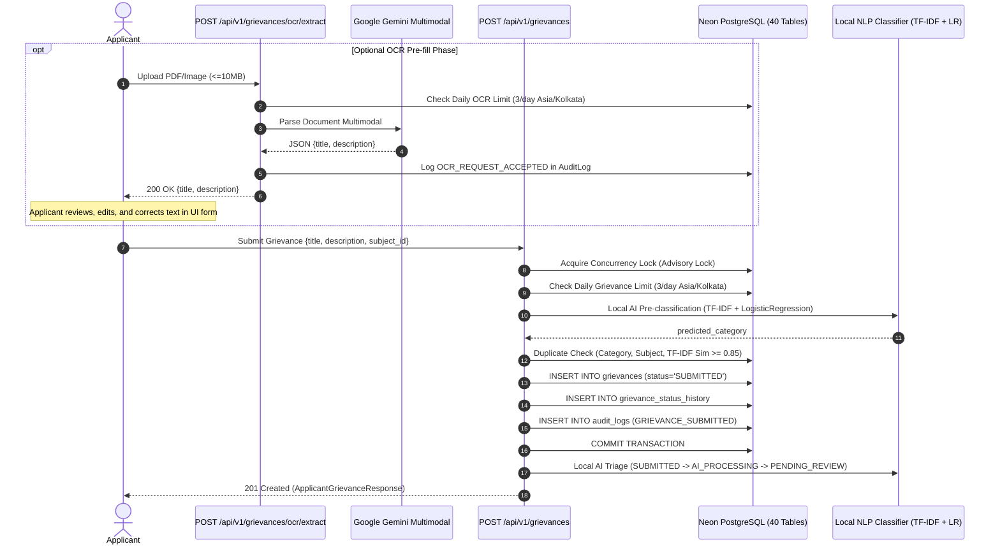

# NIVARAN Filing Integrity & Gemini OCR Assistance Specification

**Status:** APPROVED & IMPLEMENTED  
**Target Path:** `docs/pillars/nivaran/filing-integrity.md`  
**Subsystem:** `apps/pillars/nivaran/backend`  
**Test Coverage:** 99/99 Automated Backend Tests Passing  

---

## 1. Architectural Overview & Boundary Separation

The applicant filing subsystem within the **VYASA-NIVARAN** pillar guarantees institutional intake discipline, prevents denial-of-service spam, avoids duplicate case docketing, and provides assistive document digitization for handwritten or printed physical complaints.

### 1.1 Strict AI Responsibility Boundary
There is an absolute, immutable architectural separation between the two AI roles in NIVARAN:

```
+==================================================================================================+
|                                    NIVARAN AI ARCHITECTURE                                        |
+==================================================================================================+
|                                                                                                  |
|   1. GRIEVANCE CATEGORY CLASSIFICATION                                                           |
|      - Technology: Local Scikit-Learn Pipeline (TF-IDF Vectorizer + Logistic Regression)         |
|      - Artifact: app/ai/models/category_classifier.joblib                                        |
|      - Execution: 100% OFFLINE, CPU-based (<1ms latency, ~1.8 MB memory)                        |
|      - Prohibitions: ZERO Gemini. ZERO external AI APIs. ZERO cloud inference.                   |
|                                                                                                  |
|   2. OCR / TEXT EXTRACTION ASSISTANCE (INPUT ASSISTANCE ONLY)                                    |
|      - Technology: Google Gemini Multimodal API (gemini-3.1-flash-lite)                          |
|      - Service: app/services/ocr_service.py                                                      |
|      - Purpose: Stateless applicant drafting pre-fill (converts document bytes to text)         |
|      - State: Completely STATELESS. Does NOT create or alter grievances or database records.     |
|      - Prohibitions: NEVER used for category classification, routing, or triage decisions.       |
|                                                                                                  |
+==================================================================================================+
```

---

## 2. Daily Grievance Submission Limit (Part A)

### 2.1 Quota & Timezone Specification
- **Limit:** Exactly **3 grievance submissions** per candidate per calendar day.
- **Timezone:** Strictly **`Asia/Kolkata`** (IST, UTC+05:30).
- **Identity Scope:** Filtered by `Grievance.applicant_vyasa_user_id == applicant_id` (VYASA Core UUID).

### 2.2 Counting & Reset Mechanics
- **Start of Day Calculation:**
  Calculates `00:00:00.000000 IST` converted to UTC (`18:30:00.000000 UTC` of the previous calendar day). The quota automatically resets at midnight IST.
- **What Counts:**
  Every row successfully committed to the `grievances` table created during the current Asia/Kolkata day. All grievance statuses (`SUBMITTED`, `PENDING_REVIEW`, `RESOLVED`, `CLOSED`, etc.) count towards the limit.
- **What Does NOT Count:**
  - Failed HTTP submissions (400 validation error, 404 subject not found).
  - Duplicate-blocked submissions (409 conflict).
  - Reopened grievances created on prior calendar days.
- **AI Failure Case:**
  If background AI classification fails during filing, the grievance was already committed to the database and therefore **still counts** towards the daily quota.

### 2.3 Concurrency & Lock Serialization
- Serializes concurrent filing requests per applicant via a dual mechanism:
  1. Row lock on `StudentMasterRecord` via `with_for_update()` if an academic snapshot exists.
  2. Transaction-level PostgreSQL advisory lock `SELECT pg_advisory_xact_lock(hashtext(:user_id))`.
- Avoids adding non-standard schema tables while guaranteeing race-condition safety.

### 2.4 Error Contract
- **HTTP Status:** `429 Too Many Requests`
- **Response Payload:**
  ```json
  {
    "detail": {
      "error_code": "DAILY_LIMIT_EXCEEDED",
      "message": "You have reached your grievance submission limit for today. Please try again tomorrow."
    }
  }
  ```

---

## 3. Duplicate Active Grievance Detection (Part B)

### 3.1 Scope & Active Status Whitelist
Duplicate detection is strictly **applicant-scoped** (`Grievance.applicant_vyasa_user_id == applicant_id`). Submissions from different candidates never block each other.

Checks against active grievances only:
- `SUBMITTED`
- `AI_PROCESSING`
- `PENDING_REVIEW`
- `ASSIGNED`
- `IN_PROGRESS`
- `AWAITING_INFORMATION`
- `ESCALATED`
- `REOPENED`

> [!NOTE]
> Grievances in **`RESOLVED`** and **`CLOSED`** statuses are **excluded** and do not block new submissions.

### 3.2 Three-Tier Detection Engine
1. **Rule 1 — Category Match (Hard Block):**
   Runs local AI pre-classification on `title` + `description`. If the predicted category matches the category of any currently active grievance of the same applicant, it is blocked immediately.
2. **Rule 2 — Subject / Title Match (Hard Block):**
   Normalizes title text (strips punctuation and excess whitespace) and strips bureaucratic prefixes (`"application for"`, `"request for"`, `"grievance regarding"`, `"matter of"`). If normalized titles or stripped subjects (length $\ge 5$) match, it is blocked immediately.
3. **Rule 3 — High Text Similarity (TF-IDF Cosine Similarity $\ge 0.85$):**
   Composes combined text `"{title}. {description}"`. Computes pairwise TF-IDF matrix using `TfidfVectorizer(stop_words="english", ngram_range=(1, 2))`. If cosine similarity $\ge 0.85$, it is blocked immediately.

### 3.3 Error Contract
- **HTTP Status:** `409 Conflict`
- **Response Payload:**
  ```json
  {
    "detail": {
      "error_code": "SIMILAR_ACTIVE_GRIEVANCE",
      "message": "Your similar grievance is already registered and is currently under process.",
      "existing_grievance_id": "G-20260927-A1B2C3"
    }
  }
  ```
- Blocked duplicates do **NOT** commit a grievance row and do **NOT** consume the 3/day submission quota.

---

## 4. Gemini OCR Document Text Extraction Assistance (Part C)

### 4.1 Purpose & Stateless Input-Assistance Model
- **Endpoint:** `POST /api/v1/grievances/ocr/extract`
- **Payload:** `multipart/form-data` with `file: UploadFile`.
- **Purpose:** An applicant uploads an image or PDF of a handwritten complaint. Gemini Multimodal parses the text and pre-fills the form's `title` and `description` fields.
- **Stateless Principle:**
  - Does **NOT** create a grievance or insert a grievance row.
  - Does **NOT** create status history or audit log transitions.
  - Does **NOT** create AI processing records.
  - Does **NOT** save or persist uploaded file bytes to disk or object storage.
  - Returns plain JSON to the browser so the applicant can **review, edit, append, or correct** the text before submitting.

### 4.2 Supported Formats & File Limits
- **Allowed Formats:** `.png`, `.jpg`, `.jpeg`, `.webp`, `.pdf`
- **Maximum File Size:** Exactly **10 MB** (`10 * 1024 * 1024` bytes).
- **Authentication:** Requires verified applicant identity header (`X-Applicant-User-Id` / `X-Vyasa-User-Id`).

### 4.3 Independent Daily OCR Rate Limit
- **Limit:** Exactly **3 successful OCR requests** per candidate per calendar day in `Asia/Kolkata`.
- **Quota Independence:**
  The OCR quota is completely independent of the grievance submission quota. A candidate may perform **3 OCR extractions AND 3 grievance submissions** on the same day.
- **Quota Accounting:**
  Recorded via `AuditLog(action="OCR_REQUEST_ACCEPTED", user_vyasa_id=applicant_id, entity_type="OCR")`.
  Only successful extractions consume quota. If Gemini fails or times out, the quota is **not consumed**.
- **Rate Limit Error:** HTTP 429
  ```json
  {
    "detail": {
      "error_code": "OCR_DAILY_LIMIT_EXCEEDED",
      "message": "You have reached your OCR limit for today. Please try again tomorrow."
    }
  }
  ```

### 4.4 Controlled Error Handling & Privacy
- If Gemini API fails, the service returns HTTP 500:
  ```json
  {
    "detail": {
      "error_code": "OCR_EXTRACTION_ERROR",
      "message": "Failed to digitize document. Please type your grievance details manually or try a clearer image."
    }
  }
  ```
- **Security Guarantee:** Gemini API keys, internal model parameters, prompts, and raw stack traces are never exposed in responses or logs.

---

## 5. End-to-End Execution Sequence



---

## 6. Verification & Test Suite Summary

The filing integrity and OCR assistance subsystem is verified by **99 automated tests** in `apps/pillars/nivaran/backend/tests/`:
- **`test_filing_integrity_and_ocr.py` (30 tests):**
  - Daily limit allowed, 4th blocked, midnight reset, rollback/failure handling.
  - Duplicate detection: category match, subject match, TF-IDF $\ge 0.85$, different applicant isolation, resolved case non-blocking.
  - Gemini OCR: PNG/JPG/WEBP/PDF acceptance, $>10\text{MB}$ rejection, mock response parsing, quota isolation (3/3), failure safety.
- **`test_grievance_core.py` (12 tests):**
  - Creation, SUBMITTED lifecycle initial state, subject validation, applicant scoping.
- **`test_ai_processing.py` (8 tests):**
  - Full local AI lifecycle `SUBMITTED -> AI_PROCESSING -> PENDING_REVIEW`.
- **`test_ai_pipeline.py` (22 tests):**
  - Offline TF-IDF + Logistic Regression classification against 16 classes.
- **`test_seed_master_data.py` (8 tests):**
  - 10 Subject Clusters, 55 Subjects, 3 Grievance Clusters, Categories.
- **`test_models.py` & `test_alembic.py` (19 tests):**
  - Frozen 40-table schema compliance and database migration integrity.
