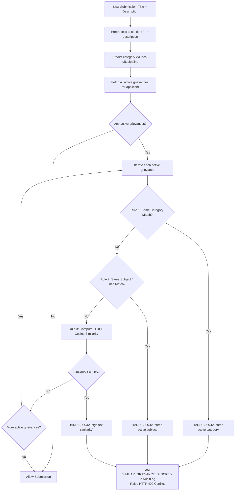
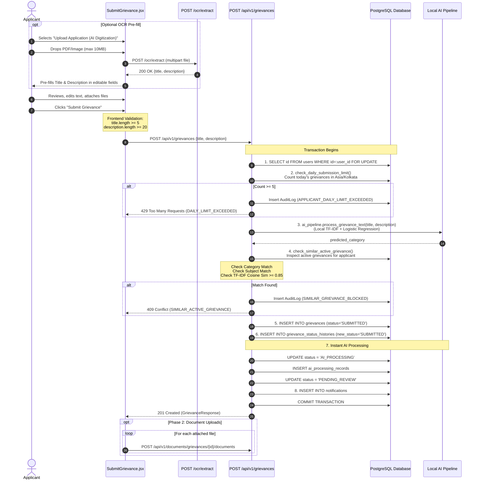

# Forensic Audit Phase 2: Applicant Filing Integrity & OCR Deep Audit

**Document Identifier:** `VYASA-NIVARAN-AUDIT-02`  
**Phase:** 2 — Applicant Filing Integrity & OCR Deep Forensic Audit  
**Status:** COMPLETE / FROZEN AUDIT BASELINE  
**Audit Scope:** Deep forensic examination of legacy `C:\Projects\NIVARAN-AI\` missing capabilities: Daily Submission Throttle, Duplicate Active Grievance Detection, and OCR Text Pre-fill.  
**Target File:** `docs/pillars/nivaran/forensic-audit/02-filing-integrity-and-ocr.md`  

---

## 1. Daily Submission Throttle (Deep Source Code Trace)

### 1.1 Enforcement Location & Mechanism
- **Enforcing Route:** `POST /api/v1/grievances` (`create_grievance`) in `C:\Projects\NIVARAN-AI\backend\app\api\routes\grievances.py` (lines 373–381).
- **Enforcing Service:** `check_daily_submission_limit(db: Session, applicant: User)` in `C:\Projects\NIVARAN-AI\backend\app\services\submission_restriction_service.py` (lines 36–94).
- **Configuration Origin:** `C:\Projects\NIVARAN-AI\backend\app\core\config.py` in `Settings` class:
  ```python
  DAILY_GRIEVANCE_SUBMISSION_LIMIT: int = 5
  APPLICATION_TIMEZONE: str = "Asia/Kolkata"
  ```
  Both values are configurable via environment variables (`.env`) using `pydantic-settings`. Default fallback is strictly `5` submissions and `"Asia/Kolkata"`.

### 1.2 Date Boundary & Timezone Calculations
The daily window is calculated strictly based on the applicant's calendar day in India Standard Time (`Asia/Kolkata`, UTC+05:30):
```python
local_tz = ZoneInfo("Asia/Kolkata")
now_local = datetime.now(local_tz)
start_of_day_local = datetime.combine(now_local.date(), time.min, tzinfo=local_tz)
start_of_day_utc = start_of_day_local.astimezone(timezone.utc)
```
- **Midnight Boundary:** At `00:00:00.000000 IST` (which is `18:30:00.000000 UTC` of the previous calendar day), `start_of_day_utc` shifts forward by 24 hours, resetting the applicant's count to zero.
- **Microsecond Precision:** Uses `time.min` (`00:00:00.000000`).

### 1.3 Database Query & What Qualifies as a Submission
```python
stmt = (
    select(Grievance)
    .where(
        Grievance.applicant_id == applicant.id,
        Grievance.created_at >= start_of_day_utc,
    )
)
todays_grievances = db.scalars(stmt).all()
submission_count = len(todays_grievances)
```

#### Forensic Classification of Grievance States:
| Scenario | Counts Towards Daily Limit? | Code Evidence & Mechanism |
| :--- | :---: | :--- |
| **Normal Successful Submission** | **YES** | Creates row in `grievances` with `created_at >= start_of_day_utc`. |
| **Failed Submissions (400, 422, 409, 500)** | **NO** | Exception raised before `db.add(grievance)` and `db.commit()`; no row is inserted into `grievances`. |
| **Closed / Resolved / Rejected Grievances** | **YES** | The query has **no status filter**. Any grievance created today counts, even if it reached `RESOLVED` or `REJECTED`. |
| **AI Classification Failure on Creation** | **YES** | In `create_grievance` (lines 442–453), an AI failure falls back to `PENDING_REVIEW` and commits the record. The grievance row is created and thus counts. |
| **Reopened Grievances** | **NO (for prior days) / YES (if created today)** | Reopening changes `status = REOPENED` on an existing row via `/reopen` without altering `created_at`. An old grievance does not count; a grievance submitted today and reopened today counts once. |
| **Blocked Duplicate Submissions** | **NO** | Blocked by `check_similar_active_grievance` before row creation. Only logs to `AuditLog`. |
| **Hard-Deleted Grievances** | N/A | The system has no hard-delete capability for grievances. |

### 1.4 Concurrency Control & Race Condition Prevention
To prevent an applicant from rapidly firing parallel HTTP requests to bypass the count of 5:
```python
db.execute(
    select(User.id)
    .where(User.id == current_user.id)
    .with_for_update()
)
```
- Acquires an exclusive row-level lock (`SELECT ... FOR UPDATE`) on the user record in PostgreSQL.
- Forces concurrent requests from the same user to queue sequentially.

### 1.5 Role Exceptions & Bypasses
- **Are there administrator bypasses?** **NO**.
- **Role Guard:** `require_permission(Permission.CREATE_GRIEVANCE)`.
- In `app/core/permissions.py`, `Permission.CREATE_GRIEVANCE` is assigned **strictly to `UserRole.APPLICANT`**. Administrators, Deans, and Managers do not possess this permission and receive HTTP 403 Forbidden if calling `POST /api/v1/grievances`.
- No `is_admin` bypass flag exists. The limit of 5 is universal and unconditional for all submissions.

### 1.6 Error Response & Frontend Behavior
- **HTTP Status:** `429 Too Many Requests`
- **JSON Payload:**
  ```json
  {
    "detail": {
      "error_code": "DAILY_LIMIT_EXCEEDED",
      "message": "You have reached your grievance submission limit for today. Please try again tomorrow."
    }
  }
  ```
- **Audit Log Entry Generated:**
  `AuditLog(action="APPLICANT_DAILY_LIMIT_EXCEEDED", user_id=applicant.id, entity_type="GRIEVANCE")`
- **Frontend Reaction (`SubmitGrievance.jsx` lines 256–261, 327–381):**
  - Catches `err.data?.error_code === "DAILY_LIMIT_EXCEEDED"`.
  - Halts submission spinner (`loading = false`, `submissionStep = 0`).
  - Displays a dedicated amber alert banner:
    > **⚠️ Daily Submission Limit Reached**  
    > "You have reached your grievance submission limit for today. Please try again tomorrow."
  - The form text remains intact so the applicant does not lose their typed work.

---

## 2. Duplicate Active Grievance Detection (Deep Source Code Trace)

### 2.1 Invocation Point & Execution Scope
- **File & Function:** `check_similar_active_grievance` in `C:\Projects\NIVARAN-AI\backend\app\services\submission_restriction_service.py` (lines 135–292).
- **Invocation Point:** `create_grievance` in `api/routes/grievances.py` (line 390), immediately after AI classification and before `Grievance(...)` instantiation.
- **Applicant Scope:** Strictly scoped to `Grievance.applicant_id == applicant.id`. An applicant is never blocked by a grievance submitted by a different student/applicant.
- **Accidental Self-Match Prevention:** The new grievance has not been inserted into the database yet; therefore, the query `select(Grievance).where(...)` only inspects previously committed records.

### 2.2 Active Status Definition
The check inspects **only active grievances** using the explicit status whitelist:
```python
ACTIVE_GRIEVANCE_STATUSES = [
    GrievanceStatus.SUBMITTED,
    GrievanceStatus.AI_PROCESSING,
    GrievanceStatus.PENDING_REVIEW,
    GrievanceStatus.ASSIGNED,
    GrievanceStatus.IN_PROGRESS,
    GrievanceStatus.AWAITING_INFORMATION,
    GrievanceStatus.ESCALATED,
    GrievanceStatus.REOPENED,
]
```
- **Terminal Statuses Ignored:** `GrievanceStatus.RESOLVED`, `GrievanceStatus.REJECTED`, and `GrievanceStatus.CLOSED` are **completely excluded**. An applicant is free to file a grievance on a topic that was previously resolved or rejected.

### 2.3 Two-Tier Detection Rules & Preprocessing
The algorithm evaluates three sequential rules:



#### Detailed Rule Implementation:
1. **Rule 1 — Same Category Rule (Hard Block):**
   - Predicted category of new grievance is matched against `existing.final_category_id`, `existing.category_id`, or resolved category names.
   - Normalized using `name.replace("_", " ").replace("-", " ").strip().lower()`.
   - If match is positive, blocks immediately without computing text similarity.
2. **Rule 2 — Same Subject Rule (Hard Block):**
   - Strips non-alphanumeric characters: `re.sub(r"[^\w\s]", " ", text.lower())`.
   - Strips formal bureaucratic prefixes via `extract_core_subject()`:
     - `"application for change of"`, `"application for"`, `"request for change of"`, `"request for"`, `"issue regarding"`, `"grievance regarding"`, `"complaint regarding"`, `"matter regarding"`, `"matter of"`, `"regarding"`, `"sub"`, `"subject"`.
   - If normalized titles match, or stripped core subjects (len $\ge 5$) match, blocks immediately.
3. **Rule 3 — High Text Similarity (TF-IDF + Cosine Similarity):**
   - Combined text: `ai_pipeline.preprocess_text(title, description)` $\to$ `"{clean_title}. {clean_desc}"`.
   - Vectorizer: `sklearn.feature_extraction.text.TfidfVectorizer(stop_words="english", ngram_range=(1, 2))`.
   - Fits and transforms pairwise: `tfidf_matrix = vectorizer.fit_transform([new_text, existing_text])`.
   - Metric: `cosine_similarity(tfidf_matrix[0:1], tfidf_matrix[1:2])[0][0]`.
   - Threshold: **$\ge 0.85$** (`settings.SIMILARITY_THRESHOLD_GLOBAL`).
   - Exception Fallback: Jaccard token overlap `len(intersection) / len(union)`.

### 2.4 Error Response & Frontend Message
- **HTTP Status:** `409 Conflict`
- **JSON Payload:**
  ```json
  {
    "detail": {
      "error_code": "SIMILAR_ACTIVE_GRIEVANCE",
      "message": "Your similar grievance is already registered and is currently under process.",
      "existing_grievance_id": "GRV-2026-0042"
    }
  }
  ```
- **Audit Logging:** Writes `AuditLog(action="SIMILAR_GRIEVANCE_BLOCKED", grievance_id=existing.id, user_id=applicant.id)` with exact similarity score and reason.
- **Frontend Reaction (`SubmitGrievance.jsx` lines 262–268, 384–471):**
  - Catches `err.data?.error_code === "SIMILAR_ACTIVE_GRIEVANCE"`.
  - Displays blue/indigo alert card:
    > **⚠️ Similar Grievance Already Registered**  
    > "A similar grievance is already registered and is currently under process. Please wait for the existing grievance to be resolved."  
    > **Existing Grievance:** `[GRV-2026-0042 →]` (Clickable link leading to `/dashboard/grievances/GRV-2026-0042`).
- **Override/Bypass:** Submission is **hard blocked**. Neither the applicant nor the manager can bypass this intake check to file a duplicate under the same applicant.

---

## 3. OCR Text Pre-fill (Deep Source Code Trace)

### 3.1 Route Implementation & Authentication
- **Route:** `POST /api/v1/grievances/ocr/extract` in `C:\Projects\NIVARAN-AI\backend\app\api\routes\grievances.py` (lines 278–350).
- **Authentication:** `current_user: User = Depends(require_permission(Permission.CREATE_GRIEVANCE))`. Requires valid JWT Bearer token; role must be `APPLICANT` (401 if unauthenticated, 403 if other role).
- **Payload:** `file: UploadFile = File(...)` (multipart/form-data).

### 3.2 Supported Formats & File Limits
- **MIME Types Whitelist (`SUPPORTED_OCR_MIME_TYPES`):**
  - `image/jpeg`, `image/jpg`, `image/png`, `image/webp`, `application/pdf`.
  - Fallback extension mapping for `application/octet-stream` or missing content type based on `.jpg`, `.jpeg`, `.png`, `.webp`, `.pdf`.
- **File Size Limit:** Exactly **10 MB** (`MAX_OCR_FILE_SIZE_BYTES = 10 * 1024 * 1024`). Rejection returns HTTP 400 with detail `"File size exceeds the 10MB limit for OCR extraction."`.

### 3.3 Forensic Examination of the Underlying OCR Engine
```python
class GrievanceOCRExtractor:
    def __init__(self, api_key: Optional[str] = None, model_name: Optional[str] = None):
        self._api_key = (
            api_key
            or settings.PARTH_LLM_API_KEY
            or os.getenv("GEMINI_API_KEY", "")
            or os.getenv("GOOGLE_API_KEY", "")
        ).strip()
        self.model_name = (
            model_name
            or settings.PARTH_LLM_MODEL
            or "gemini-3.1-flash-lite"
        ).strip()
```

> [!CRITICAL]
> **CRITICAL FORENSIC DISCOVERY:**  
> Although grievance category classification in `NIVARAN-AI` is strictly local ML (`category_classifier.joblib`, TF-IDF + Logistic Regression), the legacy OCR pre-fill service **does NOT use Tesseract or local OCR**.  
> It relies on **Google Gemini Multimodal API** via the `google-genai` SDK (`gemini-3.1-flash-lite`, temperature `0.1`, structured JSON mode)!
>
> In the new pillar, the project constraint mandates:
> **"There must be NO Gemini. There must be NO external AI API call during inference."**
> Therefore, importing legacy `ocr_service.py` directly would violate the offline local ML architecture!

### 3.4 Operational Characteristics of Legacy OCR
| Dimension | Verified Legacy Behavior |
| :--- | :--- |
| **Is OCR text stored in database?** | **NO**. Zero database writes. Stateless input assistance only. |
| **Is the uploaded file stored on disk?** | **NO**. Read into memory bytes, dispatched to model, and discarded. |
| **Does OCR create a grievance?** | **NO**. Grievance creation requires explicit user submission later. |
| **Is extracted text editable?** | **YES**. Pre-fills controlled inputs `title` and `description` which can be fully edited. |
| **Is OCR mandatory?** | **NO**. Completely optional. Default entry mode is "Enter Manually". |
| **Output Schema:** | `{"title": str, "description": str, "confidence_note": str}` |
| **Minimum Text Guarantees:** | Fallback title: `"Handwritten Grievance Application"`. Fallback desc: `"Extracted from uploaded handwritten application. Please review and verify details."` |
| **Error Handling:** | Invalid MIME $\to$ 400; File $>10\text{MB}$ $\to$ 400; JSON parse error $\to$ 400; Model API error $\to$ 500 (`"Failed to digitize handwritten document using AI. Please type your grievance details manually or try a clearer image."`). |

---

## 4. Cross-Feature Interaction & Execution Ordering

The exact chronological lifecycle verified across frontend and backend is:



---

## 5. New Architecture Mapping

### 5.1 Daily Submission Throttle
- **Legacy Location:** `app/services/submission_restriction_service.py:check_daily_submission_limit`
- **New Pillar Location:** `apps/pillars/nivaran/backend/app/services/submission_restrictions.py`
- **Integration Hook:** Call inside `GrievanceSubmissionService.submit_grievance` (in `app/services/grievance_submission.py`) prior to entity creation.
- **Dependencies:** `zoneinfo.ZoneInfo`, `datetime`, `sqlalchemy.select`, `sqlalchemy.func`.
- **Concurrency Locking in Pillar Architecture:**
  - *Architectural Consideration:* In legacy NIVARAN, locking was performed on `users` table (`SELECT id FROM users ... FOR UPDATE`).
  - *In VYASA-NIVARAN:* `users` belongs to VYASA Core; the pillar database does not have a local user entity to lock.
  - *Clean Solution without Schema Change:* Use PostgreSQL Transaction-Level Advisory Lock:
    `SELECT pg_advisory_xact_lock(hashtext(:applicant_id::text))`
    This serializes concurrent submissions for the same applicant without touching any tables.
- **Schema Impact on Frozen 40 Tables:** **ZERO**. Queries `grievances.applicant_id` and `grievances.created_at`.
- **Implementation Risk:** Low. Must ensure timezone is explicitly `ZoneInfo("Asia/Kolkata")`.

### 5.2 Duplicate Active Grievance Detection
- **Legacy Location:** `app/services/submission_restriction_service.py:check_similar_active_grievance`
- **New Pillar Location:** `apps/pillars/nivaran/backend/app/services/submission_restrictions.py`
- **Integration Hook:** Call inside `GrievanceSubmissionService.submit_grievance` immediately following the daily limit check.
- **Dependencies:** `scikit-learn` (`TfidfVectorizer`, `cosine_similarity`), `re`, `sqlalchemy.select`.
- **Schema Impact on Frozen 40 Tables:** **ZERO**. Queries existing `grievances` fields: `applicant_id`, `status`, `title`, `description`, `predicted_category_id`.
- **Implementation Risk:** Low to Medium. Ensure category comparison checks `grievance_categories` names and active status whitelist matches frozen enum `GrievanceStatus`.

### 5.3 OCR Text Pre-fill
- **Legacy Location:** `app/api/routes/grievances.py:extract_handwritten_grievance` + `app/services/ocr_service.py` (Gemini SDK).
- **New Pillar Architectural Location:**
  - Route: `apps/pillars/nivaran/backend/app/api/v1/endpoints/ocr.py`
  - Service: `apps/pillars/nivaran/backend/app/services/ocr_service.py`
- **External API Policy Resolution:**
  - *Conflict:* The legacy implementation uses `google.genai` (Gemini 3.1 flash-lite), but the pillar core guidelines prohibit external AI APIs during inference.
  - *Resolution Options:*
    1. **Option A (Local OCR Engine):** Use local open-source OCR (e.g. `pytesseract` or `easyocr`) with regex-based title/description extraction. Zero external network calls.
    2. **Option B (Strict Input-Assistance Exception):** If multimodal LLM transcription is required for handwritten documents, clearly isolate OCR as an external utility tool with a configurable opt-in key (`PARTH_LLM_API_KEY`), ensuring the core grievance classification remains 100% offline local ML (`TF-IDF + LogisticRegression`).
- **Schema Impact on Frozen 40 Tables:** **ZERO**. OCR is completely stateless and performs no database writes.
- **Implementation Risk:** Medium (requires architectural decision on OCR engine choice).

---

## 6. Gap Matrix

| Capability | Exact Old Behavior | New Pillar Status | Classification | Required Action |
| :--- | :--- | :---: | :---: | :--- |
| **Daily Throttle Limit (5/day)** | Max 5 grievances created in calendar day based on `Asia/Kolkata` | Missing | **MISSING** | Implement `check_daily_submission_limit` in `submission_restrictions.py`. |
| **Daily Concurrency Row-Lock** | `SELECT id FROM users FOR UPDATE` | Missing | **INTENTIONAL ARCHITECTURAL CHANGE** | Implement `pg_advisory_xact_lock(hashtext(applicant_id))` to avoid cross-pillar user table dependencies. |
| **Daily Limit Error Contract** | HTTP 429 `{error_code: "DAILY_LIMIT_EXCEEDED", message: ...}` | Missing | **MISSING** | Raise custom domain exception mapping to HTTP 429 in API layer. |
| **Similar Grievance Category Match** | Hard block if active grievance matches predicted category | Missing | **MISSING** | Port Rule 1 logic into `check_similar_active_grievance`. |
| **Similar Grievance Subject Match** | Hard block if title or core subject prefix matches | Missing | **MISSING** | Port prefix stripping and normalization logic. |
| **Similar Grievance TF-IDF Sim** | Block if TF-IDF cosine similarity $\ge 0.85$ | Missing | **MISSING** | Port scikit-learn pairwise TF-IDF vectorizer ($1,2$ n-grams). |
| **Active Status Filtering** | Whitelist of 8 active statuses; `RESOLVED`/`REJECTED` ignored | Missing | **MISSING** | Query `Grievance.status.in_(ACTIVE_GRIEVANCE_STATUSES)`. |
| **Duplicate Error Contract** | HTTP 409 `{error_code: "SIMILAR_ACTIVE_GRIEVANCE", existing_grievance_id: ...}` | Missing | **MISSING** | Raise domain exception mapping to HTTP 409 with reference ID. |
| **Audit Logging on Blocks** | Writes `AuditLog` for both 429 and 409 events | Missing | **MISSING** | Connect to new pillar `audit_log` service. |
| **OCR Document Intake Endpoint** | `POST /api/v1/grievances/ocr/extract` | Missing | **MISSING** | Create stateless OCR endpoint returning `{title, description}`. |
| **OCR Multimodal Engine** | Gemini 3.1 Flash Lite via `google-genai` | In Conflict with Local ML Rule | **UNCLEAR / ARCHITECTURAL DECISION** | Await user instruction on local OCR (Tesseract) vs external Gemini API for input assistance. |

---

## 7. Forensic Sign-off & Examined Files

### Examined Reference Files (Legacy NIVARAN-AI):
1. `C:\Projects\NIVARAN-AI\backend\app\services\submission_restriction_service.py` (lines 1–292)
2. `C:\Projects\NIVARAN-AI\backend\app\api\routes\grievances.py` (lines 275–470)
3. `C:\Projects\NIVARAN-AI\backend\app\services\ocr_service.py` (lines 1–161)
4. `C:\Projects\NIVARAN-AI\backend\app\core\config.py` (lines 1–148)
5. `C:\Projects\NIVARAN-AI\backend\app\ai\pipeline.py` (lines 1–80)
6. `C:\Projects\NIVARAN-AI\frontend\src\pages\SubmitGrievance.jsx` (lines 1–780)
7. `C:\Projects\NIVARAN-AI\backend\tests\test_submission_restrictions.py` (lines 1–587)
8. `C:\Projects\NIVARAN-AI\backend\tests\test_grievance_ocr.py` (lines 1–146)

### Integrity Constraints Verification:
- **`C:\Projects\NIVARAN-AI\`:** Strictly Read-Only (0 bytes modified).
- **VYASA Core (`apps/vyasa/`):** Strictly Read-Only (0 bytes modified).
- **Frozen 40-table Schema:** Intact (0 tables/columns added or modified).
- **Codebase State:** Mode is AUDIT ONLY; no implementation was performed in this phase.
