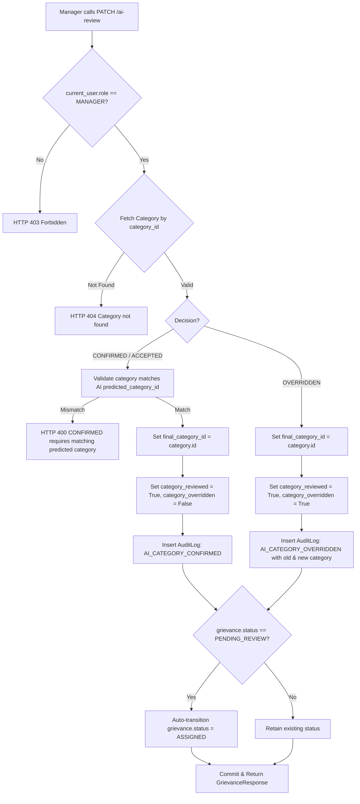

# Forensic Audit Phase 4: Manager Triage, Command Center & Operational Workflow

**Document Identifier:** `VYASA-NIVARAN-AUDIT-03`  
**Phase:** 4 — Manager / Triage Workflow  
**Status:** COMPLETE / FROZEN AUDIT BASELINE  
**Audit Scope:** Forensic analysis of legacy `C:\Projects\NIVARAN-AI\` Manager capabilities and gap analysis against `C:\Projects\VYASA\apps\pillars\nivaran\`  
**Target File:** `docs/pillars/nivaran/forensic-audit/03-manager-triage-and-command-center.md`  

---

## 1. Executive Summary & Core Architectural Role

In the **NIVARAN** institutional architecture, the **Manager** operates as the **Central Operational Clearinghouse and Triage Authority**. While academic deans (Assistant Dean, Associate Dean, Dean) resolve grievances within disciplinary jurisdictions and committees conduct collective inquiries, the Manager sits at the apex of intake, routing, workflow monitoring, and administrative closure.

```
       APPLICANT
           │
           ▼
     [SUBMITTED]
           │
           ▼
    [AI_PROCESSING] (Local NLP Inference: TF-IDF + Logistic Regression)
           │
           ▼
    [PENDING_REVIEW] ◄─── MANAGER INTAKE QUEUE
           │
           ├── (Accepts/Overrides AI Category)
           ├── (Validates Urgency & SLA Deadline)
           ▼
       [ASSIGNED] ───► Subject Assistant Dean / Cluster Authority
           │
          ... Academic Resolution Loop (Investigation, Committees, Approvals)
           │
           ▼
       [RESOLVED] ◄─── MANAGER CLOSURE QUEUE
           │
           ├── (Validates Institutional Settlement & Signatures)
           ▼
        [CLOSED] ───► E-File Dossier Archive Generation
           │
   (If Dissatisfied)
           │
           ▼
       [REOPENED] ◄─── MANAGER RE-TRIAGE QUEUE (Or Dean Escalation)
```

### Key Architectural Tenets of the Manager Role:
1. **Institutional Omniscience (Universal Visibility):** Unlike Subject Assistant Deans whose view is filtered to their assigned academic subjects, the Manager possesses unfiltered, institution-wide visibility across all departments, subjects, statuses, and escalation tiers.
2. **AI Category Review Exclusive Custody:** Only the Manager (`current_user.role == UserRole.MANAGER`) is authorized to formally accept or override AI-predicted categories (`PATCH /api/v1/grievances/{id}/ai-review`). Assistant Deans and Deans cannot alter AI category determinations directly during intake triage.
3. **Omnipotent Assignment & Reassignment Authority:** While academic authorities can only forward grievances actively assigned to them, the Manager can reassign or forward *any* case at *any* stage, bypassing assignee locking.
4. **Administrative Gatekeeper of Final Closure:** Authorities transition grievances from active states (`IN_PROGRESS`, `ESCALATED`, `AWAITING_INFORMATION`) to `RESOLVED`. However, only the Manager (or Dean) executes formal `CLOSED` status, triggering archival digital dossier generation (E-File).

---

## 2. Manager Role, Authentication & RBAC Model

### 2.1 Identity & Authentication
- **User Role:** `UserRole.MANAGER = "MANAGER"` defined in `app/models/user.py`.
- **JWT Claims:** The token payload contains `{"sub": str(user.id), "role": "MANAGER"}`.
- **Dependency Guard:** Routes in `manager.py` enforce:
  ```python
  current_user: User = Depends(require_permission(Permission.VIEW_ALL_GRIEVANCES))
  ```
  And specific endpoints apply explicit identity/role guards:
  ```python
  if current_user.role != UserRole.MANAGER:
      raise HTTPException(status_code=403, detail="Only Manager can review AI category")
  ```

### 2.2 Explicit Permission Mapping in `permissions.py`
The legacy system defines a 24-permission entitlement bundle for `UserRole.MANAGER`:
```python
UserRole.MANAGER: [
    # Grievance Administration & Global Visibility
    Permission.VIEW_ALL_GRIEVANCES,
    Permission.VIEW_GRIEVANCE,
    Permission.ASSIGN_GRIEVANCE,
    Permission.CHANGE_PRIORITY,
    Permission.CHANGE_STATUS,
    Permission.CLOSE_GRIEVANCE,
    Permission.REOPEN_GRIEVANCE,
    Permission.RESOLVE_GRIEVANCE,
    
    # Internal Dialogue & Communication
    Permission.ADD_INTERNAL_COMMENT,
    Permission.VIEW_INTERNAL_COMMENTS,
    
    # Documentation & Archival Evidence
    Permission.UPLOAD_ATTACHMENT,
    Permission.VIEW_ATTACHMENT,
    Permission.DELETE_ATTACHMENT,
    Permission.GENERATE_E_FILE,
    Permission.SEARCH_E_FILE_REPOSITORY,
    Permission.PREVIEW_E_FILE,
    Permission.DOWNLOAD_E_FILE,
    
    # Operational Intelligence & Telemetry
    Permission.VIEW_ANALYTICS,
    Permission.VIEW_ACTIVITY_LOGS,
    Permission.VIEW_AUDIT_LOGS,
    
    # Digital Signatures & System Verification
    Permission.SIGN_DOCUMENT,
    Permission.VERIFY_SIGNATURE,
    
    # Feedback Administration
    Permission.VIEW_FEEDBACK,
    Permission.SUBMIT_FEEDBACK,
]
```

---

## 3. Manager Dashboard & Command Center Architecture

The Manager Command Center is orchestrated by `app/api/routes/manager.py` backed by `app/services/manager_service.py`. It comprises 6 specialized API endpoints powering the manager front-end dashboard:

```
GET /api/v1/manager/overview     ──► High-level KPIs, urgent case preview, recent activity stream
GET /api/v1/manager/grievances   ──► Unified paginated data table with server-side queue filters
GET /api/v1/manager/workflow     ──► 5-stage pipeline funnel & stage counts
GET /api/v1/manager/assignments  ──► Authority workload distribution & unassigned queue
GET /api/v1/manager/analytics    ──► Institutional SLA velocity, category distribution & trend graphs
GET /api/v1/manager/activity     ──► System-wide audit log stream
```

### 3.1 `GET /api/v1/manager/overview`
Returns high-level operational intelligence:
- **`kpis`**:
  - `total_cases`: Total count of non-deleted grievances in system.
  - `pending_cases`: Count of grievances in `[SUBMITTED, PENDING_REVIEW, ASSIGNED, IN_PROGRESS, ESCALATED, AWAITING_INFORMATION]`.
  - `resolved_today`: Count of grievances transitioned to `RESOLVED` on the current calendar day.
  - `overdue_cases`: Count of active grievances where `deadline < now()`.
  - `reopened_count`: Count of active grievances in `REOPENED` status.
  - `ai_review_pending_count`: Count of grievances in `PENDING_REVIEW` or unreviewed `SUBMITTED/ASSIGNED`.
  - `closure_pending_count`: Count of grievances in `RESOLVED` status awaiting final administrative closure.
- **`urgent_cases_preview`**: Top 5 critical grievances ordered by `priority == URGENT` desc, `deadline asc`.
- **`recent_activities_preview`**: Top 10 system-wide audit log records ordered by `created_at desc`.

### 3.2 `GET /api/v1/manager/workflow`
Aggregates cases into a 5-stage institutional processing funnel:
1. `STAGE_1_INTAKE`: `[SUBMITTED, PENDING_REVIEW]`
2. `STAGE_2_TRIAGE`: `[ASSIGNED]`
3. `STAGE_3_INVESTIGATION`: `[IN_PROGRESS, AWAITING_INFORMATION]`
4. `STAGE_4_DECISION`: `[RESOLVED, ESCALATED]`
5. `STAGE_5_ARCHIVED`: `[CLOSED]`
Also returns counts for action sub-queues: `pending_ai_validation`, `closure_verification`, and `escalated_cases`.

### 3.3 `GET /api/v1/manager/assignments`
Provides authority workload monitoring to prevent administrative bottlenecks:
- `total_assigned`: Count of active grievances with an active `Assignment` record.
- `total_unassigned`: Count of active grievances without an active `Assignment` record.
- `authority_workloads`: Grouped array of authorities (`Assistant Dean`, `Associate Dean`, `Dean`) showing:
  - `user_id`, `name`, `role`, `department`
  - `active_count`: Active grievances currently in their court
  - `overdue_count`: Cases in their court where `deadline < now()`

### 3.4 `GET /api/v1/manager/analytics`
Generates aggregate business intelligence:
- `resolution_rate`: Percentage of total non-draft grievances that have reached `RESOLVED` or `CLOSED`.
- `avg_resolution_time_days`: Average days elapsed between `created_at` and `resolved_at`.
- `sla_compliance_rate`: Percentage of resolved cases where `resolved_at <= deadline`.
- `category_distribution`: Breakdown of cases across all institutional grievance categories.
- `velocity_trends`: Daily case creation vs resolution volume over the past 30 days.

---

## 4. Operational Triage Queues

The Manager data grid (`GET /api/v1/manager/grievances`) implements server-side filtering via a dedicated `queue` parameter:

| Queue Parameter (`queue=`) | SQL Filter Logic | Operational Purpose |
| :--- | :--- | :--- |
| `ai_review_pending` | `or_(Grievance.status == GrievanceStatus.PENDING_REVIEW, and_(Grievance.status.in_([SUBMITTED, ASSIGNED]), Grievance.category_reviewed.is_(False)))` | Triage desk: Cases needing AI category confirmation/override before delegation. |
| `reopened` | `Grievance.status == GrievanceStatus.REOPENED` | Re-investigation desk: Cases reopened by applicant or internal officer due to failed remedy. |
| `closure_pending` | `Grievance.status == GrievanceStatus.RESOLVED` | Audit & closure desk: Resolved cases awaiting formal closure, verification, and E-File sealing. |
| `unassigned` | `Grievance.status.not_in([RESOLVED, CLOSED, DRAFT])` AND no active row in `assignments` where `is_active == True` | Allocation desk: Cases lacking an assigned authority. |
| `urgent` | `Grievance.priority == GrievancePriority.URGENT` AND `status.not_in([RESOLVED, CLOSED])` | Emergency desk: High-priority institutional escalations. |
| `overdue` | `Grievance.deadline < now()` AND `status.not_in([RESOLVED, CLOSED])` | Breach desk: Cases violating institutional Citizen Charter SLA. |

### Query Capabilities:
- Full text search across `grievance_id`, `title`, `description`, `applicant.full_name`, and `applicant.email`.
- Status filtering (`status`), Category filtering (`category_id`), Priority filtering (`priority`).
- Date range filtering (`start_date`, `end_date`).
- Server-side sorting (`order_by=created_at|priority|deadline`, `order_dir=asc|desc`).
- Standard pagination (`page`, `page_size`, returning `total`, `pages`, and `filters_meta`).

---

## 5. The PENDING_REVIEW Stage & AI Prediction Presentation

When an applicant submits a grievance, it transitions through `AI_PROCESSING` and lands in `PENDING_REVIEW`.

### 5.1 AI Presentation Schema
The Manager view exposes the full telemetry record stored in `ai_processing_records`:
- `predicted_category_id`: UUID of the classifier's top choice.
- `predicted_category_name`: Human-readable label (e.g., `"Academic & Evaluation"`).
- `confidence_score`: Float between `0.0` and `1.0`.
- `top_predictions`: JSON array of top alternative categories with their respective softmax probability scores:
  ```json
  [
    {"category_id": "...", "category_name": "Hostel & Accommodation", "score": 0.7842},
    {"category_id": "...", "category_name": "Infrastructure & Maintenance", "score": 0.1521},
    {"category_id": "...", "category_name": "Fee & Financial Aid", "score": 0.0410}
  ]
  ```
- `model_name` & `model_version`: Telemetry proving model provenance (e.g., `"NIVARAN-AI-NLP"` / `"2.0.0"`).
- `processing_time_ms`: Inference latency in milliseconds.

---

## 6. AI Category Review Mechanics: ACCEPT vs OVERRIDE

### 6.1 Endpoint Specification
- **Method:** `PATCH`
- **Route:** `/api/v1/grievances/{id}/ai-review`
- **File:** `C:\Projects\NIVARAN-AI\backend\app\api\routes\grievances.py` (lines 780–870)
- **RBAC Guard:** Strictly limited to `UserRole.MANAGER`:
  ```python
  if current_user.role != UserRole.MANAGER:
      raise HTTPException(status_code=403, detail="Only Manager can review AI category")
  ```

### 6.2 Request Payload (`AICategoryReviewRequest`)
```json
{
  "category_id": "uuid",
  "decision": "CONFIRMED" | "OVERRIDDEN",
  "remarks": "Optional manager rationale for override"
}
```

### 6.3 State Mutation Logic


### 6.4 Key Immutability Guarantees:
- The historical record in `ai_processing_records` is **never mutated or overwritten**.
- The `Grievance.predicted_category_id` remains the original AI output.
- The `Grievance.final_category_id` stores the authoritative triage decision.
- Audit logs record the exact operator, previous category, new category, and remarks.

---

## 7. Manager Assignment, Reassignment & Dynamic Authority Routing

### 7.1 Assignment Mechanics
- **Route:** `POST /api/v1/assignments/{grievance_id}`
- **File:** `C:\Projects\NIVARAN-AI\backend\app\api\routes\assignment.py`
- **Exemption for Manager:** 
  Standard authorities can only forward cases assigned to themselves:
  ```python
  if current_user.role != UserRole.MANAGER:
      if active_assignment.assigned_to_id != current_user.id:
          raise HTTPException(403, "You can only reassign grievances currently assigned to you")
  ```
  The **Manager is explicitly exempt** from this check. The Manager can reassign *any* grievance from any authority to any other authority at any time.

### 7.2 Forwarding vs Initial Assignment
- **Initial Assignment (`is_forward = False`):**
  - Used when routing a freshly triaged grievance out of `PENDING_REVIEW`.
  - Deactivates previous assignments (`is_active = False`).
  - Creates new `Assignment(assigned_by_id=manager.id, assigned_to_id=target.id, is_active=True)`.
  - Sets `grievance.status = GrievanceStatus.ASSIGNED`.
- **Formal Forwarding (`is_forward = True`):**
  - Requires explicit institutional acknowledgment via 6 required boolean flags:
    1. `student_notified`
    2. `target_authority_briefed`
    3. `case_history_compiled`
    4. `jurisdiction_verified`
    5. `action_plan_attached`
    6. `confidentiality_cleared`
  - Creates an `AuditLog(action="GRIEVANCE_FORWARDED")` and sends notifications to both student and target authority.

### 7.3 Dynamic Authority Resolution (`authority_routing.py`)
When assigning, the Manager UI queries `GET /api/v1/assignments/suggested-authority/{grievance_id}` which calls `get_next_authority_for_grievance()`:
- **Routing Type 1: `SUBJECT_ASSISTANT_DEAN`**
  - Evaluates grievance's academic `subject_id`.
  - Traverses `Subject -> SubjectCluster -> AssistantDean`.
  - Resolves to the dedicated Subject Assistant Dean for that discipline.
- **Routing Type 2: `GRIEVANCE_CLUSTER`**
  - Evaluates category cluster (Academic, Administrative, Welfare).
  - Traverses `GrievanceCluster -> ClusterAuthority`.
- **Routing Type 3: `FIXED_AUTHORITY`**
  - Resolves directly to designated fixed officer (e.g., Proctor, Chief Warden).

---

## 8. Grievance Detail Screen & Visibility Boundaries

In `ManagerGrievanceDetail.jsx`, the Manager view presents complete operational context that is hidden from students:

| UI Section / Data Element | Applicant View | Authority View | Manager View |
| :--- | :---: | :---: | :---: |
| Title, Public Ref (`GRV-...`), Description | ✅ | ✅ | ✅ |
| Lifecycle Status & Public Timeline | ✅ | ✅ | ✅ |
| Category (Applicant selected vs AI predicted) | Masked (Final only) | Final + AI Predicted | Full AI Probabilities + Override Button |
| Real Assignee Officer Name & Designation | Masked in early stages | Real Name & Dept | Real Name, Dept & Workload |
| Internal Authority Notes / Comments | ❌ Hidden | Restricted to Assignee | ✅ Full Read/Write |
| Complete Audit Trail & IP Addresses | ❌ Hidden | Partial / Relevant | ✅ Full Institutional Audit Log |
| Assignment Reallocation Controls | ❌ Hidden | Forward only if assigned | ✅ Omnipotent Reassign / Override |
| E-File Archival Generation & Repository | ❌ Hidden | Read-only / Step-up | ✅ Full Generation & Repository Access |

---

## 9. Grievance Resolution Lifecycle

### 9.1 Resolution Endpoint
- **Route:** `POST /api/v1/grievances/{id}/resolve`
- **File:** `C:\Projects\NIVARAN-AI\backend\app\api\routes\grievances.py` (lines 920–1040)
- **Solvable Pre-conditions:** Grievance status must be one of:
  `[ASSIGNED, IN_PROGRESS, ESCALATED, PENDING_REVIEW, AWAITING_INFORMATION, REOPENED]`
- **Manager Exemption:**
  ```python
  if current_user.role != UserRole.MANAGER and current_user.role != UserRole.DEAN:
      if not active_assignment or active_assignment.assigned_to_id != current_user.id:
          raise HTTPException(403, "Only the active assignee or Manager/Dean can resolve this grievance")
  ```
- **Execution:**
  - `grievance.status = GrievanceStatus.RESOLVED`
  - `grievance.resolution_notes = data.resolution_notes`
  - `grievance.resolved_by_id = current_user.id`
  - `grievance.resolved_at = datetime.now(timezone.utc)`
  - Deactivates active assignment rows.
  - Creates `AuditLog(action="GRIEVANCE_RESOLVED")`.
  - Dispatches `GRIEVANCE_RESOLVED` notification to the applicant.

---

## 10. Grievance Formal Closure

### 10.1 Closure Endpoint
- **Route:** `POST /api/v1/grievances/{id}/close`
- **File:** `C:\Projects\NIVARAN-AI\backend\app\api\routes\grievances.py` (lines 1045–1120)
- **Authorized Roles:** `require_permission(Permission.CLOSE_GRIEVANCE)` (Manager and Dean).
- **Valid Current Statuses:**
  - `RESOLVED` (standard closure following successful resolution)
  - `PENDING_REVIEW` (administrative dismissal/rejection during triage)
  - `ASSIGNED` (administrative cancellation)

### 10.2 Closure Execution Sequence
1. Sets `grievance.status = GrievanceStatus.CLOSED`.
2. Sets `grievance.closed_by_id = current_user.id`.
3. Sets `grievance.closed_at = datetime.now(timezone.utc)`.
4. Appends optional `closure_remarks` to grievance audit record.
5. Deactivates any remaining active assignments.
6. Dispatches `NotificationType.GRIEVANCE_CLOSED` to the applicant.
7. Logs `AuditLog(action="GRIEVANCE_CLOSED", description="Grievance formally closed by Manager.")`.
8. Enqueues background email notification with closure summary.

---

## 11. Grievance Reopen Handling

### 11.1 Reopen Endpoint
- **Route:** `POST /api/v1/grievances/{id}/reopen`
- **File:** `C:\Projects\NIVARAN-AI\backend\app\api\routes\grievances.py` (lines 1125–1240)
- **Pre-conditions:** Grievance status must be `CLOSED` or `RESOLVED`. Must be within 14-day appeal window.

### 11.2 Dual Routing Branching:
The legacy code implements a strict bifurcation depending on *who* initiates the reopen:
```python
if current_user.role == UserRole.APPLICANT:
    # Branch 1: Applicant appeal routes to DEAN for reopen review
    reopen_review = DeanReopenReview(
        grievance_id=grievance.id,
        applicant_id=current_user.id,
        reopen_reason=data.reason,
        status="AWAITING_REVIEW"
    )
    db.add(reopen_review)
    # Grievance stays in existing status pending Dean's determination
else:
    # Branch 2: Manager / Authority reopen immediately reactivates case
    grievance.status = GrievanceStatus.REOPENED
    grievance.reopened_by_id = current_user.id
    grievance.reopened_at = datetime.now(timezone.utc)
    grievance.reopen_reason = data.reason
    grievance.resolved_at = None
    grievance.closed_at = None
    # Lands immediately in Manager's queue=reopened
```

---

## 12. Document & Attachment Management

- **Routes:** `C:\Projects\NIVARAN-AI\backend\app\api\routes\documents.py`
- **Manager Upload Privilege:** Manager can upload evidence or investigation attachments directly to any grievance (`POST /api/v1/documents/{grievance_id}`).
- **Manager Delete Privilege:** In `documents.py` (lines 470–475):
  ```python
  # Only uploader or Manager can delete
  if current_user.role != UserRole.MANAGER and document.uploaded_by != current_user.id:
      raise HTTPException(403, "You do not have permission to delete this document")
  ```
  The Manager has institutional override authority to purge tainted or confidential documents mistakenly uploaded.

---

## 13. Internal Comments & Communications

- **Routes:** Handled via grievance comments in `grievances.py`.
- **Visibility:** Comments with `is_internal = True` are strictly filtered out of the Applicant's responses.
- **Manager Participation:** Manager can post internal directives (e.g., instructing an Assistant Dean to expedite a physical inspection) that are visible to all internal handling authorities but hidden from the student.
- **Audit Logging:** Every internal note logs `COMMENT_ADDED` with visibility scope recorded.

---

## 14. Committee Workflow Demarcation

Forensic inspection of `committees.py` confirms that the **Manager does NOT manage or sit on Academic Inquest Committees**:
- `GET /committees/eligible-members`: Specifically raises `HTTP 403 Forbidden` if `current_user.role in {UserRole.APPLICANT, UserRole.MANAGER}`. Committee rosters are restricted to Assistant Deans, Associate Deans, and Deans.
- `GET /committees/requests/{grievance_id}`: Specifically raises `HTTP 403 Forbidden` for Managers.
- `_verify_active_committee_member_chat_access`: Contains no role bypass for Managers. Committee deliberations are confidential to appointed committee members.
- **Demarcation Rule:** The Manager triages and assigns cases to authorities; if an authority requires a formal committee of inquiry, the authority requests it and the Dean authorizes it. The Manager monitors the overarching grievance status (`IN_PROGRESS`) without interfering in committee voting.

---

## 15. Digital Signatures & Cryptographic Sealing

- **Architecture:** 4096-bit RSA keys with RSA-PSS padding and SHA-256 digests.
- **Manager Signing Authority:**
  - Manager holds private signing keys for administrative orders.
  - Can initiate `SigningAuthorizationRequest` for purpose `GRIEVANCE_RESOLUTION` or `GRIEVANCE_CLOSURE`.
  - When reviewing signed resolutions, Manager verifies the officer's cryptographic public key and certificate chain (`GET /api/v1/signatures/verify/{id}`).
  - Manager always sees the unmasked, real legal identity of signing officers.

---

## 16. Digital E-File Dossier Preservation

- **Routes:** `C:\Projects\NIVARAN-AI\backend\app\api\routes\efiles.py`
- **Authorized Roles:** Only `MANAGER` and `DEAN` are permitted to generate and access the institutional E-File repository (`/efiles/repository`).
- **Generation:** Once a grievance is `CLOSED`, the Manager can trigger `POST /api/v1/efiles/{grievance_id}/generate`.
- **Dossier Bundle Contents:**
  - Complete PDF dossier containing initial intake form, OCR attachments, full timeline, assignment history, committee recommendations, digital signatures, and closure orders.
  - Cryptographic SHA-256 seal computed and stored in `efiles.file_hash`.
  - Download requires Step-Up TOTP authentication token for non-repudiation.

---

## 17. System Notifications Matrix

| Trigger Event | Recipient | Type | Delivery Channel |
| :--- | :--- | :--- | :--- |
| **Grievance Submitted** | All Managers | `GRIEVANCE_SUBMITTED` | In-App Notification & Manager Dashboard Badge |
| **AI Category Reviewed** | System Audit Log | Telemetry Event | Audit Trail & Event Stream |
| **Grievance Assigned** | Target Authority | `GRIEVANCE_ASSIGNED` | In-App Notification + Institutional Email |
| **Grievance Forwarded** | Target Authority & Student | `GRIEVANCE_FORWARDED` | In-App Notification + Forwarding Summary Email |
| **Grievance Resolved** | Applicant | `GRIEVANCE_RESOLVED` | In-App Notification + Resolution Order Email |
| **Grievance Closed** | Applicant | `GRIEVANCE_CLOSED` | In-App Notification + Archival Notice Email |
| **Grievance Reopened** | All Managers & Assignee | `GRIEVANCE_REOPENED` | In-App Notification + High Priority Queue Alert |

---

## 18. Audit Trail & Status Transition Matrix

### 18.1 Complete Audit Log Actions Driven by Manager
1. `AI_CATEGORY_CONFIRMED`: Recorded when manager accepts classifier output.
2. `AI_CATEGORY_OVERRIDDEN`: Recorded when manager overrides classifier with another category.
3. `GRIEVANCE_ASSIGNED`: Recorded when initial assignment is executed.
4. `GRIEVANCE_REASSIGNED`: Recorded when existing assignee is replaced.
5. `GRIEVANCE_FORWARDED`: Recorded when 6-checkbox formal forwarding is committed.
6. `GRIEVANCE_PRIORITY_CHANGED`: Recorded when manager escalates/de-escalates priority.
7. `GRIEVANCE_RESOLVED`: Recorded when manager resolves grievance directly.
8. `GRIEVANCE_CLOSED`: Recorded when manager signs off on final closure.
9. `GRIEVANCE_REOPENED`: Recorded when manager reactivates closed case.
10. `E_FILE_GENERATED`: Recorded when archival dossier is minted.
11. `E_FILE_DOWNLOADED`: Recorded when confidential PDF archive is exported.

### 18.2 Valid Lifecycle Status Transitions for Manager
```
[SUBMITTED]           ──(Direct Assignment)───────────────► [ASSIGNED]
[PENDING_REVIEW]      ──(Accept/Override AI Category)─────► [ASSIGNED]
[PENDING_REVIEW]      ──(Immediate Dismissal)─────────────► [CLOSED]
[ASSIGNED]            ──(Reassignment / Forwarding)───────► [ASSIGNED]
[ASSIGNED]            ──(Direct Manager Resolution)───────► [RESOLVED]
[ASSIGNED]            ──(Direct Cancellation)─────────────► [CLOSED]
[IN_PROGRESS]         ──(Reassignment / Direct Resolution)► [RESOLVED]
[RESOLVED]            ──(Administrative Closure)──────────► [CLOSED]
[CLOSED]              ──(Administrative Reopen)───────────► [REOPENED]
[REOPENED]            ──(Re-triage Assignment)────────────► [ASSIGNED]
```

---

## 19. Comprehensive RBAC / Permission Matrix

| Operation / Capability | Applicant | Asst Dean | Assoc Dean | Dean | Manager |
| :--- | :---: | :---: | :---: | :---: | :---: |
| View All Institutional Grievances | ❌ | ❌ | ❌ | ✅ | ✅ |
| Access `/manager/overview` & Queues | ❌ | ❌ | ❌ | ❌ | ✅ |
| Review / Override AI Category (`PATCH /ai-review`) | ❌ | ❌ | ❌ | ❌ | ✅ |
| Assign Unassigned Cases | ❌ | ❌ | ❌ | ✅ | ✅ |
| Reassign Cases Assigned to Other Officers | ❌ | ❌ | ❌ | ✅ | ✅ |
| Forward Cases Actively Assigned to Self | ❌ | ✅ | ✅ | ✅ | ✅ |
| Resolve Grievances Assigned to Other Officers | ❌ | ❌ | ❌ | ✅ | ✅ |
| Execute Final Formal Closure (`POST /close`) | ❌ | ❌ | ❌ | ✅ | ✅ |
| Reopen Internal Case (`POST /reopen`) | Appeal | ❌ | ❌ | ✅ | ✅ |
| Generate Archival Digital E-File | ❌ | ❌ | ❌ | ✅ | ✅ |
| Form / Deliberate on Inquest Committees | ❌ | ✅ | ✅ | ✅ | ❌ |

---

## 20. Frontend-to-Backend Architectural Mapping

| Legacy Frontend View / Component | Backend API Endpoint Called | Key Response Fields / Component Payload |
| :--- | :--- | :--- |
| `ManagerDashboard.jsx` | `GET /api/v1/manager/overview` | `kpis`, `urgent_cases_preview`, `recent_activities_preview` |
| `ManagerWorkflow.jsx` | `GET /api/v1/manager/workflow` | `stage_counts` (5 stages), `pending_ai_validation`, `closure_verification` |
| `ManagerAssignments.jsx` | `GET /api/v1/manager/assignments` | `total_assigned`, `total_unassigned`, `authority_workloads` list |
| `ManagerAnalytics.jsx` | `GET /api/v1/manager/analytics` | `resolution_rate`, `category_distribution`, `velocity_trends` |
| `ManagerActivity.jsx` | `GET /api/v1/manager/activity` | Paginated `AuditLogResponse` records |
| `ManagerGrievances.jsx` | `GET /api/v1/manager/grievances` | Paginated data grid with `queue` tabs (`all`, `ai_review_pending`, `reopened`, etc.) |
| `ManagerGrievanceDetail.jsx` | `PATCH /api/v1/grievances/{id}/ai-review` | AI review modal: `decision`, `category_id`, `remarks` |
| `ManagerGrievanceDetail.jsx` | `POST /api/v1/assignments/{id}` | Assignment dropdown: `assigned_to_id`, `notes`, `is_forward` |
| `ManagerGrievanceDetail.jsx` | `POST /api/v1/grievances/{id}/resolve` | Resolution modal: `resolution_notes`, signature token |
| `ManagerGrievanceDetail.jsx` | `POST /api/v1/grievances/{id}/close` | Closure button: `closure_remarks` |

---

## 21. Legacy Test Suite Analysis

The legacy repository maintains two dedicated test suites validating Manager behavior:

### 21.1 `test_manager_endpoints.py` (143 lines)
Validates core API routes and role restrictions:
- `test_manager_endpoints()`:
  - Verifies `GET /api/v1/manager/overview` returns `kpis`, `total_cases`, `urgent_cases_preview`.
  - Verifies RBAC: Applicant token receives `HTTP 403 Forbidden` on `/manager/overview`.
  - Verifies `GET /api/v1/manager/grievances` with pagination (`page=1&page_size=10`) and search (`search=GRV`).
  - Verifies `GET /api/v1/manager/workflow` returns 5 stage counts and sub-queue numbers.
  - Verifies `GET /api/v1/manager/assignments` returns workloads.
  - Verifies `GET /api/v1/manager/analytics` returns resolution rate and trends.
  - Verifies `GET /api/v1/manager/activity` returns audit stream.

### 21.2 `test_manager_queues.py` (250 lines)
Validates operational queue queries and business logic:
- `test_manager_queues_overview_kpis()`: Verifies `reopened_count`, `ai_review_pending_count`, and `closure_pending_count` KPIs exist and match database state.
- `test_manager_queue_filtering_reopened()`: Verifies `queue=reopened` filters cases with `status == REOPENED` and includes `reopen_reason` and `reopened_by_name`.
- `test_manager_queue_filtering_ai_review_pending()`: Verifies `queue=ai_review_pending` returns cases with `status == PENDING_REVIEW` or unreviewed `SUBMITTED/ASSIGNED`.
- `test_manager_queue_filtering_closure_pending()`: Verifies `queue=closure_pending` returns cases with `status == RESOLVED` and resolution notes.
- `test_manager_queue_rbac()`: Verifies applicant is rejected with `HTTP 403` on all queue endpoints.

---

## 22. Feature Parity Matrix & Gap Analysis

Comparison between legacy `C:\Projects\NIVARAN-AI\` and current `C:\Projects\VYASA\apps\pillars\nivaran\`:

| Capability / Feature | Legacy NIVARAN-AI | Current VYASA Pillar Backend | Status / Gap Classification |
| :--- | :---: | :---: | :--- |
| **`UserRole.MANAGER` Enum** | Present (`app/models/user.py`) | Present (`app/models/user.py`) | ✅ Fully Parity |
| **Manager Permission Map (24 perms)** | Present (`core/permissions.py`) | Missing (Core VYASA auth bridge pending) | ⚠️ Missing in Pillar Backend |
| **`manager.py` Route Controller** | Present (6 endpoints) | Missing | ❌ To Be Implemented |
| **`manager_service.py` Service Layer** | Present (KPIs, queues, funnels) | Missing | ❌ To Be Implemented |
| **AI Category Review (`PATCH /ai-review`)** | Present (`grievances.py`) | Missing | ❌ To Be Implemented |
| **Manager Omnipotent Reassignment** | Present (`assignment.py`) | Missing | ❌ To Be Implemented |
| **Authority Routing Resolution** | Present (`authority_routing.py`) | Missing (Taxonomy tables exist) | ❌ To Be Implemented |
| **Manager Direct Resolution (`/resolve`)** | Present (`grievances.py`) | Missing | ❌ To Be Implemented |
| **Manager Formal Closure (`/close`)** | Present (`grievances.py`) | Missing | ❌ To Be Implemented |
| **Manager Internal Reopen (`/reopen`)** | Present (`grievances.py`) | Missing | ❌ To Be Implemented |
| **E-File Generation & Repository** | Present (`efiles.py`) | Missing | ⏳ Deferred to Archival Phase |
| **RSA-PSS Digital Signatures** | Present (`signatures.py`) | Missing | ⏳ Deferred to Signatures Phase |
| **Committee Formation Exclusion** | Enforced in `committees.py` | N/A (Committees not implemented) | ℹ️ Architectural Policy Confirmed |

---

## 23. Implementation Roadmap & Technical Directives for Phase 5

When building the Manager / Triage capability in the new **VYASA-NIVARAN** pillar:

1. **Manager Service Layer (`app/services/manager_service.py`):**
   - Implement `get_manager_overview(db)` computing institutional KPIs (`total_cases`, `pending_cases`, `resolved_today`, `overdue_cases`, `reopened_count`, `ai_review_pending_count`, `closure_pending_count`).
   - Implement `get_manager_grievances(db, queue, ...)` with native SQL support for queues: `ai_review_pending`, `reopened`, `closure_pending`, `unassigned`, `urgent`, `overdue`.
   - Implement `get_manager_workflow(db)` computing the 5-stage pipeline funnel.
   - Implement `get_manager_assignments(db)` computing authority workloads.
   - Implement `get_manager_analytics(db)` computing resolution velocities and distributions.

2. **Manager API Routes (`app/api/routes/manager.py`):**
   - Mount `/api/v1/manager` router in FastAPI application.
   - Enforce Manager role authorization via JWT dependency.

3. **AI Category Review Endpoint (`app/api/routes/grievances.py`):**
   - Implement `PATCH /api/v1/grievances/{id}/ai-review`.
   - Strictly guard to Manager role (`HTTP 403` for non-managers).
   - Support `CONFIRMED` and `OVERRIDDEN` decisions with category ID validation.
   - Transition `PENDING_REVIEW` to `ASSIGNED` on review completion.
   - Record `AI_CATEGORY_CONFIRMED` or `AI_CATEGORY_OVERRIDDEN` in `AuditLog`.

4. **Dynamic Authority Routing (`app/services/authority_routing.py`):**
   - Connect institutional taxonomy models (`Subject`, `SubjectCluster`, `GrievanceCluster`, `CategoryRoutingType`) to resolve the Subject Assistant Dean automatically.

5. **Manager Assignment & Reassignment (`app/api/routes/assignment.py`):**
   - Implement initial assignment and forwarding with 6-checkbox validation.
   - Allow Manager role to bypass active assignee lock.

6. **Comprehensive Automated Verification:**
   - Implement complete unit and integration tests mirroring `test_manager_endpoints.py` and `test_manager_queues.py`.
   - Ensure all existing 99 foundation tests continue to pass with zero regressions.
