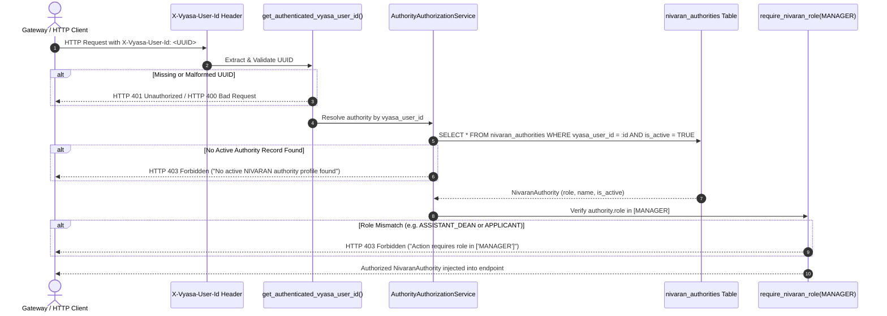

# NIVARAN Pillar: Manager Identity & RBAC Foundation

**Document Identifier:** `VYASA-NIVARAN-AUTH-01`  
**Phase:** 5A — Manager Identity + RBAC Foundation  
**Status:** IMPLEMENTED & VERIFIED  
**Target Path:** `docs/pillars/nivaran/manager-authorization.md`  

---

## 1. Architectural Boundary & Identity Ownership

The NIVARAN pillar strictly adheres to the VYASA ecosystem identity boundary:

```
┌────────────────────────────────────────────────────────────────────────┐
│                          VYASA CORE ECOSYSTEM                          │
│                                                                        │
│   • Central Identity Management (User Directory)                       │
│   • Multi-Factor Authentication & SSO Gateway                          │
│   • Password & Credential Storage (Zero passwords in NIVARAN)          │
│   • Session Management & JWT Issuance                                  │
│   • Institutional Organization & Tenant Boundary                       │
└───────────────────────────────────┬────────────────────────────────────┘
                                    │
                       Forwarded Identity Header:
                        `X-Vyasa-User-Id: <UUID>`
                                    │
                                    ▼
┌────────────────────────────────────────────────────────────────────────┐
│                        NIVARAN GRIEVANCE PILLAR                        │
│                                                                        │
│   • Domain Authority Profiles (`nivaran_authorities`)                  │
│   • Domain-Specific Roles (`NivaranRole.MANAGER`, `DEAN`, etc.)        │
│   • Institutional Grievance Permissions (24 Domain Capabilities)       │
│   • Workflow & Triage Authorization Dependencies                       │
│   • Academic Taxonomy Arbitration & Audit Trails                       │
└────────────────────────────────────────────────────────────────────────┘
```

### Why NIVARAN Does Not Create Local Authentication:
1. **Zero Credential Duplication:** NIVARAN stores **no** passwords, password hashes, salts, or credentials.
2. **Zero JWT Issuance:** NIVARAN never generates or verifies local cryptographic tokens; it relies entirely on the verified platform gateway identity.
3. **Decoupled Identity Lifecycle:** If a user's account is suspended, terminated, or reassigned in VYASA Core, NIVARAN immediately reflects that identity via its authoritative `vyasa_user_id` foreign reference.

---

## 2. Manager Role & `vyasa_user_id` Mapping

In NIVARAN, the **Manager** is represented within the existing, frozen 40-table schema in `nivaran_authorities`:

```sql
TABLE nivaran_authorities (
    id UUID PRIMARY KEY,
    vyasa_user_id UUID UNIQUE NOT NULL,    -- Foreign reference to VYASA Core User
    role nivaran_role NOT NULL,             -- Enum: 'MANAGER', 'DEAN', etc.
    name_snapshot VARCHAR(150) NOT NULL,    -- Denormalized cache of full name
    email_snapshot VARCHAR(255) NOT NULL,   -- Denormalized cache of email
    designation VARCHAR(150),
    department VARCHAR(150),
    is_active BOOLEAN NOT NULL DEFAULT TRUE,
    created_at TIMESTAMP WITH TIME ZONE DEFAULT NOW(),
    updated_at TIMESTAMP WITH TIME ZONE DEFAULT NOW()
);
```

- **Role Enum Value:** `NivaranRole.MANAGER = "MANAGER"` in `app/models/enums.py`.
- **Zero Schema Alteration:** The model and PostgreSQL table already support `NivaranRole.MANAGER`. No Alembic migrations or schema expansions were performed.

---

## 3. Authorization Flow & Service Abstraction

Authorization decisions are derived through a strict unidirectional dependency chain:



### Security Guarantees:
- **Never Trusts Client Role:** Any client-supplied body field `{"role": "MANAGER"}` or custom header `X-Role: MANAGER` is completely ignored. Privileges are derived exclusively from the database lookup.
- **Fail-Closed Default:** Any unknown user ID, inactive authority (`is_active = False`), or non-authority caller receives an explicit `HTTP 403 Forbidden`.

---

## 4. Manager Domain Permissions Architecture

Rather than expanding the database schema with extra tables (`manager_permissions`, `role_permissions`), domain permissions are modeled in `app/core/permissions.py` using `NivaranPermission` and mapped in code via `ROLE_PERMISSIONS`.

The Manager possesses all **24 domain capabilities** discovered during the Phase 4 forensic audit:

| Category | Permission Name | Operational Purpose |
| :--- | :--- | :--- |
| **Grievance Administration** | `VIEW_ALL_GRIEVANCES` | Global, cross-department visibility across all cases |
| | `VIEW_GRIEVANCE` | Access individual grievance dossier |
| | `ASSIGN_GRIEVANCE` | Allocate/reassign case to an authority |
| | `CHANGE_PRIORITY` | Escalate or adjust case priority |
| | `CHANGE_STATUS` | Drive workflow stage transitions |
| | `CLOSE_GRIEVANCE` | Formal administrative sign-off and closure |
| | `REOPEN_GRIEVANCE` | Reactivate resolved/closed cases for re-investigation |
| | `RESOLVE_GRIEVANCE` | Direct manager resolution without active assignee lock |
| **Internal Dialogue** | `ADD_INTERNAL_COMMENT` | Record non-student-facing internal directives |
| | `VIEW_INTERNAL_COMMENTS`| Read all internal discussions and instructions |
| **Evidence & Archival** | `UPLOAD_ATTACHMENT` | Attach evidence or official notifications |
| | `VIEW_ATTACHMENT` | Access case documents |
| | `DELETE_ATTACHMENT` | Purge confidential or erroneous uploads |
| | `GENERATE_E_FILE` | Mint official archival PDF dossier |
| | `SEARCH_E_FILE_REPOSITORY`| Global search across sealed E-Files |
| | `PREVIEW_E_FILE` | Preview generated dossier prior to final export |
| | `DOWNLOAD_E_FILE` | Export sealed dossier (with step-up auth) |
| **Operational Intelligence** | `VIEW_ANALYTICS` | Access institutional resolution rate & SLA velocity |
| | `VIEW_ACTIVITY_LOGS` | Access real-time activity feeds |
| | `VIEW_AUDIT_LOGS` | Access immutable system audit trail |
| **Digital Signatures** | `SIGN_DOCUMENT` | Initiate RSA-PSS signing authorization |
| | `VERIFY_SIGNATURE` | Verify cryptographic validity of officer signatures |
| **Feedback Administration** | `VIEW_FEEDBACK` | Review applicant post-resolution feedback |
| | `SUBMIT_FEEDBACK` | Submit administrative feedback notes |

---

## 5. Legacy vs New NIVARAN RBAC Mapping

| Dimension | Legacy `NIVARAN-AI` | New Independent `VYASA-NIVARAN` |
| :--- | :--- | :--- |
| **User Table** | `users` table storing local email, `password_hash`, `role` | `nivaran_authorities` linking to external `vyasa_user_id` |
| **Authentication** | Local `/api/v1/auth/token` with JWT issuance | Platform Gateway / SSO header `X-Vyasa-User-Id` |
| **Password Storage** | Bcrypt hashes in PostgreSQL | **Zero password storage** (Managed by VYASA Core) |
| **Role Enum** | `UserRole.MANAGER` in `app/models/user.py` | `NivaranRole.MANAGER` in `app/models/enums.py` |
| **Permissions Structure** | In-memory `ROLE_PERMISSIONS` dict in `permissions.py` | In-memory `ROLE_PERMISSIONS` dict in `app/core/permissions.py` |
| **Authorization Check** | `require_permission(Permission.X)` via JWT dependency | `require_nivaran_permission(NivaranPermission.X)` via gateway identity |

---

## 6. Deferred Manager Capabilities (Next Phases)

The following operational capabilities are deliberately deferred to subsequent implementation phases as scoped:

1. **Phase 5B:** Manager Command Center & Dashboard endpoints (`/api/v1/manager/overview`, `/workflow`, `/assignments`, `/analytics`, `/activity`).
2. **Phase 5C:** Operational Action Queues (`ai_review_pending`, `reopened`, `closure_pending`, `unassigned`).
3. **Phase 5D:** AI Category Review (`PATCH /api/v1/grievances/{id}/ai-review`) and dynamic authority assignment (`POST /api/v1/assignments/{id}`).
4. **Phase 5E:** Resolution, Formal Closure, and Reopen triage workflows.
5. **Phase 5F:** Digital Signatures and Archival E-File dossier integration.
