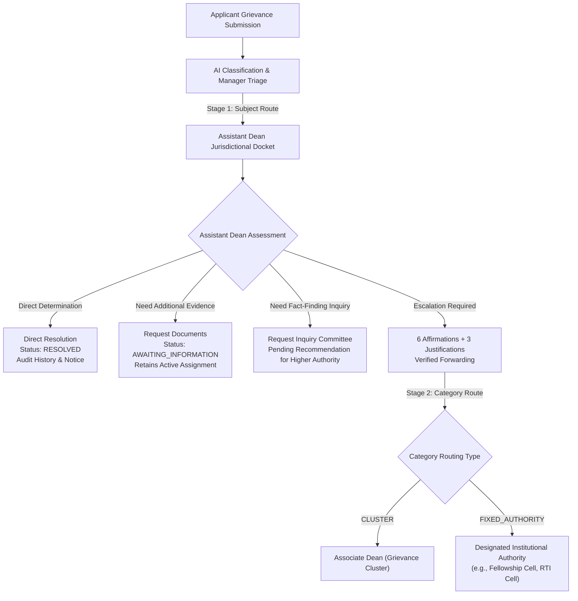

# Atharva Veda: NIVARAN-AI Assistant Dean Workflow (Stage 1 Redressal)

## 1. Overview
The Assistant Dean workflow represents **Stage 1 Redressal** in the Atharva Veda (`NIVARAN-AI`) sequential grievance resolution hierarchy. Following intake and Manager triage, grievances are routed to the appointed Assistant Dean based on academic subject cluster jurisdiction.

---

## 2. Sequential Routing Principle

Under NIVARAN-AI canonical rules:
1. **Manager does not route to Associate Dean or Dean directly**: The Manager strictly ratifies/overrides category and triggers **Stage 1 Subject Routing** to the Assistant Dean of the academic subject cluster.
2. **Assistant Dean evaluates within Subject Cluster**: The Assistant Dean reviews all submissions originating within their appointed academic subjects.
3. **Stage 2 Routing is Category-Driven**: When forwarded by the Assistant Dean, destination resolution executes via `DynamicRoutingEngine.resolve_category_route` using `final_category_id` (or fallback `category_id`):
   - **CLUSTER**: Routed to the Associate Dean of the Grievance Cluster (e.g., Course Work Cluster $\rightarrow$ Associate Dean).
   - **FIXED_AUTHORITY**: Routed directly to the designated authority (e.g., Fellowship $\rightarrow$ Fellowship Coordinator, RTI $\rightarrow$ RTI Nodal Officer).
   - **DIRECT_DEAN / TERMINAL**: If terminal at Assistant Dean, forwarding is safely blocked.

---

## 3. Security & Jurisdictional Boundaries

1. **Role Enforcement**:
   - Access is restricted via `require_atharva_assistant_dean`.
   - The user must possess an active record in `nivaran_authorities` with `role == 'ASSISTANT_DEAN'` and `is_active == True`.
   - Non-authorities, applicants, managers, or other authority roles are returned `HTTP 403 Forbidden`.

2. **Docket Scoping & Jurisdiction**:
   - The Assistant Dean docket (`GET /assistant-dean/queue`) retrieves grievances where:
     - The grievance has an active assignment to the Assistant Dean (`Assignment.is_active == True`), OR
     - The grievance's subject belongs to the Assistant Dean's appointed `SubjectCluster`.
   - Direct mutations (`resolve`, `forward`, `document-requests`, `committee-requests`) verify that the grievance is currently assigned to or within the subject cluster jurisdiction of the requesting Assistant Dean.

---

## 4. Key Actions & State Transitions

### A. Direct Resolution (`POST /assistant-dean/grievances/{id}/resolve`)
- Solves grievances locally without higher authority escalation.
- Validates that grievance status is solvable (`ASSIGNED`, `UNDER_INVESTIGATION`, `AWAITING_INFORMATION`).
- Atomically updates:
  - `status = RESOLVED`
  - `resolution_summary = <resolution_notes>`
  - `resolved_by_authority_id = <asst_dean_authority_id>`
  - `resolved_at = datetime.now(timezone.utc)`
- Inserts `GrievanceStatusHistory` record (`remarks="Directly resolved by Assistant Dean"`).
- Inserts `AuditLog` entry (`action="ASSISTANT_DEAN_RESOLVED"`).
- Emits in-app notifications to applicant and departmental authorities.

### B. Verified Forwarding to Stage 2 (`POST /assistant-dean/grievances/{id}/forward`)
- Evaluates Stage 2 routing destination using `DynamicRoutingEngine.resolve_category_route`.
- Enforces **6 Mandatory Institutional Verification Affirmations**:
  1. `reviewed_student_submission == True`
  2. `reviewed_prior_history == True`
  3. `reviewed_regulations == True`
  4. `verified_no_conflict == True`
  5. `confirmed_jurisdiction == True`
  6. `confirmed_recommendations_actionable == True`
- Enforces **3 Mandatory Justifications** (minimum 5 non-whitespace characters each):
  1. `reasons_justification`: Explanation why case requires Stage 2 escalation.
  2. `preliminary_findings`: Summary of facts established and departmental inquiries.
  3. `specific_questions`: Actionable determinations requested from Stage 2 authority.
- Atomically executes:
  - Deactivates previous active assignment.
  - Creates new active `Assignment` record pointing to resolved target authority.
  - Inserts `ForwardingConfirmation` record storing all 6 affirmations and 3 justifications.
  - Updates grievance `status = ASSIGNED`.
  - Inserts `GrievanceStatusHistory` (`to_status="ASSIGNED"`).
  - Inserts `AuditLog` (`action="ASSISTANT_DEAN_FORWARDED"`).

### C. Evidentiary Document Requests (`POST /assistant-dean/grievances/{id}/document-requests`)
- Allows issuing formal document requests to scholar or academic department.
- Transitions grievance status: `status = AWAITING_INFORMATION`.
- **Preserves active assignment** to the Assistant Dean (preventing orphaned cases).
- Inserts `DocumentRequest` rows with title, optional description, and optional deadline.
- Inserts status history and audit log.

### D. Ad-Hoc Committee Formation Requests (`POST /assistant-dean/grievances/{id}/committee-requests`)
- Allows recommending constitution of an ad-hoc inquiry committee.
- Validates justification (min 5 characters) and optional proposed member roles.
- Prevents duplicate pending requests for the same grievance.
- Inserts `CommitteeCreationRequest` record in `PENDING` status for higher authority ratification.

---

## 5. API Endpoints Reference

| Method | Endpoint | Description |
|---|---|---|
| `GET` | `/api/modules/atharva-veda/nivaran/assistant-dean/queue` | Paginated queue with filters (`status_filter`, `search`, `priority`) |
| `GET` | `/api/modules/atharva-veda/nivaran/assistant-dean/cases` | Scoped list alias for jurisdictional cases |
| `GET` | `/api/modules/atharva-veda/nivaran/assignments/my/grievances` | Reference alias for my assigned grievances |
| `GET` | `/api/modules/atharva-veda/nivaran/assistant-dean/grievances/{id}` | Dossier with Stage 2 routing preview & forward capability flags |
| `POST` | `/api/modules/atharva-veda/nivaran/assistant-dean/grievances/{id}/resolve` | Formal direct resolution determination |
| `POST` | `/api/modules/atharva-veda/nivaran/grievances/{id}/resolve` | Canonical resolve alias |
| `POST` | `/api/modules/atharva-veda/nivaran/assistant-dean/grievances/{id}/forward` | 6-checkbox + 3-justification verified forwarding |
| `POST` | `/api/modules/atharva-veda/nivaran/assignments/{id}` | Canonical re-assignment / forwarding alias |
| `POST` | `/api/modules/atharva-veda/nivaran/assistant-dean/grievances/{id}/document-requests` | Evidentiary document requests |
| `GET` | `/api/modules/atharva-veda/nivaran/grievances/{id}/document-requests` | List document requests for grievance |
| `POST` | `/api/modules/atharva-veda/nivaran/assistant-dean/grievances/{id}/committee-requests` | Committee formation recommendation |
| `POST` | `/api/modules/atharva-veda/nivaran/committees/requests/{id}` | Canonical committee request alias |

---

## 6. Frontend Components & Pages

1. **`AssistantDeanDashboardPage`**:
   - Location: `frontend/src/modules/atharva-veda/nivaran/pages/AssistantDeanDashboardPage.tsx`
   - Docket metrics (Total, Under Active Review, Awaiting Information, Resolved).
   - Real-time search, status tabs, and priority filters.
   - Case table with direct navigation to grievance dossier.
2. **`AssistantDeanGrievanceDetailPage`**:
   - Location: `frontend/src/modules/atharva-veda/nivaran/pages/AssistantDeanGrievanceDetailPage.tsx`
   - Full case dossier, applicant details, AI review status, and attached documents.
   - Stage 2 routing destination preview card with target authority details.
   - Jurisdictional action buttons (Direct Resolution, Forward, Request Documents, Request Committee).
   - Document requests list and status history timeline.
3. **`ForwardConfirmationModal`**:
   - Location: `frontend/src/modules/atharva-veda/nivaran/components/ForwardConfirmationModal.tsx`
   - Interactive 6-checkbox verification grid.
   - 3 mandatory justification text areas with live length validation.
   - Stage 2 destination preview card.
4. **`ResolveGrievanceModal`**:
   - Location: `frontend/src/modules/atharva-veda/nivaran/components/ResolveGrievanceModal.tsx`
   - Formal resolution determination input with character validation.
5. **`RequestDocumentModal`**:
   - Location: `frontend/src/modules/atharva-veda/nivaran/components/RequestDocumentModal.tsx`
   - Multi-document request builder with deadlines.
6. **`RequestCommitteeModal`**:
   - Location: `frontend/src/modules/atharva-veda/nivaran/components/RequestCommitteeModal.tsx`
   - Committee inquiry justification and proposed roles builder.

---

## 7. Verification & Audit Trail

- **Backend Test Suite**: `backend/tests/test_assistant_dean_workflow_phase6c.py` (9/9 passed, 100%).
- **Frontend Test Suite**: `frontend/src/modules/atharva-veda/nivaran/__tests__/assistantDeanPages.test.tsx` (7/7 passed, 100%).
- **Reference Integrity**: `projects/NIVARAN-AI/` completely untouched.
- **Database Schema**: 0 Alembic migrations, existing schema utilized with zero drift.
