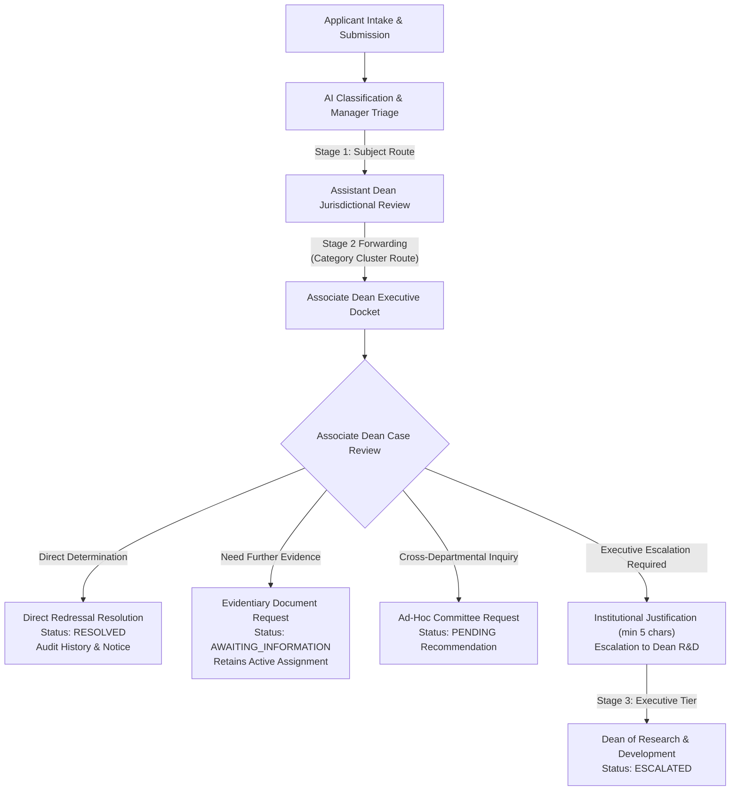

# Atharva Veda: NIVARAN-AI Associate Dean Workflow (Stage 2 Redressal)

## 1. Overview
The Associate Dean workflow represents **Stage 2 Executive Redressal** in the Atharva Veda (`NIVARAN-AI`) sequential grievance resolution hierarchy. Following preliminary inquiry and forwarding by the Assistant Dean at Stage 1, grievances route to the designated Associate Dean based on Grievance Category and Grievance Cluster jurisdiction.

---

## 2. Sequential Routing Principle & Jurisdictional Handoff

Under NIVARAN-AI canonical rules:
1. **Manager does not route to Associate Dean directly**: The Manager strictly ratifies/overrides category and triggers **Stage 1 Subject Routing** to the Assistant Dean of the academic subject cluster.
2. **Assistant Dean Verified Forwarding**: The Assistant Dean reviews the case locally, conducts preliminary inquiries, and, if unresolved, forwards the grievance via Stage 2 Category Routing.
3. **Category-to-Cluster Routing**: For categories configured with `CategoryRoutingType.GRIEVANCE_CLUSTER`, `DynamicRoutingEngine.resolve_category_route` resolves the assigned `GrievanceCluster` and its configured Associate Dean (`associate_dean_id`).
4. **Stage 3 Dean Destination Resolution**: When an Associate Dean determines that institutional policy intervention is required, the grievance is escalated to the Executive Tier. `DynamicRoutingEngine.resolve_dean_route` dynamically identifies the active Dean authority (`NivaranRole.DEAN`).

---

## 3. Security & Jurisdictional Boundaries

1. **Role Enforcement**:
   - Access is strictly governed via `require_atharva_associate_dean`.
   - The user must possess an active record in `nivaran_authorities` with `role == 'ASSOCIATE_DEAN'` and `is_active == True`.
   - Applicants, Managers, Assistant Deans, or Deans attempting to access Associate Dean management routes receive `HTTP 403 Forbidden`. Unauthenticated requests receive `HTTP 401 Unauthorized`.

2. **Docket Scoping & Record-Level Jurisdiction**:
   - The Associate Dean queue (`GET /modules/atharva-veda/nivaran/associate-dean/grievances` and backwards-compatible alias `/associate-dean/cases`) queries only cases where:
     - The grievance has an active assignment to the requesting Associate Dean (`Assignment.is_active == True`).
   - Associate Deans cannot view, resolve, or escalate cases assigned to other authorities (enforced with `HTTP 403 Forbidden` / `HTTP 404 Not Found`).

---

## 4. Key Actions & State Transitions

### A. Direct Resolution (`POST /associate-dean/grievances/{id}/resolve`)
- Resolves grievances within Associate Dean executive authority.
- Validates that grievance status is actionable (`ASSIGNED`, `IN_PROGRESS`, `UNDER_REVIEW`, `AWAITING_INFORMATION`).
- Enforces non-empty resolution notes (`resolution_notes`, minimum 5 non-whitespace characters).
- Atomically executes:
  - Updates `status = RESOLVED`.
  - Sets `resolution_summary = <resolution_notes>`.
  - Sets `resolved_by_authority_id = <associate_dean_authority_id>`.
  - Sets `resolved_at = datetime.now(timezone.utc)`.
  - Inserts `GrievanceStatusHistory` record (`actor_type="ASSOCIATE_DEAN"`).
  - Inserts `AuditLog` entry (`action="GRIEVANCE_RESOLVED"`).
  - Emits real-time notification to the applicant.
- Prevents redundant resolutions on terminal cases (`HTTP 400 Bad Request`).

### B. Escalation / Forwarding to Dean (`POST /associate-dean/grievances/{id}/forward` / `/escalate`)
- Escalates intractable grievances to the Executive Tier (Dean of Research & Development).
- Enforces institutional justification text (`justification` or `reason`, minimum 5 non-whitespace characters).
- Dynamically resolves target Dean via `DynamicRoutingEngine.resolve_dean_route`.
- Atomically executes:
  - Deactivates Associate Dean's active assignment (`Assignment.is_active = False`).
  - Creates new active `Assignment` record pointing to the resolved Dean.
  - Updates grievance `status = ESCALATED`.
  - Sets `current_assigned_authority_id = <dean_authority_id>`.
  - Inserts `ForwardingConfirmation` record storing the institutional justification.
  - Inserts `GrievanceStatusHistory` (`to_status="ESCALATED"`).
  - Inserts `AuditLog` entry (`action="GRIEVANCE_ESCALATED"`).
  - Dispatches notifications to both the Dean and the applicant.

### C. Evidentiary Document Requests (`POST /associate-dean/grievances/{id}/document-requests`)
- Issues formal document requests to the applicant or department.
- Updates grievance status to `AWAITING_INFORMATION`.
- **Preserves active assignment** to the Associate Dean.
- Inserts `DocumentRequest` rows with title, description, and optional deadline.
- Inserts status history, audit log, and applicant notification.

### D. Ad-Hoc Committee Formation Requests (`POST /associate-dean/grievances/{id}/request-committee`)
- Recommends the formal constitution of an inquiry or fact-finding panel.
- Validates justification and committee type (`INQUIRY`, `APPEAL`, `SPECIAL`).
- Creates `CommitteeCreationRequest` in `PENDING` status.
- Prevents duplicate pending requests for the same grievance (`HTTP 400 Bad Request`).

---

## 5. API Reference Summary

| Endpoint | Method | Role Required | Description |
|---|---|---|---|
| `/modules/atharva-veda/nivaran/associate-dean/dashboard` | `GET` | `ASSOCIATE_DEAN` | Aggregate KPI metrics (total, pending, in-progress, resolved, escalated) |
| `/modules/atharva-veda/nivaran/associate-dean/grievances` | `GET` | `ASSOCIATE_DEAN` | Active jurisdictional queue with status, priority, search, & pagination |
| `/modules/atharva-veda/nivaran/associate-dean/cases` | `GET` | `ASSOCIATE_DEAN` | Canonical alias for active jurisdictional queue |
| `/modules/atharva-veda/nivaran/associate-dean/grievances/{id}` | `GET` | `ASSOCIATE_DEAN` | Comprehensive dossier with Stage 3 Dean preview & determination flags |
| `/modules/atharva-veda/nivaran/associate-dean/grievances/{id}/resolve` | `POST` | `ASSOCIATE_DEAN` | Direct resolution of grievance with formal summary notes |
| `/modules/atharva-veda/nivaran/associate-dean/grievances/{id}/forward` | `POST` | `ASSOCIATE_DEAN` | Escalation to Dean R&D with institutional justification |
| `/modules/atharva-veda/nivaran/associate-dean/grievances/{id}/escalate` | `POST` | `ASSOCIATE_DEAN` | Canonical alias for escalation to Dean |
| `/modules/atharva-veda/nivaran/grievances/{id}/resolve` | `POST` | Dynamic Authority | Shared resolve route dispatched to Associate Dean service when caller is Associate Dean |
| `/modules/atharva-veda/nivaran/grievances/{id}/escalate` | `POST` | Dynamic Authority | Shared escalate route dispatched to Associate Dean service when caller is Associate Dean |
| `/modules/atharva-veda/nivaran/associate-dean/grievances/{id}/document-requests` | `POST` | `ASSOCIATE_DEAN` | Dispatches evidentiary document requests to scholar |
| `/modules/atharva-veda/nivaran/associate-dean/grievances/{id}/request-committee` | `POST` | `ASSOCIATE_DEAN` | Submits formal ad-hoc committee constitution proposal |
