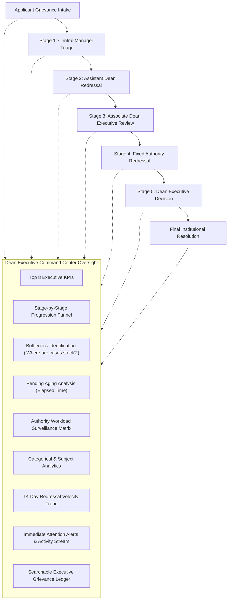

# Atharva Veda: NIVARAN-AI Dean Executive Command Center

## 1. Overview & Institutional Mandate

The **Dean Executive Command Center** (`DeanExecutiveDashboardPage.tsx`) represents the institutional apex surveillance and intelligence console for the **Dean of Research & Development** at Chhatrapati Shahu Ji Maharaj University (CSJMU). 

Unlike operational task queues (which only show a single authority's inbox), the Executive Command Center provides comprehensive, multi-dimensional oversight across the entire university grievance lifecycle:



---

## 2. Core Architectural Principles & Strict Guarantees

1. **Pure Data-Driven Operational Metrics (Zero Hardcoding)**:
   - Every single number, percentage, dwell duration, and backlog count is derived through deterministic SQL/SQLAlchemy queries on live records.
   - Zero mock data or estimated values in production pipelines.

2. **No Performance Rankings or Leaderboards**:
   - The dashboard focuses strictly on workload balance, stage dwell times, pending case counts, and institutional bottlenecks.
   - Avoids individual competition rankings to maintain collaborative academic administration.

3. **Strict Dean Role Authorization**:
   - Backend endpoints (`GET /dean/dashboard` and `GET /dean/dashboard/cases`) are strictly guarded with `require_atharva_dean`.
   - Any non-Dean persona (Applicant, Manager, Assistant Dean, Associate Dean, Platform Admin) receives `HTTP 403 Forbidden`.
   - Frontend routes (`/modules/atharva-veda/nivaran/dean/dashboard`) are guarded by `AuthorityScopedRoute allowedRoles={['DEAN']}`.

4. **Zero Database Migrations**:
   - The entire surveillance and analytics engine operates cleanly atop existing schema models (`NivaranGrievance`, `NivaranAssignment`, `NivaranAuthority`, `GrievanceStatusHistory`, `NivaranCategory`, `SubjectCluster`, `GrievanceCluster`, `NivaranSubject`).
   - Migration status remains locked at `8b29c54e1005 (head)`.

5. **Canonical Asia/Kolkata (`UTC+05:30`) Timezone & Elapsed Time Metrics**:
   - All aging calculations compute elapsed duration from `created_at` or `assigned_at` to `datetime.now(timezone.utc)`.
   - Formatted into readable days and hours (e.g., `4d 12h`, `18h`, `< 24h`).

---

## 3. Executive Dashboard Panels & Analytical Engines

### A. Top 8 Executive KPI Cards
Provides high-altitude university metrics with click-to-filter drilldown:
1. **Total Intake**: Cumulative volume of all recorded grievances in the institution.
2. **Active / Open**: All unresolved grievances currently in motion (`SUBMITTED`, `PENDING_REVIEW`, `ASSIGNED`, `IN_PROGRESS`, `AWAITING_INFORMATION`, `ESCALATED`, `REOPENED`).
3. **Pending Queue**: Active cases currently awaiting administrative action.
4. **In Progress**: Grievances under active investigation or evidentiary inquiry.
5. **Resolved**: Cases successfully determined, with resolution rate (%) and average resolution duration (`avg_resolution_time_display`).
6. **Escalated**: Cases escalated upwards to higher authority or Dean executive tier.
7. **Awaiting Info**: Grievances pending applicant evidentiary documents.
8. **Critical / Urgent**: High-risk cases with `CRITICAL` or `URGENT` priority status.

### B. Workflow Progression Pipeline (6-Stage Funnel)
Visualizes end-to-end case flow with current volume, percentage of active workload, and average dwell time per stage:
- **Stage 1 (Applicant Intake)**: Cases in `SUBMITTED` state.
- **Stage 2 (Central Manager Triage)**: Triage, AI category verification, and initial routing.
- **Stage 3 (Assistant Dean Redressal)**: Subject-cluster-based preliminary investigation.
- **Stage 4 (Associate Dean Review)**: Category-cluster-based executive review.
- **Stage 5 (Fixed Authority Redressal)**: Specialized administrative office redressal (e.g., Fellowship, Evaluation).
- **Stage 6 (Dean Executive Decision)**: Direct university executive determination.

### C. "Where Are Cases Stuck?" Bottleneck Analysis
Dynamically highlights administrative friction points by authority tier:
- Current pending case count per tier (`MANAGER`, `ASSISTANT_DEAN`, `ASSOCIATE_DEAN`, `FIXED_AUTHORITY`, `DEAN`).
- Age of the oldest pending case (`oldest_case_age_display` and `oldest_case_tracking_id`).
- Average, median, and maximum dwell times in the current stage.

### D. Pending Aging Analysis (Elapsed Time Buckets)
Granular distribution of active grievance aging:
- `< 24 Hours`: Fresh intake
- `1–3 Days`: Standard processing
- `4–7 Days`: Approaching normal threshold
- `8–14 Days`: Delayed / In progress
- `15–30 Days`: Substantially aged
- `30+ Days`: Critical institutional backlog
- Each bucket displays count, percentage of active queue, priority composition, and click-to-filter capability.

### E. Administrative Authority Workload Surveillance
Tabbed inspection across administrative tiers:
- **Assistant Deans Tab**: Docket breakdown by assigned faculty, subject cluster, active/pending/resolved counts, and oldest case.
- **Associate Deans Tab**: Grievance cluster jurisdiction, active workload, escalations to Dean, and avg age.
- **Manager Triage Tab**: Manager intake queue, awaiting AI review count, and AI classification accuracy rate (%).
- **Fixed Authorities Tab**: Dedicated category jurisdictions (e.g., Fellowship, Examinations), responsible officers, active docket.
- **All Active Officers Tab**: Comprehensive roster across all university grievance authorities.

### F. Categorical & Subject Cluster Surveillance
- **Category Volume & Dwell Time**: Case count, active count, resolved count, and average resolution time per category.
- **Subject Cluster Distribution**: Grievance volume categorized by academic school/faculty cluster.

### G. 14-Day Redressal Velocity Trend
- Daily velocity tracking incoming intake vs. successful resolutions vs. executive escalations.
- Net active university backlog trend over the past 14 days.

### H. Immediate Attention Required & Recent Activity
- **Immediate Attention Panel**: Identifies top critical aged cases, escalations to Dean, and multi-escalation grievances.
- **Institutional Activity Stream**: Chronological feed of assignments, resolutions, escalations, and status transitions.

### I. Executive Grievance Ledger
- Searchable, filterable, and paginated (15 per page) institutional case registry.
- Displays tracking ID, applicant title, academic subject & category, current stage level, assigned authority officer, priority badge, status badge, total elapsed age, current stage dwell time, and last action taken.
- Direct navigation to detailed case dossier (`/modules/atharva-veda/nivaran/dean/cases/{id}`).

---

## 4. API Endpoints Specification

### 1. `GET /modules/atharva-veda/nivaran/dean/dashboard`
Aggregates all command center intelligence in a single, high-performance payload.

**Query Parameters (Optional Filters)**:
- `start_date`: ISO 8601 timestamp
- `end_date`: ISO 8601 timestamp
- `status`: Grievance status filter (`SUBMITTED`, `ASSIGNED`, `IN_PROGRESS`, `RESOLVED`, etc.)
- `priority`: Priority filter (`LOW`, `MEDIUM`, `HIGH`, `URGENT`, `CRITICAL`)
- `level`: Stage level filter (`MANAGER`, `ASSISTANT_DEAN`, `ASSOCIATE_DEAN`, `FIXED_AUTHORITY`, `DEAN`)
- `category_id`: UUID
- `subject_cluster_id`: UUID
- `subject_id`: UUID
- `authority_id`: UUID
- `aging_bucket`: Bucket key (`<24h`, `1-3d`, `4-7d`, `8-14d`, `15-30d`, `30+d`)

**Response Schema**: `DeanDashboardDataResponse`

### 2. `GET /modules/atharva-veda/nivaran/dean/dashboard/cases`
Provides paginated, filtered grievance records for the Executive Ledger.

**Query Parameters**:
- Same filters as dashboard endpoint.
- `page`: Integer (default: 1)
- `page_size`: Integer (default: 15)
- `search`: String (searches tracking ID, title, applicant name, description)
- `sort_by`: String (`created_at`, `priority`, `status`, `total_age_hours`)
- `sort_dir`: String (`asc`, `desc`, default: `desc`)

**Response Schema**: `ExecutiveLedgerResponse`

---

## 5. Security & Authorization

```python
# Guard applied to all /dean routes:
async def require_atharva_dean(
    current_user: User = Depends(get_current_user),
    db: AsyncSession = Depends(get_db),
) -> NivaranAuthority:
    # 1. Queries nivaran_authorities for current_user.id
    # 2. Verifies authority.role == NivaranRole.DEAN
    # 3. Verifies authority.is_active is True
    # 4. If invalid, raises HTTPException(status_code=403, detail="Atharva Veda Dean authorization required")
```

---

## 6. Verification & Test Coverage

- **Backend Test Suite**: `backend/tests/test_dean_executive_dashboard.py`
  - 12 comprehensive automated tests covering Dean authorization, non-Dean 403 rejections, KPI aggregations, workflow pipeline funnel, bottleneck metrics, aging bucket counts, authority workloads, oldest cases, 14-day trends, filter queries, ledger pagination, and search.
  - Result: **12 passed (100%) in 152s**.
- **Frontend Test Suite**: `frontend/src/modules/atharva-veda/nivaran/__tests__/deanExecutiveDashboard.test.tsx`
  - 8 comprehensive UI integration tests covering Command Center header, refresh controls, 8 KPI cards, 6-stage funnel, bottleneck cards, click-to-filter aging analysis, tabbed authority workload matrix, attention alerts & activity stream, and the executive ledger.
  - Result: **8 passed (100%) in 1.1s**.
- **Full Nivaran Test Suite**: **6 test files, 48 tests passed (100%)**.
- **Frontend Build**: `npm run build` completed with **0 TypeScript and 0 Vite bundle errors**.
