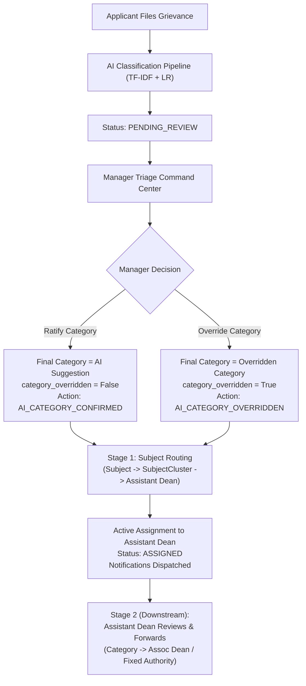

# Atharva Veda: NIVARAN-AI Manager Triage & AI Classification Review Workflow

## 1. Overview
The Manager Triage workflow in Atharva Veda (`NIVARAN-AI`) implements the authoritative institutional gateway bridging applicant grievance intake and downstream authority redressal:



---

## 2. Permissions & Authorization Boundaries
Access to triage workflows is strictly guarded by the backend dependency `require_atharva_manager`:
- **Eligible Persona**: Only an active user having an appointed record in `nivaran_authorities` with `role == MANAGER` and `is_active == True`.
- **Role Boundary Enforcement**:
  - `applicant` $\rightarrow$ `HTTP 403 Forbidden`
  - `assistant_dean` $\rightarrow$ `HTTP 403 Forbidden`
  - `associate_dean` $\rightarrow$ `HTTP 403 Forbidden`
  - `dean` $\rightarrow$ `HTTP 403 Forbidden`
  - `administrator` (without appointed Manager authority) $\rightarrow$ `HTTP 403 Forbidden`
- **Scope**: University-wide triage authority across all subjects and categories.

---

## 3. Manager Triage Queue
Mounted at `GET /api/modules/atharva-veda/nivaran/manager/queue`:
- **Eligible Cases**: Defaults to cases in `status=PENDING_REVIEW` awaiting triage.
- **Action Queues**:
  - `queue=ai_review` or `queue=ai_review_pending`: retrieves cases in `PENDING_REVIEW` or unreviewed `SUBMITTED`/`ASSIGNED`.
  - `queue=reopened`: retrieves cases in `REOPENED` status.
  - `queue=assigned`: retrieves cases already assigned.
- **Dynamic Search & Filtering**:
  - `search`: Case-insensitive substring search matching tracking ID, title, and description.
  - `priority`: Filter by `LOW`, `MEDIUM`, `HIGH`, `URGENT`.
  - `category_id`: Filter by active category.
  - `subject_id`: Filter by academic department/subject.
  - `sort_by`: Sort field (`created_at`, `priority`).
  - `sort_order`: `desc` (newest first, reference parity) or `asc`.
  - `page` and `page_size`: Server-side SQL LIMIT/OFFSET pagination.

---

## 4. AI Recommendation Review (Reference Parity Endpoint)
Mounted at `PATCH /api/modules/atharva-veda/nivaran/grievances/{grievance_id}/ai-review`:
- **Request Body**:
  ```json
  {
    "category_id": "<UUID or null>",
    "decision": "CONFIRMED" | "ACCEPTED" | "OVERRIDDEN"
  }
  ```
- **Ratification (`CONFIRMED` / `ACCEPTED`)**:
  - Validates that target category matches `ai_suggested_category_id`.
  - Sets `category_overridden = False`, `category_reviewed = True`.
  - Preserves immutable `AIProcessingRecord`.
  - Records `AuditLog` (`action="AI_CATEGORY_CONFIRMED"`).
- **Override (`OVERRIDDEN`)**:
  - Requires valid active `category_id`.
  - Sets `final_category_id = category_id`, `category_overridden = True`, `category_reviewed = True`.
  - Preserves original `ai_suggested_category_id` and `ai_confidence`.
  - Records `AuditLog` (`action="AI_CATEGORY_OVERRIDDEN"`).

---

## 5. Manager Review & Dynamic Assignment Endpoint
Mounted at `POST /api/modules/atharva-veda/nivaran/manager/grievances/{grievance_id}/review`:
- **Request Body**:
  ```json
  {
    "confirm_category": true,
    "override_category_id": "<UUID or null>",
    "override_reason": "<mandatory string if overriding, min 5 chars>",
    "priority": "HIGH",
    "remarks": "<optional triage remarks>"
  }
  ```
- **Concurrency & Row Locking**:
  - Utilizes `select(Grievance)...with_for_update()` to prevent race conditions during concurrent manager access.
- **Idempotency**:
  - Rejects already triaged and assigned cases with `HTTP 400 Bad Request` (`"This grievance has already been reviewed and assigned."`).
- **Final Category Semantics**:
  - Downstream routing engine dynamically resolves the handling authority using `final_category_id` (the Manager's verified decision, never stale AI predictions).

---

## 6. Sequential Routing Architecture (2-Stage Resolution)
The NIVARAN-AI workflow enforces strict sequential authority hierarchy:
```
APPLICANT -> MANAGER (AI Review) -> [Stage 1: Subject Route] -> ASSISTANT DEAN -> [Stage 2: Category Route] -> ASSOCIATE DEAN / FIXED AUTHORITY -> DEAN
```

### Stage 1: Manager Triage -> Subject Assistant Dean
Manager triage ALWAYS assigns the grievance to the accountable Assistant Dean determined by the scholar's academic subject:
- Resolves: `Subject` $\rightarrow$ `SubjectCluster` $\rightarrow$ Appointed `assistant_dean_id` via `DynamicRoutingEngine.resolve_subject_route()`.
- **Critical Rule**: Manager NEVER routes directly to Associate Dean or Fixed Authority. Fixed Authority (`Fellowship`, `RTI_IIGRS`) and Cluster categories do NOT bypass the Assistant Dean.
- The Manager's category decision (`final_category_id`, `category_reviewed`, `category_overridden`, `category_override_reason`) is persisted on `Grievance` for downstream handling.

### Stage 2: Assistant Dean Forwarding -> Category-Based Authority (Downstream)
When the Assistant Dean reviews and forwards the case, the system evaluates `DynamicRoutingEngine.resolve_category_route()` using the grievance's `final_category_id`:
1. `CategoryRoutingType.FIXED_AUTHORITY`:
   - Resolves: `Category` $\rightarrow$ Appointed `fixed_authority_id` (e.g. Fellowship or RTI_IIGRS authority).
2. `CategoryRoutingType.GRIEVANCE_CLUSTER` / `CLUSTER`:
   - Resolves: `Category` $\rightarrow$ `GrievanceCluster` $\rightarrow$ Appointed `associate_dean_id`.
3. `CategoryRoutingType.SUBJECT_ASSISTANT_DEAN`:
   - Remains with or re-verifies the Assistant Dean.

---

## 7. State Transitions & Immutable Status History
1. Prior active assignments for the grievance are deactivated (`is_active = False`, `unassigned_at = now`).
2. A new active `Assignment` record is created foreign-keyed to the resolved target authority.
3. Grievance status transitions from `PENDING_REVIEW` to `ASSIGNED`.
4. `GrievanceStatusHistory` entry created:
   - `from_status`: `PENDING_REVIEW`
   - `to_status`: `ASSIGNED`
   - `actor_type`: `USER`
   - `actor_user_id`: Manager's user UUID.
   - `remarks`: Detailed triage audit narrative.

---

## 8. Audit Logging & Notifications
- **Audit Logs** (`audit_logs`):
  - `action`: `AI_CATEGORY_CONFIRMED` or `AI_CATEGORY_OVERRIDDEN`
  - `action`: `grievance.assigned`
- **In-App Notifications** (`notifications`):
  - **To Assigned Authority**: `type="GRIEVANCE_ASSIGNED"`, `title="New Grievance Assigned"`, `message=f"Grievance {grievance_id} has been assigned to you by Manager."`
  - **To Submitting Applicant**: `type="GRIEVANCE_STATUS_CHANGED"`, `title="Grievance Assigned for Review"`, `message=f"Your grievance {grievance_id} has been triaged and assigned to {authority_name} ({role}) for formal processing."`

---

## 9. Frontend Components
- **Manager Triage Queue**: [`frontend/src/modules/atharva-veda/nivaran/pages/ManagerTriageQueuePage.tsx`](file:///c:/Projects/VYASA/frontend/src/modules/atharva-veda/nivaran/pages/ManagerTriageQueuePage.tsx)
  - Displays queue counts, status filters, search bar, and triage case cards.
- **Manager Case Review & Triage**: [`frontend/src/modules/atharva-veda/nivaran/pages/ManagerGrievanceReviewPage.tsx`](file:///c:/Projects/VYASA/frontend/src/modules/atharva-veda/nivaran/pages/ManagerGrievanceReviewPage.tsx)
  - Case dossier summary, statement of facts, scholar particulars.
  - AI analysis recommendation panel with confidence percentage and color calibration.
  - Radio toggle for Confirm vs Override Category.
  - Active category dropdown with mandatory override justification.
  - Dynamic routing live preview card showing resolved target authority before committing.
- **Service Integration**: [`frontend/src/modules/atharva-veda/nivaran/services/grievanceService.ts`](file:///c:/Projects/VYASA/frontend/src/modules/atharva-veda/nivaran/services/grievanceService.ts)
  - `getManagerTriageQueue()`
  - `previewRouting()`
  - `reviewAndAssignGrievance()`
  - `reviewAIRecommendation()`
