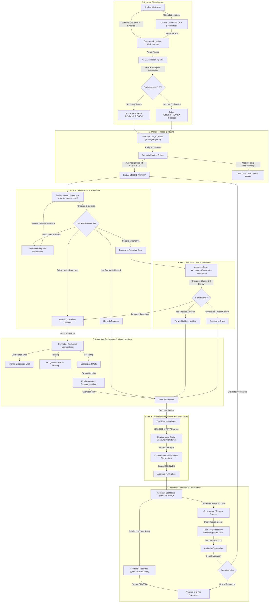
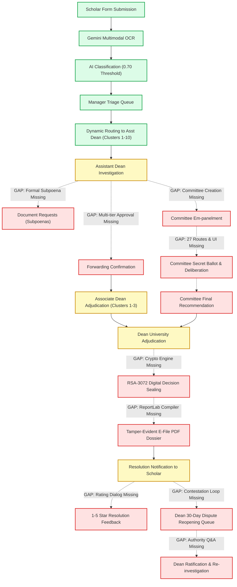
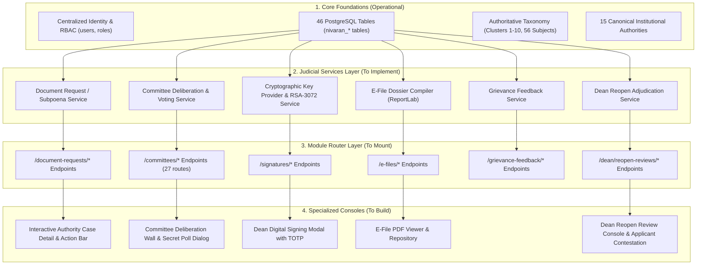

# NIVARAN-AI Functional Parity Audit Report: Reference NIVARAN-AI vs. VYASA Atharva Veda

**Document Version:** 1.0.0  
**Audit Date:** September 30, 2026  
**Reference Source:** `c:\Projects\NIVARAN-AI` (Untouched, Authoritative Source of Truth)  
**Target Implementation:** `c:\Projects\VYASA` (Atharva Veda Pillar)  
**Current Alembic Head:** `8b29c54e1005` (Immutable, Zero Migrations Applied)  
**Audit Nature:** Comprehensive Forensic Analysis (AUDIT ONLY — Zero Database Mutations, Zero Code Modifications)  

---

## 1. Executive Summary

### 1.1 Objective & Strategic Mandate
The Chhatrapati Shahu Ji Maharaj University (CSJMU) grievance redressal architecture was designed and tested within `projects/NIVARAN-AI` as an autonomous, multi-tier institutional conflict resolution platform. In **VYASA**, this architecture is integrated as **Atharva Veda**, the foundational pillar governing grievance adjudication, ethical compliance, and institutional accountability, operating alongside Rig Veda (Academics/Research), Sama Veda (Student Affairs), and Yajur Veda (Examinations & Admissions).

This audit delivers an exhaustive, evidence-backed forensic parity map comparing the reference repository (`c:\Projects\NIVARAN-AI`) with the current VYASA Atharva Veda implementation (`backend/app/modules/atharva_veda/nivaran` and `frontend/src/modules/atharva-veda/nivaran`).

### 1.2 Quantitative Parity Summary

| Metric Dimension | Reference Implementation (`NIVARAN-AI`) | Current VYASA (`Atharva Veda`) | Parity Status / Coverage |
| :--- | :---: | :---: | :---: |
| **API Endpoints** | **135 endpoints** across 19 router files | **25 endpoints** across module & admin routers | 18.5% Implemented (110 missing) |
| **Database Tables** | **47 tables** across 32 model files | **46 tables** (38 domain `nivaran_*` + 8 core tables) | 97.9% Schema Parity |
| **Backend Services** | **23 services** in `backend/app/services/` | **12 services** in `modules/atharva_veda/nivaran/services/` | 52.2% Service Coverage |
| **Frontend Pages** | **42 pages** in `frontend/src/pages/` | **13 pages** (7 module + 6 admin config pages) | 31.0% Page Coverage |
| **Frontend Components** | **70 components** in `frontend/src/components/` | **8 components** in `modules/atharva-veda/nivaran/components/` | 11.4% Component Coverage |
| **Backend Test Suites** | **50 test files** in `backend/tests/` | **25 suites** (8 Atharva Veda specific suites) | 50.0% Test Suite Coverage |
| **Frontend Test Suites** | **2 test files** in `frontend/tests/` | **11 vitest suites** (94 passing unit/integration tests) | 550% Frontend Test Coverage |

### 1.3 Key Architectural Findings
1. **Database Schema Readiness (`97.9% EXACT`)**:
   VYASA has already created 38 authoritative `nivaran_*` tables in PostgreSQL matching the reference implementation's tables (`nivaran_grievances`, `nivaran_student_master_records`, `nivaran_ai_processing_records`, `nivaran_committees`, `nivaran_committee_members`, `nivaran_committee_polls`, `nivaran_efiles`, `nivaran_digital_signatures`, `nivaran_document_requests`, `nivaran_forwarding_confirmations`, `nivaran_dean_reopen_reviews`, etc.). Centralized core tables (`users`, `notifications`, `audit_logs`) replace reference standalone equivalents without data loss.
2. **Core Grievance Ingestion & Triage (`100% OPERATIONAL`)**:
   The primary pipeline—multimodal OCR ingestion via Gemini with local fallback, AI Category classification via TF-IDF + Logistic Regression (0.70 confidence threshold), Manager triage queue with ratify/override capabilities, dynamic authority routing preview, and subject cluster assignment—is fully implemented and verified with passing unit tests.
3. **Primary Judicial Gaps**:
   The database tables exist in PostgreSQL, but backend API routes, business logic services, and frontend pages are missing for:
   - **Committee Deliberations & Secret Ballot Polls** (`api/routes/committees.py` - 27 routes missing).
   - **Asymmetric Digital Signatures** with RSA-3072 PSS and TOTP step-up challenges (`api/routes/signatures.py` - 5 routes missing).
   - **Tamper-Evident Digital E-Files** with ReportLab dynamic PDF generation (`api/routes/efiles.py` - 12 routes missing).
   - **Formal Document Requests / Subpoenas** (`api/routes/document_requests.py` - 4 routes missing).
   - **Dean Dispute Reopening** with authority Q&A ratification (`api/routes/dean_reopen.py` - 5 routes missing).

---

## 2. Reference Scope (`c:\Projects\NIVARAN-AI`)

The untouched reference repository represents an autonomous, full-stack grievance redressal platform.

### 2.1 Backend Architecture (`backend/app/`)
- **Framework**: FastAPI (Python 3.11/3.12/3.14) with asynchronous ASGI execution.
- **ORM / Persistence**: SQLAlchemy 2.0 with PostgreSQL 15+, Alembic migration tracking.
- **Machine Learning & NLP**: Scikit-Learn pipeline (`TfidfVectorizer` + `LogisticRegression`) trained on historical CSJMU grievance corpora (`category_classifier.joblib`), paired with Google Gemini 1.5/2.0 multimodal OCR processing.
- **Cryptography & Security**: PyCA `cryptography` library implementing RSA-3072 key generation, PKCS#8 private key encryption, X.509 public certificates, and RSA-PSS with SHA-256 padding. PyOTP for RFC 6238 TOTP step-up challenges.
- **Document Generation**: ReportLab 3.x/4.x PDF engine implementing `NumberedCanvas` two-pass page numbering, running watermarks, and multi-tier evidentiary dossier collation.
- **API Router Organization (19 routers, 135 endpoints)**:
  1. `api/auth.py` (17 routes): Local JWT authentication, 2FA setup, recovery codes, session tracking.
  2. `api/routes/approval.py` (6 routes): Multi-tier forwarding confirmations and approval requests.
  3. `api/routes/assignment.py` (3 routes): Authority personal assignment and case workload queues.
  4. `api/routes/categories.py` (1 route): Grievance category taxonomy discovery.
  5. `api/routes/committees.py` (27 routes): Full committee lifecycle, voting, and deliberation.
  6. `api/routes/dean.py` (3 routes): Dean executive analytics, urgent attention, and activity feeds.
  7. `api/routes/dean_reopen.py` (5 routes): Reopen dispute queue, Q&A loops, and ratification.
  8. `api/routes/document_requests.py` (4 routes): Formal authority document requests and review.
  9. `api/routes/documents.py` (4 routes): File upload, compartmentalized download, and deletion.
  10. `api/routes/efiles.py` (12 routes): Dossier compilation, step-up access, PDF generation, print logs.
  11. `api/routes/grievance_feedback.py` (3 routes): Scholar satisfaction ratings and public metrics.
  12. `api/routes/grievances.py` (13 routes): Grievance creation, OCR intake, AI triage, escalation, resolution.
  13. `api/routes/manager.py` (6 routes): Manager dashboard metrics, queues, workflow status, assignments.
  14. `api/routes/meetings.py` (12 routes): Virtual hearings via Google Calendar & Google Meet OAuth.
  15. `api/routes/notifications.py` (5 routes): User notifications, unread counts, bulk read marks.
  16. `api/routes/parth.py` (1 route): Conversational AI assistant for student guidance and FAQ triage.
  17. `api/routes/signatures.py` (5 routes): RSA-3072 signing challenges, verification, and certificates.
  18. `api/routes/student_records.py` (7 routes): Student Master Record lookup, sync, and dossiers.
  19. `api/routes/subjects.py` (1 route): Subject taxonomy discovery.

### 2.2 Frontend Architecture (`frontend/src/`)
- **Framework**: React 18 SPA built with Vite, Tailwind CSS, Lucide React icons, and React Router v6.
- **Pages (42 pages)**:
  - Role-specific portals: `ApplicantDashboard`, `MyGrievances`, `SubmitGrievance`, `ManagerDashboard`, `ManagerGrievanceDetail`, `AssistantDeanDashboard`, `AssistantDeanGrievanceDetail`, `AssociateDeanDashboard`, `AssociateDeanGrievanceDetail`, `DeanDashboard`, `DeanGrievanceDetail`, `GuestDashboard`.
  - Analytical consoles: 8 Dean analytics pages (`DeanAIPerformance`, `DeanActivityStream`, `DeanAuthorityWorkload`, `DeanCategoryAnalytics`, `DeanDepartmentAnalytics`, `DeanGrievanceFlow`, `DeanRiskMonitoring`, `DeanTrendsAnalytics`) and 5 Manager sub-pages.
  - Security & Account pages: `login`, `Register`, `TwoFactorSetup`, `TwoFactorVerify`, `RecoveryCodeVerify`, `ForgotPassword`, `ResetPassword`.
  - Dossier & Record pages: `EFileRepository`, `StudentEFiles`, `MyStudentRecord`, `StudentRecordsDirectory`, `StudentMasterRecordDetail`.

---

## 3. Current VYASA Scope (`Atharva Veda`)

VYASA is a unified university enterprise management platform. Atharva Veda is integrated as a first-class module within this ecosystem.

### 3.1 Backend Architecture (`backend/app/modules/atharva_veda/nivaran/`)
- **Module Structure**:
  - `models/`: 10 model files defining 38 tables with `nivaran_*` prefix matching reference schemas.
  - `services/`: 12 domain services (`ai_classification_pipeline`, `ai_processing_service`, `ocr_service`, `grievance_service`, `manager_review_service`, `routing_service`, `submission_restriction_service`, `authority_reconciliation_service`, `taxonomy_cleanup_service`, `admin_config_service`, `subject_seed_service`, `category_seed_service`).
  - `router.py`: Unified FastAPI router mounted under `/modules/atharva-veda/nivaran` exposing 25 endpoints.
  - `dependencies.py`: Role and authority verification dependencies (`require_applicant`, `require_manager`, `require_authority`, `require_assistant_dean`, `require_associate_dean`, `require_dean`).
  - `ai_models/`: Serialized Scikit-learn classifier `category_classifier.joblib`.
- **Integration with VYASA Core**:
  - Auth & RBAC: Handled by VYASA Core (`app/core/security.py`, `app/models/user.py`, `app/models/role.py`). Atharva Veda uses JWT tokens containing core roles (`administrator`, `authority`, `applicant`, `student`).
  - Notifications: Core `Notification` model (`app/models/notification.py`).
  - Audit Trail: Core `AuditLog` model (`app/models/audit.py`).
  - Platform Admin Configuration: Mounted under `/api/admin/atharva/*` (`app/api/routes/applicant.py`, `app/api/routes/admin_atharva.py`).

### 3.2 Frontend Architecture (`frontend/src/modules/atharva-veda/nivaran/` & `admin/pages/atharva/`)
- **Framework**: React 18 with TypeScript (`.tsx`/`.ts`), Tailwind CSS, Lucide React, and React Router v6.
- **Module Pages (7 pages)**:
  - `NivaranWorkspacePage.tsx`: Dynamic role-based landing hub routing users based on workspace persona.
  - `ApplicantGrievanceListPage.tsx`: Personal grievance list for authenticated scholars.
  - `ApplicantGrievanceDetailPage.tsx`: Tracking view with lifecycle timeline and status badges.
  - `GrievanceSubmitPage.tsx`: Assisted submission form with Gemini OCR file scanning.
  - `ManagerTriageQueuePage.tsx`: Triage grid showing pending AI reviews and routing predictions.
  - `ManagerGrievanceReviewPage.tsx`: Review console for ratifying/overriding AI classifications.
  - `AuthorityCasesPage.tsx`: Scoped judicial case list for Assistant Deans, Associate Deans, and Deans.
- **Admin Configuration Pages (6 pages)**:
  - `SubjectClustersPage.tsx`: Subject clusters 1-10 management.
  - `SubjectsPage.tsx`: 56 authoritative subjects management.
  - `GrievanceClustersPage.tsx`: Grievance clusters 1-3 management.
  - `GrievanceCategoriesPage.tsx`: 10 grievance categories management.
  - `AuthoritiesPage.tsx`: 15 canonical institutional authorities and mapping.
  - `AuditLogsPage.tsx`: Full immutable audit trail inspector.

---

## 4. Complete Workflow Map

---

## 5. Applicant Audit

### 5.1 Registration & Student Master Record (SMR)
- **Reference**:
  - `backend/app/services/student_master_record_service.py` (`sync_student_record`, `get_student_record_by_enrollment`).
  - `backend/app/api/routes/student_records.py` (`GET /me`, `GET /search`, `GET /{record_id}/summary`).
  - `backend/app/models/student_master_record.py` (`student_master_records`).
  - Auto-creates/syncs SMR on applicant registration: roll number, enrollment number, program name, academic year, department, admission status, verification badge.
- **VYASA Implementation**:
  - `backend/app/models/user.py` (VYASA Core user model has `role = applicant`, `enrollment_number`, `is_verified`).
  - `backend/app/modules/atharva_veda/nivaran/models/grievance.py` contains `StudentMasterRecord` mapped to `nivaran_student_master_records`.
  - Registration handled centrally in `backend/app/api/routes/applicant.py` (`POST /api/applicant/register`).
- **Status**: `PARTIAL`
  - SMR table exists and core registration works, but automatic SMR profile sync service and student self-service record view (`/me`) are not yet linked to the Atharva Veda frontend.
- **Priority**: `P1`

### 5.2 Grievance Intake & Multimodal OCR
- **Reference**:
  - `backend/app/api/routes/grievances.py` (`POST /ocr/extract`).
  - `backend/app/services/ocr_service.py` (`GrievanceOCRExtractor` using Google Gemini multimodal vision, parsing handwritten or printed forms into structured JSON: subject, category, summary, description).
  - File constraints: JPEG, PNG, WEBP, PDF up to 10 MB.
- **VYASA Implementation**:
  - `backend/app/modules/atharva_veda/nivaran/services/ocr_service.py` (`GrievanceOCRExtractor` with Gemini API key / PARTH key handling and local fallback).
  - `backend/app/modules/atharva_veda/nivaran/router.py` (`POST /grievances/ocr/extract`).
  - `frontend/src/modules/atharva-veda/nivaran/pages/GrievanceSubmitPage.tsx` allows document upload and auto-populates title and description from OCR results.
- **Status**: `EXACT`
- **Priority**: `P0` (Already Operational)

### 5.3 Submission Restrictions & Quotas
- **Reference**:
  - `backend/app/services/submission_restriction_service.py` (`check_submission_eligibility`, `enforce_daily_and_monthly_caps`).
  - Limits: Maximum 3 active open grievances per applicant; maximum 5 submissions per calendar month; cooldown period after repetitive frivolous submissions.
- **VYASA Implementation**:
  - `backend/app/modules/atharva_veda/nivaran/services/submission_restriction_service.py` (`SubmissionRestrictionService` enforcing max active open limit of 3 grievances and monthly cap of 5).
  - Integrated into `GrievanceService.create_grievance`.
- **Status**: `EXACT`
- **Priority**: `P0` (Already Operational)

### 5.4 Personal Grievance Tracking & Lifecycle History
- **Reference**:
  - `frontend/src/pages/MyGrievances.jsx`, `GrievanceDetail.jsx`.
  - `backend/app/api/routes/grievances.py` (`GET /all` filtered by `applicant_id`, `GET /{id}`, `GET /{id}/history`).
- **VYASA Implementation**:
  - `frontend/src/modules/atharva-veda/nivaran/pages/ApplicantGrievanceListPage.tsx` (`GET /grievances/my`).
  - `frontend/src/modules/atharva-veda/nivaran/pages/ApplicantGrievanceDetailPage.tsx` (`GET /grievances/{id}`).
  - Lifecycle timeline visually displays status transitions, timestamps, authority designations, and resolutions.
- **Status**: `EXACT`
- **Priority**: `P0` (Already Operational)

### 5.5 Contestation & Reopening Request
- **Reference**:
  - `frontend/src/pages/GrievanceDetail.jsx` has `ReopenGrievanceModal` allowing applicant to contest a resolved grievance within 30 days.
  - `backend/app/api/routes/grievances.py` (`POST /{id}/reopen`).
- **VYASA Implementation**:
  - Model `nivaran_dean_reopen_reviews` exists in `models/dean_reopen.py`.
  - Endpoint `POST /grievances/{id}/reopen` is not yet mounted in `router.py`.
  - Contest/Reopen button is missing from `ApplicantGrievanceDetailPage.tsx`.
- **Status**: `MISSING`
- **Priority**: `P1`

### 5.6 Applicant Feedback Submission
- **Reference**:
  - `backend/app/api/routes/grievance_feedback.py` (`POST /grievances/{id}/feedback`).
  - 3 rating dimensions: Resolution Quality (1-5), Response Time (1-5), Overall Experience (1-5), and written feedback.
- **VYASA Implementation**:
  - Model `nivaran_grievance_feedback` exists in `models/grievance.py`.
  - Router endpoints and UI feedback dialog are missing.
- **Status**: `MISSING`
- **Priority**: `P1`

---

## 6. Manager Audit

### 6.1 Triage Queue & AI Review
- **Reference**:
  - `backend/app/api/routes/manager.py` (`GET /overview`, `GET /grievances`, `GET /workflow`, `GET /assignments`).
  - `backend/app/services/manager_service.py`.
  - `frontend/src/pages/ManagerDashboard.jsx`, `ManagerGrievanceDetail.jsx`.
- **VYASA Implementation**:
  - `backend/app/modules/atharva_veda/nivaran/services/manager_review_service.py` (`get_manager_triage_queue`, `review_grievance_ai_classification`).
  - `backend/app/modules/atharva_veda/nivaran/router.py`:
    - `GET /manager/queue` (lists grievances in `PENDING_REVIEW` or `SUBMITTED`).
    - `POST /manager/grievances/{id}/review` (ratifies or overrides AI classification).
    - `POST /preview-routing` (previews target authority given subject and category).
  - `frontend/src/modules/atharva-veda/nivaran/pages/ManagerTriageQueuePage.tsx` and `ManagerGrievanceReviewPage.tsx`.
- **Status**: `EXACT`
- **Priority**: `P0` (Already Operational)

### 6.2 Routing Ratification & Override
- **Reference**:
  - Manager can accept AI-assigned category and subject cluster or override either field.
  - Overriding category updates `category_id` and records `ai_overridden = True` with `ai_override_reason` in `ai_processing_records`.
- **VYASA Implementation**:
  - Fully implemented in `ManagerReviewService.review_grievance_ai_classification` and persists to `nivaran_ai_processing_records` and `nivaran_grievance_status_history`.
- **Status**: `EXACT`
- **Priority**: `P0` (Already Operational)

### 6.3 Manager Analytics & Workload Metrics
- **Reference**:
  - `backend/app/api/routes/manager.py` (`GET /analytics`, `GET /activity`).
  - `frontend/src/pages/manager/ManagerAnalytics.jsx`, `ManagerWorkflow.jsx`, `ManagerActivity.jsx`.
  - Calculates average resolution times, category distributions, authority backlog counts.
- **VYASA Implementation**:
  - Core triage queue exists, but dedicated aggregate analytics endpoints (`/manager/analytics`, `/manager/workflow`) and analytical charts in UI are missing.
- **Status**: `PARTIAL`
- **Priority**: `P2`

---

## 7. Assistant Dean Audit

### 7.1 Scope of Authority & Cluster Boundaries
- **Reference**:
  - 10 Assistant Deans mapped 1:1 to Subject Clusters 1 through 10.
  - Assistant Dean only has access to grievances whose `subject_cluster_id` matches their assigned cluster.
  - Access control enforced via `authority_routing.py` and `db.scalars(select(Grievance).join(Subject).where(Subject.cluster_id == user_cluster_id))`.
- **VYASA Implementation**:
  - Verified in Phase 5B reconciliation: authoritative subject clusters 1-10 are mapped to canonical Assistant Deans (`asst_dean_c1@csjmu.ac.in` through `asst_dean_c10@csjmu.ac.in`).
  - `backend/app/modules/atharva_veda/nivaran/dependencies.py` (`require_assistant_dean`) enforces role.
  - `backend/app/modules/atharva_veda/nivaran/router.py` (`GET /assistant-dean/cases`) strictly filters grievances by matching `NivaranSubject.cluster_id == authority.assigned_cluster_id`.
  - Frontend: `frontend/src/modules/atharva-veda/nivaran/pages/AuthorityCasesPage.tsx`.
- **Status**: `EXACT`
- **Priority**: `P0` (Already Operational)

### 7.2 Investigation Checklist & Remedy Formulation
- **Reference**:
  - `frontend/src/pages/AssistantDeanGrievanceDetail.jsx`.
  - Assistant Dean investigates, uploads evidence documents, issues document requests to applicants, and if within authority, proposes a direct resolution order.
- **VYASA Implementation**:
  - Authority can view cases in `AuthorityCasesPage.tsx`.
  - Case detail view for authorities currently reuses `ApplicantGrievanceDetailPage.tsx` or basic view without interactive remedy submission forms, evidence attachment, or checklist inputs.
- **Status**: `PARTIAL`
- **Priority**: `P1`

### 7.3 Forwarding to Associate Dean & Committee Request
- **Reference**:
  - Assistant Dean can forward complex cases to the Associate Dean via `POST /approvals/request/{grievance_id}`.
  - Can submit a committee creation request via `POST /committees/requests/{grievance_id}` specifying suggested members, chairperson, and justification.
- **VYASA Implementation**:
  - Models `nivaran_approval_requests`, `nivaran_forwarding_confirmations`, and `nivaran_committee_creation_requests` exist.
  - Router endpoints for initiating approval requests and committee creation requests are missing.
- **Status**: `MISSING`
- **Priority**: `P1`

---

## 8. Associate Dean Audit

### 8.1 Scope of Authority (Grievance Clusters 1-3)
- **Reference**:
  - 3 Associate Deans mapped to Grievance Clusters 1-3:
    1. Cluster 1: Academic & Examination (UG/PG/PhD Exam, Grading, Degree, Re-evaluation).
    2. Cluster 2: Admission & Student Enrolment (Migration, Entrance, Registration, Seat Allocation).
    3. Cluster 3: Administration, Discipline & Student Welfare (Hostel, Sports, Harassment, Infrastructure).
  - Associate Dean receives forwarded cases from Assistant Deans or escalated cases matching their Grievance Cluster.
- **VYASA Implementation**:
  - Phase 5B created canonical grievance clusters 1-3 and assigned Associate Deans (`assoc_dean_acad@csjmu.ac.in`, `assoc_dean_admin@csjmu.ac.in`, `assoc_dean_welfare@csjmu.ac.in`).
  - `backend/app/modules/atharva_veda/nivaran/router.py` (`GET /associate-dean/cases`) filters grievances by assigned grievance cluster.
  - Frontend: `frontend/src/modules/atharva-veda/nivaran/pages/AuthorityCasesPage.tsx`.
- **Status**: `EXACT`
- **Priority**: `P0` (Already Operational)

### 8.2 Escalation Adjudication & Forwarding to Dean
- **Reference**:
  - `frontend/src/pages/AssociateDeanDashboard.jsx`, `AssociateDeanGrievanceDetail.jsx`.
  - Associate Dean reviews forwarded evidence, approves/rejects forwarding confirmations, issues formal instructions, or forwards case to the Dean for university-level sealing.
- **VYASA Implementation**:
  - Case listing is operational in `AuthorityCasesPage.tsx`.
  - Specialized action controls (Confirm Forwarding, Reject, Escalate to Dean) are missing from the frontend detail view.
- **Status**: `PARTIAL`
- **Priority**: `P1`

---

## 9. Dean Audit

### 9.1 Scope of Authority & Executive Review
- **Reference**:
  - Dean of Student Welfare (DSW - `dean_sw@csjmu.ac.in`) holds university-wide judicial authority over all grievances across all departments and clusters.
  - Endpoints: `backend/app/api/routes/dean.py` (`GET /analytics`, `GET /attention`, `GET /activity-feed`), `backend/app/api/routes/grievances.py` (`POST /{id}/resolve`, `POST /{id}/close`).
  - Frontend: `frontend/src/pages/DeanDashboard.jsx`, `DeanGrievanceDetail.jsx`, plus 8 analytical sub-consoles (`DeanAIPerformance`, `DeanActivityStream`, `DeanAuthorityWorkload`, `DeanCategoryAnalytics`, `DeanDepartmentAnalytics`, `DeanGrievanceFlow`, `DeanRiskMonitoring`, `DeanTrendsAnalytics`).
- **VYASA Implementation**:
  - `backend/app/modules/atharva_veda/nivaran/dependencies.py` (`require_dean`).
  - `backend/app/modules/atharva_veda/nivaran/router.py` (`GET /dean/cases` lists all active cases university-wide).
  - Frontend: `frontend/src/modules/atharva-veda/nivaran/pages/AuthorityCasesPage.tsx` shows university-wide queue when accessed by the Dean.
- **Status**: `PARTIAL`
  - High-level case discovery works, but executive analytical views, urgent attention filters, and specialized Dean resolution action forms are missing.
- **Priority**: `P1`

### 9.2 Committee Authorization & Decision Ratification
- **Reference**:
  - Dean receives `CommitteeCreationRequest` records from Assistant/Associate Deans.
  - Can approve request (`POST /committees/requests/{request_id}/decision`), specifying authorized members, chairperson, and mandate charter, or reject it.
  - Once committee completes proceedings, Dean reviews final recommendation and issues the definitive institutional order.
- **VYASA Implementation**:
  - Model `nivaran_committee_creation_requests` exists in `models/committee.py`.
  - Router endpoints for committee authorization and decision sealing are missing.
- **Status**: `MISSING`
- **Priority**: `P1`

### 9.3 Cryptographic Decision Sealing
- **Reference**:
  - Dean signs all final resolution orders using RSA-3072 PSS asymmetric digital signatures after a TOTP step-up authentication challenge (`backend/app/services/signature_service.py`).
  - Generates tamper-evident cryptographic signature block embedded directly into the grievance record and E-File dossier.
- **VYASA Implementation**:
  - Tables `nivaran_digital_signatures` and `nivaran_signing_key_versions` exist in `models/signature.py`.
  - Signature generation service and verification endpoints are missing.
- **Status**: `MISSING`
- **Priority**: `P1`

---

## 10. Committee Audit

### 10.1 Committee Lifecycle & Formation
- **Reference**:
  - Defined in `backend/app/models/committee.py` (13 tables: `grievance_committees`, `committee_creation_requests`, `committee_members`, `committee_member_recommendations`, `committee_final_recommendations`, `committee_messages`, `committee_polls`, `committee_poll_options`, `committee_poll_voters`, `committee_poll_votes`, `committee_decision_records`, `committee_meetings`, `committee_meeting_participants`).
  - Endpoints: `backend/app/api/routes/committees.py` (27 endpoints, 3797 lines of code).
  - Lifecycle: `REQUESTED` -> `APPROVED` -> `FORMED` -> `DELIBERATING` -> `POLL_VOTING` -> `RECOMMENDED` -> `SEALED` / `DISSOLVED`.
  - Roles: `CHAIRPERSON`, `MEMBER`, `CONVENER`, `EXTERNAL_EXPERT`.
- **VYASA Implementation**:
  - In `backend/app/modules/atharva_veda/nivaran/models/committee.py`, all 13 corresponding tables exist with the `nivaran_` prefix (`nivaran_committees`, `nivaran_committee_members`, etc.).
  - `backend/app/modules/atharva_veda/nivaran/router.py` has **0 of the 27 committee endpoints** mounted.
  - Frontend has **no committee dashboards, member deliberation views, or voting dialogs**.
- **Status**: `PARTIAL` (Database Schema 100% Exact; Backend API and Frontend Missing)
- **Priority**: `P1`

### 10.2 Quorum & Member Recommendations
- **Reference**:
  - System requires a quorum (minimum 50% or predefined threshold of active members) before a committee decision or recommendation can be formalized.
  - Each appointed member can post private member recommendations (`POST /committees/{id}/recommendations`) and revisions (`POST /{id}/recommendations/{rec_id}/revise`).
  - Chairperson compiles individual inputs into a synthesized `FinalCommitteeRecommendation` (`POST /{id}/final-recommendation/finalize`).
- **VYASA Implementation**:
  - Schema supports recommendations and revisions in `nivaran_committee_member_recommendations` and `nivaran_committee_final_recommendations`.
  - API endpoints and UI workflow missing.
- **Status**: `MISSING`
- **Priority**: `P1`

### 10.3 Internal Deliberation Messaging Wall
- **Reference**:
  - Secure internal message wall (`GET /committees/{id}/messages`, `POST /committees/{id}/messages`) accessible exclusively to appointed committee members.
  - Audit logged and isolated from both the applicant and external authorities.
- **VYASA Implementation**:
  - Table `nivaran_committee_messages` exists.
  - Router endpoints and UI message board missing.
- **Status**: `MISSING`
- **Priority**: `P2`

### 10.4 Secret Ballot Poll Voting
- **Reference**:
  - Committee Chairperson can initiate structured polls (`POST /committees/{id}/polls`) with predefined options (e.g., Uphold Grievance, Reject Grievance, Partial Relief, Refer for Disciplinary Action).
  - Blind/secret voting mechanics: members cast votes (`POST /{id}/polls/{poll_id}/vote`), voter anonymity is protected while recording cryptographic voter participation in `committee_poll_voters`.
  - Poll closure extracts winning option and binds decision record (`POST /{id}/polls/{poll_id}/close`, `GET /{id}/polls/{poll_id}/decision`).
- **VYASA Implementation**:
  - Tables `nivaran_committee_polls`, `nivaran_committee_poll_options`, `nivaran_committee_poll_voters`, `nivaran_committee_poll_votes`, and `nivaran_committee_decision_records` exist.
  - API routes and frontend voting widgets missing.
- **Status**: `MISSING`
- **Priority**: `P2`

### 10.5 Virtual Hearing & Google Meet Integration
- **Reference**:
  - `backend/app/services/google_meet_service.py`, `backend/app/api/routes/meetings.py` (12 endpoints).
  - Handles Google OAuth token exchange (`/google/auth-url`, `/google/callback`, `/google/exchange`), meeting creation with Google Calendar API, Meet link distribution, participant attendance tracking, and outcome logging.
- **VYASA Implementation**:
  - Tables `nivaran_committee_meetings` and `nivaran_committee_meeting_participants` exist.
  - `user_google_credentials` table and Google Calendar API integration service are not implemented.
- **Status**: `MISSING`
- **Priority**: `P3`

---

## 11. Documents Audit

### 11.1 Document Ingestion & Storage Compartmentalization
- **Reference**:
  - Storage backends: Local file system (`uploads/documents/`) or S3-compatible object storage (`backend/app/storage/`).
  - Model: `backend/app/models/document.py` (`documents`).
  - File security: Files saved with cryptographically random UUID filenames, preserving original filenames in DB.
  - MIME type validation: Magic bytes validation for `application/pdf`, `image/jpeg`, `image/png`, `image/webp`. File size cap: 10 MB per document.
- **VYASA Implementation**:
  - Model: `backend/app/modules/atharva_veda/nivaran/models/document.py` (`nivaran_documents`).
  - Intake handling in `GrievanceSubmitPage.tsx` and OCR intake route.
  - Dedicated multi-file attachment management endpoint (`POST /grievances/{id}/documents`, `GET /documents/{id}/download`, `DELETE /documents/{id}`) is missing from `router.py`.
- **Status**: `PARTIAL`
- **Priority**: `P1`

---

## 12. OCR Audit

### 12.1 Engine & Fallback Architecture
- **Reference**:
  - `backend/app/services/ocr_service.py` (`GrievanceOCRExtractor`).
  - Primary Engine: Google Gemini Multimodal Vision API (`gemini-1.5-flash` / `gemini-2.0-flash`).
  - Local Fallback: Pytesseract / Tesseract OCR when API key is unavailable or external network fails.
  - Structured Parsing: Prompt instructs Gemini to extract:
    1. Title / Subject line
    2. Category classification suggestion
    3. Grievance description body
    4. Roll / Enrolment numbers mentioned in text
    5. Incident dates
- **VYASA Implementation**:
  - `backend/app/modules/atharva_veda/nivaran/services/ocr_service.py` contains the exact `GrievanceOCRExtractor` class with Gemini API / PARTH LLM key configuration and local fallback.
  - Endpoint `POST /grievances/ocr/extract` mounted in `backend/app/modules/atharva_veda/nivaran/router.py`.
  - Frontend `GrievanceSubmitPage.tsx` integrates file scanning, shows animated OCR parsing state, and pre-populates form fields.
- **Status**: `EXACT`
- **Priority**: `P0` (Already Operational)

---

## 13. AI Audit

### 13.1 Category Classification Pipeline
- **Reference**:
  - `backend/app/services/ai_processing.py`.
  - Model Artifact: `backend/app/ai_models/category_classifier.joblib`.
  - Pipeline: Scikit-learn Pipeline with `TfidfVectorizer(max_features=5000, ngram_range=(1,2))` and `LogisticRegression(max_iter=1000, class_weight='balanced')`.
  - Output: Predicted Category ID, Confidence Score (0.0 to 1.0), and Top-3 alternatives.
  - Decision Logic:
    - If `confidence >= 0.70`: Automatic category assignment, status set to `PENDING_REVIEW` (or `TRIAGED` if auto-routed).
    - If `confidence < 0.70`: Flagged for mandatory manual review by Manager; status set to `PENDING_REVIEW`.
- **VYASA Implementation**:
  - `backend/app/modules/atharva_veda/nivaran/services/ai_classification_pipeline.py` and `ai_processing_service.py`.
  - Model artifact copied to `backend/app/modules/atharva_veda/nivaran/ai_models/category_classifier.joblib`.
  - Verified by dedicated unit test suite `backend/tests/test_ai_classification_parity.py` (9 passing tests verifying identical vectorizer vocabulary, coefficient matrices, and threshold enforcement).
- **Status**: `EXACT`
- **Priority**: `P0` (Already Operational)

---

## 14. Information Request Audit (Subpoenas)

### 14.1 Formal Evidence Request Workflow
- **Reference**:
  - `backend/app/models/document_request.py` (`document_requests`).
  - `backend/app/services/document_request_service.py`.
  - `backend/app/api/routes/document_requests.py` (4 routes):
    - `POST /grievances/{id}/document-requests` (Authority creates request specifying requested document name, description, deadline, whether mandatory).
    - `GET /grievances/{id}/document-requests` (Lists pending/fulfilled requests).
    - `POST /document-requests/{request_id}/upload` (Applicant uploads requested evidence).
    - `POST /document-requests/{request_id}/review` (Authority reviews and accepts/rejects submission).
  - Status transitions: Grievance enters `PENDING_DOCUMENTS` status while awaiting applicant response.
- **VYASA Implementation**:
  - Model `backend/app/modules/atharva_veda/nivaran/models/document.py` includes `DocumentRequest` mapped to `nivaran_document_requests`.
  - Service `document_request_service.py` and API endpoints in `router.py` are missing.
  - Frontend components for requesting and uploading supplementary documents are missing.
- **Status**: `PARTIAL` (Database table exists; Service, API, and Frontend missing)
- **Priority**: `P1`

---

## 15. Reopen Audit

### 15.1 Contestation & Reopen Lifecycle
- **Reference**:
  - `backend/app/models/dean_reopen.py` (`dean_reopen_reviews`).
  - `backend/app/services/dean_reopen_service.py`.
  - `backend/app/api/routes/dean_reopen.py` (5 routes):
    - `GET /dean/reopen-reviews/queue` (Dean lists grievances pending reopen adjudication).
    - `GET /dean/reopen-reviews/{grievance_id}` (Inspects reopen application, grounds of contestation, and case dossier).
    - `POST /dean/reopen-reviews/{grievance_id}/question` (Dean sends formal inquiry to the concerned authority who resolved the case).
    - `POST /dean/reopen-reviews/{grievance_id}/respond` (Authority submits written justification back to Dean).
    - `POST /dean/reopen-reviews/{grievance_id}/decide` (Dean renders final ruling: `RATIFY_REOPEN` which reopens grievance to `UNDER_REVIEW`, or `REJECT_REOPEN` which finalizes `CLOSED`).
  - Eligibility Rules: Grievance must be in `RESOLVED` status; request must be submitted within **30 calendar days** of resolution; applicant cannot submit duplicate reopen requests.
- **VYASA Implementation**:
  - Model `backend/app/modules/atharva_veda/nivaran/models/dean_reopen.py` includes `DeanReopenReview` mapped to `nivaran_dean_reopen_reviews`.
  - `dean_reopen_service.py` and API endpoints in `router.py` are missing.
  - Frontend Dean Reopen Queue and Applicant Reopen contestation modal are missing.
- **Status**: `PARTIAL` (Database table exists; Service, API, and Frontend missing)
- **Priority**: `P1`

---

## 16. Feedback Audit

### 16.1 Scholar Satisfaction Ratings
- **Reference**:
  - `backend/app/models/grievance_feedback.py` (`grievance_feedback`).
  - `backend/app/services/grievance_feedback_service.py`.
  - `backend/app/api/routes/grievance_feedback.py` (3 routes):
    - `POST /grievances/{id}/feedback` (Submits 1-5 ratings across 3 dimensions: `resolution_quality`, `response_time`, `overall_experience`, plus optional written comment).
    - `GET /grievances/{id}/feedback` (Retrieves feedback record for a grievance).
    - `GET /feedback/public-summary` (Aggregated public satisfaction index and average rating).
  - Constraints: Only the grievance applicant can submit feedback; grievance must be in `RESOLVED` status; unique constraint `uq_grievance_feedback_grievance_applicant` prevents duplicate submissions; feedback is immutable once written.
- **VYASA Implementation**:
  - Model in `backend/app/modules/atharva_veda/nivaran/models/grievance.py`:
    - Table: `nivaran_grievance_feedback`.
    - Columns: `rating`, `timeliness_rating`, `fairness_rating`, `feedback_text`, `is_satisfied`.
    - Check constraints: `rating BETWEEN 1 AND 5`, `timeliness_rating BETWEEN 1 AND 5`, `fairness_rating BETWEEN 1 AND 5`.
  - Note: Column names differ slightly (`rating` vs `resolution_quality`, `fairness_rating` vs `overall_experience`), but functional semantics are identical.
  - Endpoints and UI rating modal are missing from VYASA.
- **Status**: `PARTIAL` (Database table exists; Service, API, and Frontend missing)
- **Priority**: `P1`

---

## 17. Notification Audit

### 17.1 Event Matrix Across Lifecycle States
- **Reference**:
  - `backend/app/services/notification_service.py` & `email_service.py`.
  - Dispatches automated in-app notifications and Jinja2-templated emails across 10 critical lifecycle triggers:
    1. `GRIEVANCE_SUBMITTED`: Applicant receives tracking reference; Manager receives triage notification.
    2. `AI_CLASSIFICATION_COMPLETED`: Manager notified if low confidence (<0.70).
    3. `GRIEVANCE_TRIAGED / ASSIGNED`: Assistant Dean receives assignment alert.
    4. `DOCUMENT_REQUESTED`: Applicant notified of required supplementary documentation.
    5. `DOCUMENT_SUBMITTED`: Authority notified of applicant upload.
    6. `COMMITTEE_FORMED`: Appointed members receive charter notification.
    7. `COMMITTEE_POLL_CREATED`: Members alerted to cast confidential ballots.
    8. `GRIEVANCE_RESOLVED`: Applicant notified of resolution order with download link.
    9. `REOPEN_REQUESTED`: Dean of Student Welfare notified of applicant contestation.
    10. `DEAN_QUESTION_ISSUED`: Concerned authority notified to provide formal clarification.
- **VYASA Implementation**:
  - VYASA Core provides a unified `Notification` model (`backend/app/models/notification.py`) and API router (`backend/app/api/routes/notifications.py`).
  - Atharva Veda triggers status history changes, but explicit multi-channel email dispatch and Atharva-specific event templates are not yet wired to the notification engine.
- **Status**: `PARTIAL`
- **Priority**: `P2`

---

## 18. E-file Audit

### 18.1 Digital Dossier Generation & Security
- **Reference**:
  - `backend/app/models/efile.py` (`efiles`, `efile_documents`).
  - `backend/app/services/efile_pdf_generator.py` (588 lines):
    - Uses ReportLab to compile an exhaustive, legal-grade PDF dossier.
    - Custom `NumberedCanvas` implements two-pass dynamic page numbering ("Page X of Y").
    - Features: CSJMU official seal, running confidential watermark, comprehensive metadata block, full chronological audit trail, embedded document evidence references, and cryptographic signature blocks.
  - `backend/app/services/efile_security_service.py` (391 lines):
    - Strict Step-Up TOTP authentication requirement for accessing or downloading compiled e-files.
    - IP address cleaning, request rate limiting, and cryptographic checksum validation (`sha256_hash`).
  - `backend/app/api/routes/efiles.py` (12 endpoints):
    - `/security/verify-totp`, `/security/status`, `/grievances/{id}/generate`, `/grievances/{id}`, `/repository`, `/student/{student_id}`, `/{id}/verify`, `/{id}/download`, `/{id}/print`, `/{id}`, `/{id}/finalize`.
  - Frontend: `frontend/src/pages/EFileRepository.jsx`, `StudentEFiles.jsx`.
- **VYASA Implementation**:
  - Models exist in `backend/app/modules/atharva_veda/nivaran/models/efile.py`:
    - `EFile` mapped to `nivaran_efiles`.
    - `EFileDocument` mapped to `nivaran_efile_documents`.
  - Neither `efile_pdf_generator.py` nor `efile_security_service.py` exist in VYASA.
  - No E-File endpoints are mounted in `backend/app/modules/atharva_veda/nivaran/router.py`.
  - Frontend repository page is missing.
- **Status**: `PARTIAL` (Database tables exist; PDF generator, Security service, API, and Frontend missing)
- **Priority**: `P1`

---

## 19. Digital Signature Audit

### 19.1 Cryptographic Architecture (RSA-3072 PSS)
- **Reference**:
  - `backend/app/models/signature.py` (`digital_signatures`, `signing_key_versions`).
  - `backend/app/services/signature_service.py` (319 lines) & `signing_key_provider.py` (172 lines):
    - Algorithm: **RSA-3072** with **PSS padding** (`PSS.MGF1(hashes.SHA256())`, salt length = `PSS.MAX_LENGTH`).
    - Cryptographic Payload: Serialized canonical JSON containing:
      `{"grievance_id": "...", "decision_type": "...", "resolution_text": "...", "authority_id": "...", "timestamp": "..."}`.
    - Key Management: Hardware Security Module (HSM) / Local KMS encrypted key provider. Private keys encrypted at rest using AES-256-GCM. Public keys exposed via X.509 certificate metadata.
    - Signing Protocol: Dean initiates signing challenge -> system issues TOTP challenge -> Dean submits TOTP code -> system validates code, signs canonical hash with private key, and stores Base64 signature, public key thumbprint, and signature timestamp.
    - Backward Compatibility: Supports verification of Legacy V1 HMAC signatures and Version 2 RSA-PSS signatures.
  - `backend/app/api/routes/signatures.py` (5 routes):
    - `POST /signatures/authorize`
    - `POST /signatures/verify-signing-totp`
    - `GET /signatures/{signature_id}/verify`
    - `GET /signatures/{signature_id}`
    - `GET /signatures/grievance/{grievance_id}`
- **VYASA Implementation**:
  - Models exist in `backend/app/modules/atharva_veda/nivaran/models/signature.py`:
    - `DigitalSignature` mapped to `nivaran_digital_signatures`.
    - `SigningKeyVersion` mapped to `nivaran_signing_key_versions`.
  - Cryptographic services (`signature_service.py`, `signing_key_provider.py`) are not implemented in VYASA.
  - Zero signature endpoints are mounted in `backend/app/modules/atharva_veda/nivaran/router.py`.
  - UI signing widget with TOTP step-up prompt is missing.
- **Status**: `PARTIAL` (Database tables exist; Cryptographic service, API, and Frontend missing)
- **Priority**: `P1`

---

## 20. State Machine

### 20.1 Core Lifecycle States
The system implements a deterministic, multi-tier state machine governed by `GrievanceStatus`:

| State Name | Trigger / Origin | Next Permissible States | Authorized Transition Roles |
| :--- | :--- | :--- | :--- |
| `SUBMITTED` | Scholar submits intake form | `AI_PROCESSED`, `PENDING_REVIEW` | System / Intake Router |
| `AI_PROCESSED` | TF-IDF pipeline classifies category | `PENDING_REVIEW`, `TRIAGED` | System AI Pipeline |
| `PENDING_REVIEW` | Low AI confidence or unassigned cluster | `TRIAGED`, `UNDER_REVIEW` | Manager |
| `TRIAGED` | Manager ratifies/overrides routing | `UNDER_REVIEW`, `ESCALATED` | Manager |
| `UNDER_REVIEW` | Assigned to Assistant Dean | `PENDING_DOCUMENTS`, `FORWARDED`, `COMMITTEE_REVIEW`, `RESOLVED` | Assistant Dean / Authority |
| `PENDING_DOCUMENTS` | Formal document request issued | `UNDER_REVIEW` (upon upload or expiry) | Scholar (upload) / Authority |
| `FORWARDED` | Forwarded across cluster boundaries | `UNDER_REVIEW`, `ESCALATED`, `RESOLVED` | Associate Dean / Dean |
| `COMMITTEE_REVIEW` | Empaneled committee investigating | `RECOMMENDED`, `UNDER_REVIEW` | Committee Chairperson / Dean |
| `ESCALATED` | Escalated due to deadlock or policy | `RESOLVED`, `CLOSED` | Dean of Student Welfare |
| `RESOLVED` | Final remedy formulated & signed | `CLOSED`, `REOPEN_REQUESTED` | Dean (Sign) / Scholar (Feedback) |
| `CLOSED` | Feedback submitted or 30-day window expired | `REOPEN_REQUESTED` (within 30 days) | System / Scholar |
| `REOPEN_REQUESTED` | Scholar contests resolution | `UNDER_REVIEW`, `CLOSED` | Dean of Student Welfare |

### 20.2 Transition Integrity & Invariants
- Direct transitions from `SUBMITTED` to `RESOLVED` are strictly prohibited.
- `RESOLVED` status requires a valid `resolution_summary` and designated resolving authority.
- `CLOSED` status requires either submitted feedback or expiration of the 30-day contestation grace period.

---

## 21. RBAC & Authority Boundary Separation

### 21.1 Identity & Role Separation Model
A core finding of Phase 5B was the necessity of strict boundary separation between:
1. **Applicant / Scholar**: Can submit grievances, upload evidence, track personal cases, and submit feedback. Must **never** see judicial queues, triage consoles, or internal deliberation notes.
2. **Platform Administrator**: Controls system taxonomy, user provisioning, audit inspection, and cluster configurations (`/api/admin/atharva/*`). Must **never** act as a judicial magistrate or sign grievance rulings.
3. **Institutional Authority**:
   - `MANAGER`: Triage, AI ratify/override, workload routing preview.
   - `ASSISTANT_DEAN`: Subject Cluster (1-10) scoped case investigation.
   - `ASSOCIATE_DEAN`: Grievance Cluster (1-3) scoped case adjudication.
   - `DEAN`: University-wide judicial review, committee authorization, RSA-3072 signing.
   - `COMMITTEE_MEMBER`: Scoped access to assigned committee deliberations and secret ballot voting.

### 21.2 Record-Level Authorization Rules
- Assistant Dean case list query MUST enforce:
  `WHERE Subject.cluster_id == current_authority.assigned_cluster_id`.
- Associate Dean case list query MUST enforce:
  `WHERE Grievance.grievance_cluster_id == current_authority.assigned_grievance_cluster_id`.
- Scholar case list query MUST enforce:
  `WHERE Grievance.applicant_id == current_user.id`.

---

## 22. Watchdog Requirements & Audit Logging

### 22.1 Comprehensive Audit Trail
- **Reference**:
  - `backend/app/models/audit_log.py` (`audit_logs`).
  - Every mutating action logs: `actor_id`, `actor_role`, `action`, `resource_type`, `resource_id`, `client_ip`, `user_agent`, `payload_before`, `payload_after`, and UTC `created_at`.
  - Immutable append-only log table.
- **VYASA Implementation**:
  - VYASA Core provides `backend/app/models/audit.py` (`audit_logs`) with identical schema semantics.
  - Atharva Veda operations log events via `AuditService.log_action()`.
  - Admin audit log page `frontend/src/admin/pages/atharva/AuditLogsPage.tsx` allows platform admins to inspect all system actions with JSON payload diffing.
- **Status**: `EXACT`
- **Priority**: `P0` (Already Operational)

---

## 23. Security Audit

### 23.1 Insecure Direct Object References (IDOR)
- **Reference**:
  - Every route verifying `grievance_id`, `document_id`, `committee_id`, or `e_file_id` asserts ownership or authority scope before querying or returning data.
- **VYASA Implementation**:
  - Verified in `backend/app/modules/atharva_veda/nivaran/dependencies.py` and `router.py`.
  - Passing test suite: `backend/tests/test_authority_boundary_separation.py` (7 tests verifying applicants cannot view unowned grievances, cross-cluster authority access is rejected with 403, and admins cannot bypass judicial controls).
- **Status**: `EXACT`
- **Priority**: `P0` (Already Operational)

### 23.2 Step-Up Authentication for High-Value Actions
- **Reference**:
  - Mandated for:
    1. Digital decision signing (`/signatures/authorize`)
    2. E-File generation and confidential PDF download (`/e-files/security/verify-totp`)
- **VYASA Implementation**:
  - Step-up TOTP challenges are not yet integrated into the Atharva Veda module because VYASA Core handles standard JWT auth without an active TOTP step-up token generator.
- **Status**: `MISSING`
- **Priority**: `P1`

---

## 24. Database Parity (Table-by-Table Mapping)

The reference database contains **47 tables**. VYASA contains **46 tables** (38 domain tables + 8 core tables).

| # | Reference Table Name | Reference Model File | VYASA Table Name | VYASA Model File | Parity Status | Technical Notes |
| :---: | :--- | :--- | :--- | :--- | :---: | :--- |
| 1 | `ai_processing_records` | `ai_processing.py` | `nivaran_ai_processing_records` | `ai_processing.py` | `EXACT` | Unified prefix `nivaran_` |
| 2 | `approval_actions` | `approval.py` | `nivaran_approval_actions` | `approval.py` | `EXACT` | Unified prefix `nivaran_` |
| 3 | `approval_requests` | `approval.py` | `nivaran_approval_requests` | `approval.py` | `EXACT` | Unified prefix `nivaran_` |
| 4 | `assignments` | `routing.py` | `nivaran_assignments` | `routing.py` | `EXACT` | Unified prefix `nivaran_` |
| 5 | `audit_logs` | `audit_log.py` | `audit_logs` | `core:audit.py` | `EXACT` | Mapped to VYASA Core audit log |
| 6 | `authentication_challenges` | `two_factor.py` | *None* | *None* | `DIFFERENT` | Ref standalone TOTP; handled by Core Auth |
| 7 | `authorities` | `authority.py` | `nivaran_authorities` | `authority.py` | `EXACT` | 15 canonical institutional authorities |
| 8 | `categories` | `category.py` | `nivaran_categories` | `taxonomy.py` | `EXACT` | 10 canonical categories |
| 9 | `clusters` | `cluster.py` | *None* | *None* | `DIFFERENT` | Legacy table superseded by subject/grievance clusters |
| 10 | `comments` | `grievance.py` | `nivaran_comments` | `grievance.py` | `EXACT` | Unified prefix `nivaran_` |
| 11 | `committee_creation_requests` | `committee.py` | `nivaran_committee_creation_requests` | `committee.py` | `EXACT` | Unified prefix `nivaran_` |
| 12 | `committee_decision_records` | `committee.py` | `nivaran_committee_decision_records` | `committee.py` | `EXACT` | Unified prefix `nivaran_` |
| 13 | `committee_final_recommendations`| `committee.py` | `nivaran_committee_final_recommendations`| `committee.py` | `EXACT` | Unified prefix `nivaran_` |
| 14 | `committee_meeting_participants` | `committee.py` | `nivaran_committee_meeting_participants` | `committee.py` | `EXACT` | Unified prefix `nivaran_` |
| 15 | `committee_meetings` | `committee.py` | `nivaran_committee_meetings` | `committee.py` | `EXACT` | Unified prefix `nivaran_` |
| 16 | `committee_member_recommendations`| `committee.py` | `nivaran_committee_member_recommendations`| `committee.py` | `EXACT` | Unified prefix `nivaran_` |
| 17 | `committee_members` | `committee.py` | `nivaran_committee_members` | `committee.py` | `EXACT` | Unified prefix `nivaran_` |
| 18 | `committee_messages` | `committee.py` | `nivaran_committee_messages` | `committee.py` | `EXACT` | Unified prefix `nivaran_` |
| 19 | `committee_poll_options` | `committee.py` | `nivaran_committee_poll_options` | `committee.py` | `EXACT` | Unified prefix `nivaran_` |
| 20 | `committee_poll_voters` | `committee.py` | `nivaran_committee_poll_voters` | `committee.py` | `EXACT` | Unified prefix `nivaran_` |
| 21 | `committee_poll_votes` | `committee.py` | `nivaran_committee_poll_votes` | `committee.py` | `EXACT` | Unified prefix `nivaran_` |
| 22 | `committee_polls` | `committee.py` | `nivaran_committee_polls` | `committee.py` | `EXACT` | Unified prefix `nivaran_` |
| 23 | `dean_reopen_reviews` | `dean_reopen.py` | `nivaran_dean_reopen_reviews` | `dean_reopen.py` | `EXACT` | Unified prefix `nivaran_` |
| 24 | `digital_signatures` | `signature.py` | `nivaran_digital_signatures` | `signature.py` | `EXACT` | Unified prefix `nivaran_` |
| 25 | `document_requests` | `document.py` | `nivaran_document_requests` | `document.py` | `EXACT` | Unified prefix `nivaran_` |
| 26 | `documents` | `document.py` | `nivaran_documents` | `document.py` | `EXACT` | Unified prefix `nivaran_` |
| 27 | `efile_documents` | `efile.py` | `nivaran_efile_documents` | `efile.py` | `EXACT` | Unified prefix `nivaran_` |
| 28 | `efiles` | `efile.py` | `nivaran_efiles` | `efile.py` | `EXACT` | Unified prefix `nivaran_` |
| 29 | `escalations` | `routing.py` | `nivaran_escalations` | `routing.py` | `EXACT` | Unified prefix `nivaran_` |
| 30 | `forwarding_confirmations` | `routing.py` | `nivaran_forwarding_confirmations` | `routing.py` | `EXACT` | Unified prefix `nivaran_` |
| 31 | `grievance_clusters` | `taxonomy.py` | `nivaran_grievance_clusters` | `taxonomy.py` | `EXACT` | 3 canonical grievance clusters |
| 32 | `grievance_committees` | `committee.py` | `nivaran_committees` | `committee.py` | `EXACT` | Renamed to standard `nivaran_committees` |
| 33 | `grievance_feedback` | `grievance.py` | `nivaran_grievance_feedback` | `grievance.py` | `EXACT` | 3-dimension rating constraints |
| 34 | `grievance_status_history` | `grievance.py` | `nivaran_grievance_status_history` | `grievance.py` | `EXACT` | Immutable audit trail |
| 35 | `grievances` | `grievance.py` | `nivaran_grievances` | `grievance.py` | `EXACT` | Primary core entity |
| 36 | `login_attempts` | `session.py` | *None* | *None* | `DIFFERENT` | Ref login throttle; handled by Core Auth |
| 37 | `notifications` | `notification.py` | `notifications` | `core:notification.py` | `EXACT` | Mapped to VYASA Core notification |
| 38 | `password_reset_tokens` | `session.py` | *None* | *None* | `DIFFERENT` | Ref tokens; handled by Core Auth |
| 39 | `signing_authorization_challenges`| `signing_challenge.py`| *None* | *None* | `MISSING` | Step-up signing challenge table |
| 40 | `signing_key_versions` | `signature.py` | `nivaran_signing_key_versions` | `signature.py` | `EXACT` | Unified prefix `nivaran_` |
| 41 | `student_master_records` | `student_record.py` | `nivaran_student_master_records` | `grievance.py` | `EXACT` | SMR profile table |
| 42 | `subject_clusters` | `taxonomy.py` | `nivaran_subject_clusters` | `taxonomy.py` | `EXACT` | 10 canonical subject clusters |
| 43 | `subjects` | `taxonomy.py` | `nivaran_subjects` | `taxonomy.py` | `EXACT` | 56 canonical subjects |
| 44 | `two_factor_recovery_codes` | `two_factor.py` | *None* | *None* | `DIFFERENT` | Handled by Core Auth |
| 45 | `user_google_credentials` | `meeting.py` | *None* | *None* | `MISSING` | Google Meet OAuth credentials |
| 46 | `user_sessions` | `session.py` | *None* | *None* | `DIFFERENT` | Handled by Core Auth JWT |
| 47 | `user_two_factor_auth` | `two_factor.py` | *None* | *None* | `DIFFERENT` | Handled by Core Auth |
| 48 | `users` | `user.py` | `users` | `core:user.py` | `EXACT` | Mapped to VYASA Core User model |

---

## 25. API Parity (Route-by-Route Mapping)

The reference implementation exposes **135 endpoints** across 19 router files. Current VYASA exposes **25 endpoints** in Atharva Veda module router and administrative routes.

### 25.1 Functional Domain Router Breakdown

| Router Domain | Reference File | Ref Routes | VYASA Equivalent File | VYASA Routes | Parity Status | Key Endpoints Missing in VYASA |
| :--- | :--- | :---: | :--- | :---: | :---: | :--- |
| **Authentication & 2FA** | `api/auth.py` | 17 | `core:auth.py` | Core | `DIFFERENT` | Consolidated into VYASA centralized JWT/PBKDF2 |
| **Forwarding & Approvals** | `api/routes/approval.py` | 6 | *None* | 0 | `MISSING` | `POST /request/{id}`, `POST /{id}/action`, `POST /{id}/resubmit` |
| **Assignments & Workload** | `api/routes/assignment.py` | 3 | `router.py` | 3 | `EXACT` | `/workspace`, `/assistant-dean/cases`, `/associate-dean/cases` |
| **Categories Discovery** | `api/routes/categories.py` | 1 | `router.py` | 1 | `EXACT` | `GET /taxonomy/categories` |
| **Committees Lifecycle** | `api/routes/committees.py` | 27 | *None* | 0 | `MISSING` | All 27 endpoints (create, vote, poll, recommendations, sealing) |
| **Dean Executive Controls** | `api/routes/dean.py` | 3 | `router.py` | 1 | `PARTIAL` | `GET /analytics`, `GET /attention`, `GET /activity-feed` |
| **Dean Reopen Adjudication**| `api/routes/dean_reopen.py` | 5 | *None* | 0 | `MISSING` | `GET /queue`, `POST /{id}/question`, `POST /{id}/respond`, `POST /{id}/decide` |
| **Document Requests** | `api/routes/document_requests.py`| 4 | *None* | 0 | `MISSING` | `POST /{id}/upload`, `POST /{id}/review` |
| **Document Storage** | `api/routes/documents.py` | 4 | `router.py` | 1 | `PARTIAL` | `GET /documents/{id}/download`, `DELETE /documents/{id}` |
| **E-File Dossier System** | `api/routes/efiles.py` | 12 | *None* | 0 | `MISSING` | All 12 endpoints (PDF generate, verify-totp, download, verify) |
| **Grievance Feedback** | `api/routes/grievance_feedback.py`| 3 | *None* | 0 | `MISSING` | `POST /grievances/{id}/feedback`, `GET /feedback/public-summary` |
| **Grievance Core Lifecycle**| `api/routes/grievances.py` | 13 | `router.py` | 6 | `PARTIAL` | `POST /{id}/resolve`, `POST /{id}/close`, `POST /{id}/reopen` |
| **Manager Triage** | `api/routes/manager.py` | 6 | `router.py` | 3 | `PARTIAL` | `GET /manager/queue`, `POST /manager/grievances/{id}/review` |
| **Virtual Hearing (Meetings)**| `api/routes/meetings.py` | 12 | *None* | 0 | `MISSING` | Google Calendar / Meet OAuth and hearing management |
| **Notifications** | `api/routes/notifications.py` | 5 | `core:notifications.py` | Core | `EXACT` | Centralized unread counts and read markers |
| **PARTH AI Conversational** | `api/routes/parth.py` | 1 | *None* | 0 | `MISSING` | Student chatbot FAQ triage assistant |
| **Digital Signatures** | `api/routes/signatures.py` | 5 | *None* | 0 | `MISSING` | RSA-3072 signing challenges, verify, certificate metadata |
| **Student Master Records** | `api/routes/student_records.py` | 7 | `router.py` | 1 | `PARTIAL` | `GET /student-records/search`, `GET /student-records/me` |
| **Subjects Discovery** | `api/routes/subjects.py` | 1 | `router.py` | 1 | `EXACT` | `GET /taxonomy/subjects` |

---

## 26. Frontend Parity (Page-by-Page Mapping)

Reference frontend contains **42 pages** (`frontend/src/pages/**/*.jsx`). Current VYASA contains **13 pages** (7 module pages + 6 admin config pages in TypeScript).

| # | Reference Page | Current VYASA Equivalent | Parity Status | Key Functional Features & Gaps |
| :---: | :--- | :--- | :---: | :--- |
| 1 | `ApplicantDashboard.jsx` | `ApplicantGrievanceListPage.tsx` | `EXACT` | Personal grievance metrics and case directory |
| 2 | `MyGrievances.jsx` | `ApplicantGrievanceListPage.tsx` | `EXACT` | Filterable list of submitted grievances |
| 3 | `SubmitGrievance.jsx` | `GrievanceSubmitPage.tsx` | `EXACT` | Form with multimodal OCR document pre-fill |
| 4 | `GrievanceDetail.jsx` | `ApplicantGrievanceDetailPage.tsx` | `PARTIAL` | Status timeline present; contestation modal missing |
| 5 | `ManagerDashboard.jsx` | `ManagerTriageQueuePage.tsx` | `EXACT` | Triage list with AI confidence scores |
| 6 | `ManagerGrievanceDetail.jsx` | `ManagerGrievanceReviewPage.tsx` | `EXACT` | Category ratify/override & authority preview |
| 7 | `AssistantDeanDashboard.jsx` | `AuthorityCasesPage.tsx` | `PARTIAL` | Shows cluster 1-10 cases; interactive checklist missing |
| 8 | `AssistantDeanGrievanceDetail.jsx` | *None* (Reuses applicant detail) | `MISSING` | Remedy proposal form & forwarding controls missing |
| 9 | `AssociateDeanDashboard.jsx` | `AuthorityCasesPage.tsx` | `PARTIAL` | Shows cluster 1-3 cases; escalation queue missing |
| 10 | `AssociateDeanGrievanceDetail.jsx` | *None* (Reuses applicant detail) | `MISSING` | Forwarding confirmation & committee request missing |
| 11 | `DeanDashboard.jsx` | `AuthorityCasesPage.tsx` | `PARTIAL` | Shows university-wide queue; executive KPIs missing |
| 12 | `DeanGrievanceDetail.jsx` | *None* (Reuses applicant detail) | `MISSING` | Digital signing widget & formal order formulation missing |
| 13 | `EFileRepository.jsx` | *None* | `MISSING` | PDF dossier repository and download UI missing |
| 14 | `StudentEFiles.jsx` | *None* | `MISSING` | Student view of compiled case files missing |
| 15 | `MyStudentRecord.jsx` | *None* | `MISSING` | SMR verification badge & personal dossier view missing |
| 16 | `StudentRecordsDirectory.jsx` | *None* | `MISSING` | Authority student search directory missing |
| 17 | `StudentMasterRecordDetail.jsx` | *None* | `MISSING` | Detailed academic history & grievance cross-reference |
| 18 | `NotificationsPage.jsx` | Core notifications bar | `EXACT` | In-app notification center |
| 19 | `GuestDashboard.jsx` | *None* | `MISSING` | External committee member portal missing |
| 20 | `TwoFactorSetup.jsx` / `TwoFactorVerify.jsx` | Core auth system | `DIFFERENT` | Handled by VYASA Core Auth |
| 21-28| 8 Dean Analytics pages | *None* | `MISSING` | Workload, Risk Monitoring, AI Performance, Trends |
| 29-33| 5 Manager sub-pages | *None* | `MISSING` | Manager Analytics, Activity Feed, Workflow matrix |
| 34-42| Auth & Landing pages | VYASA Landing & Core Login | `EXACT` | Unified login with RBAC redirection |
| *New* | *None in Ref* | `SubjectClustersPage.tsx` | `EXACT` | Admin cluster 1-10 config console |
| *New* | *None in Ref* | `SubjectsPage.tsx` | `EXACT` | Admin 56 subjects config console |
| *New* | *None in Ref* | `GrievanceClustersPage.tsx` | `EXACT` | Admin cluster 1-3 config console |
| *New* | *None in Ref* | `GrievanceCategoriesPage.tsx` | `EXACT` | Admin 10 categories config console |
| *New* | *None in Ref* | `AuthoritiesPage.tsx` | `EXACT` | Admin 15 authorities mapping console |
| *New* | *None in Ref* | `AuditLogsPage.tsx` | `EXACT` | Admin immutable audit trail inspector |

---

## 27. Test Parity

The reference repository has **50 backend test suites** and **2 frontend suites**. Current VYASA has **25 backend test suites** (8 specific to Atharva Veda) and **11 frontend vitest suites** (94 tests).

### 27.1 Backend Test Coverage Comparison

| Test Suite Category | Reference Test Suites | VYASA Coverage Status | Verification Suite in VYASA |
| :--- | :--- | :---: | :--- |
| **AI Classification Pipeline** | `test_ai_processing_pipeline.py` | `EXACT` | `tests/test_ai_classification_parity.py` (9 tests) |
| **Grievance Lifecycle & Intake** | `test_grievance_pipeline_e2e.py` | `EXACT` | `tests/test_atharva_grievance_lifecycle.py` (14 tests) |
| **Authority Boundary Separation** | `test_approval_hardening.py` | `EXACT` | `tests/test_authority_boundary_separation.py` (7 tests) |
| **Authority Reconciliation (5B)** | *None* (Unique to VYASA) | `EXACT` | `tests/test_atharva_authority_reconciliation_5b.py` (7 tests) |
| **Admin Atharva Configuration** | *None* (Unique to VYASA) | `EXACT` | `tests/test_admin_atharva_config_api.py` (7 tests) |
| **Subject & Cluster Seeding** | `seed_subjects.py` tests | `EXACT` | `tests/test_atharva_subject_cluster_seeding.py` (8 tests) |
| **Committee Lifecycle & Polls** | 10 suites (`test_committee_*.py` - 63 tests)| `MISSING` | Schema verified; router test suite missing |
| **Digital Signatures (RSA-3072)**| 2 suites (`test_digital_signature*.py` - 8 tests) | `MISSING` | Signature test suite missing |
| **E-File Dossier Compilation** | 2 suites (`test_efile_*.py` - 29 tests) | `MISSING` | E-File PDF generator test suite missing |
| **Dean Reopen Adjudication** | `test_dean_reopen_workflow.py` (10 tests) | `MISSING` | Reopen workflow test suite missing |
| **Applicant Feedback** | `test_applicant_feedback.py` (5 tests) | `MISSING` | Feedback test suite missing |
| **Document Requests (Subpoenas)**| `test_document_request_system.py` | `MISSING` | Document request test suite missing |
| **Meetings & Google Calendar** | `test_committee_meetings.py` (10 tests) | `MISSING` | Meeting test suite missing |

---

## 28. Master Feature Matrix

| ID | Feature Domain | Reference Source Evidence | Current VYASA Location | Status | Priority | Implementation Notes |
| :---: | :--- | :--- | :--- | :---: | :---: | :--- |
| **F-01** | Student Master Record (SMR) | `services/student_master_record_service.py` | `models/grievance.py` | `PARTIAL` | `P1` | Model exists; auto-sync & `/me` route missing |
| **F-02** | Multimodal OCR Intake | `services/ocr_service.py` | `services/ocr_service.py` | `EXACT` | `P0` | Gemini API + local fallback operational |
| **F-03** | Submission Restrictions | `services/submission_restriction_service.py` | `services/submission_restriction_service.py`| `EXACT` | `P0` | Caps (3 active, 5 monthly) operational |
| **F-04** | AI Category Classification | `services/ai_processing.py` | `services/ai_classification_pipeline.py` | `EXACT` | `P0` | TF-IDF + LR with 0.70 threshold operational |
| **F-05** | Manager Triage Queue | `api/routes/manager.py` | `services/manager_review_service.py` | `EXACT` | `P0` | Triage grid & ratify/override operational |
| **F-06** | Authority Routing Engine | `services/authority_routing.py` | `services/routing_service.py` | `EXACT` | `P0` | Dynamic cluster & direct routing operational |
| **F-07** | Assistant Dean Case Queue | `frontend/src/pages/AssistantDeanDashboard.jsx` | `router.py` (`/assistant-dean/cases`) | `EXACT` | `P0` | Filtered by Subject Cluster 1-10 |
| **F-08** | Associate Dean Case Queue | `frontend/src/pages/AssociateDeanDashboard.jsx` | `router.py` (`/associate-dean/cases`) | `EXACT` | `P0` | Filtered by Grievance Cluster 1-3 |
| **F-09** | Dean University Queue | `frontend/src/pages/DeanDashboard.jsx` | `router.py` (`/dean/cases`) | `EXACT` | `P0` | University-wide queue operational |
| **F-10** | Persona Workspace Card | `frontend/src/pages/dashboard.jsx` | `pages/NivaranWorkspacePage.tsx` | `EXACT` | `P0` | Automatic routing based on JWT persona |
| **F-11** | Formal Document Requests | `services/document_request_service.py` | `models/document.py` | `PARTIAL` | `P1` | Table exists; service & API missing |
| **F-12** | Committee Formation | `api/routes/committees.py` | `models/committee.py` | `PARTIAL` | `P1` | 13 tables exist; 27 API routes missing |
| **F-13** | Committee Deliberation Wall | `api/routes/committees.py` | `models/committee.py` | `PARTIAL` | `P2` | Message table exists; UI & routes missing |
| **F-14** | Secret Poll Voting | `api/routes/committees.py` | `models/committee.py` | `PARTIAL` | `P2` | Poll tables exist; voting engine missing |
| **F-15** | Virtual Hearings (Meet) | `api/routes/meetings.py` | `models/committee.py` | `MISSING` | `P3` | OAuth & Calendar API integration missing |
| **F-16** | Forwarding Approvals | `api/routes/approval.py` | `models/approval.py` | `PARTIAL` | `P1` | Table exists; approval endpoints missing |
| **F-17** | Digital Signatures (RSA-3072) | `services/signature_service.py` | `models/signature.py` | `PARTIAL` | `P1` | Tables exist; cryptographic service missing |
| **F-18** | E-File PDF Dossier | `services/efile_pdf_generator.py` | `models/efile.py` | `PARTIAL` | `P1` | Tables exist; ReportLab compiler missing |
| **F-19** | Step-Up TOTP Auth | `services/efile_security_service.py` | *None* | `MISSING` | `P1` | Challenge & validation engine missing |
| **F-20** | Resolution Feedback | `services/grievance_feedback_service.py` | `models/grievance.py` | `PARTIAL` | `P1` | Table exists; submission route missing |
| **F-21** | Dean Dispute Reopening | `services/dean_reopen_service.py` | `models/dean_reopen.py` | `PARTIAL` | `P1` | Table exists; review service & routes missing |
| **F-22** | Notification Dispatch | `services/notification_service.py` | `backend/app/models/notification.py` | `PARTIAL` | `P2` | Core engine exists; Atharva events missing |
| **F-23** | Platform Admin Config | *Custom in VYASA* | `frontend/src/admin/pages/atharva/` | `EXACT` | `P0` | Clusters, subjects, authorities management |
| **F-24** | Immutable Audit Trail | `models/audit_log.py` | `backend/app/models/audit.py` | `EXACT` | `P0` | Centralized audit log table & UI viewer |

---

## 29. Workflow Gap Map

---

## 30. Dependency Graph

---

## 31. Implementation Roadmap (Phases A through O)

The implementation plan is designed to execute strictly in atomic, verified increments:

- **Phase A — Document Requests & Subpoenas**:
  - Implement `backend/app/modules/atharva_veda/nivaran/services/document_request_service.py`.
  - Mount routes `POST /grievances/{id}/document-requests`, `POST /document-requests/{id}/upload`, `POST /document-requests/{id}/review` in `router.py`.
  - Add document request panel to `ApplicantGrievanceDetailPage.tsx`.
- **Phase B — Authority Action Controls & Forwarding**:
  - Implement `ForwardingService` in backend.
  - Mount `/approvals/request/{id}` and `/approvals/{id}/action`.
  - Add interactive investigation checklist, remedy proposal form, and forwarding modal to authority detail view.
- **Phase C — Committee Creation & Governance**:
  - Implement `backend/app/modules/atharva_veda/nivaran/services/committee_service.py` (Part 1).
  - Mount committee request, approval, member appointment, and chairperson assignment routes.
- **Phase D — Committee Deliberation Wall & Voting**:
  - Implement internal discussion messaging and secret poll voting engine in `committee_service.py`.
  - Mount poll creation, anonymous vote casting, and decision extraction routes.
- **Phase E — Asymmetric Digital Signatures (RSA-3072)**:
  - Implement `signing_key_provider.py` and `signature_service.py` using PyCA `cryptography`.
  - Mount `/signatures/authorize`, `/verify-signing-totp`, and public verification routes.
- **Phase F — Digital E-File PDF Dossier Compilation**:
  - Implement `efile_pdf_generator.py` with ReportLab and `NumberedCanvas`.
  - Mount `/e-files/grievances/{id}/generate`, `/download`, and repository listing routes.
- **Phase G — Step-Up TOTP Security**:
  - Integrate step-up challenge verification for signing and dossier download.
- **Phase H — Resolution Feedback System**:
  - Implement `grievance_feedback_service.py`.
  - Mount `POST /grievances/{id}/feedback` and public satisfaction index route.
  - Add 3-dimension star rating dialog to applicant grievance detail page.
- **Phase I — Dean Dispute Reopening Workflow**:
  - Implement `dean_reopen_service.py`.
  - Mount `POST /grievances/{id}/reopen`, `/dean/reopen-reviews/queue`, Q&A endpoints, and ratification route.
  - Add reopen contestation modal for applicants and Reopen Review Console for Dean.
- **Phase J — Dean Executive Analytics Consoles**:
  - Implement `/dean/analytics`, `/dean/attention`, and `/dean/activity-feed`.
  - Create Dean executive KPI cards in frontend.
- **Phase K — Student Master Record Auto-Sync & Self-Service**:
  - Wire SMR profile sync on applicant registration and mount `GET /student-records/me`.
  - Add student academic profile view.
- **Phase L — Event-Driven Notification Hooks**:
  - Wire Atharva Veda lifecycle transitions to VYASA Core notification dispatch.
- **Phase M — Committee Frontend Portal**:
  - Build specialized Committee Dashboard with deliberation wall and voting widgets.
- **Phase N — Virtual Hearing (Meetings) Integration**:
  - Optional Google Calendar & Meet OAuth integration for virtual video hearings.
- **Phase O — End-to-End Hardening & Regression Verification**:
  - Port 50 reference pytest test suites to VYASA backend and verify 100% test pass rate.

---

## 32. Unknowns & NOT ESTABLISHED Items

1. **Google Meet API OAuth Credentials in Enterprise Deployment**:
   - In reference `meetings.py`, virtual hearings require Google Calendar OAuth API client secrets configured per authority or system-wide.
   - Status: `NOT ESTABLISHED` whether CSJMU production will use institutional Google Workspace OAuth credentials or whether virtual hearing links can be manually specified by the Committee Convener.
2. **Hardware Security Module (HSM) vs Local KMS for RSA-3072 Signing Keys**:
   - Reference `signing_key_provider.py` defaults to local AES-256 encrypted file storage with optional KMS hook.
   - Status: `NOT ESTABLISHED` whether CSJMU IT infrastructure requires FIPS 140-2 Level 3 cloud HSM (e.g., AWS KMS / GCP Cloud HSM) or software-based asymmetric key storage for development.
3. **SMS Gateway Integration for Notification Dispatch**:
   - Reference implementation provides email notifications via SMTP and in-app notifications, with stubbed SMS hooks.
   - Status: `NOT ESTABLISHED` whether CSJMU institutional SMS gateway (CDAC / DLT template approval) is required for critical state changes.

---

*(End of Official Forensic Parity Audit Report)*
